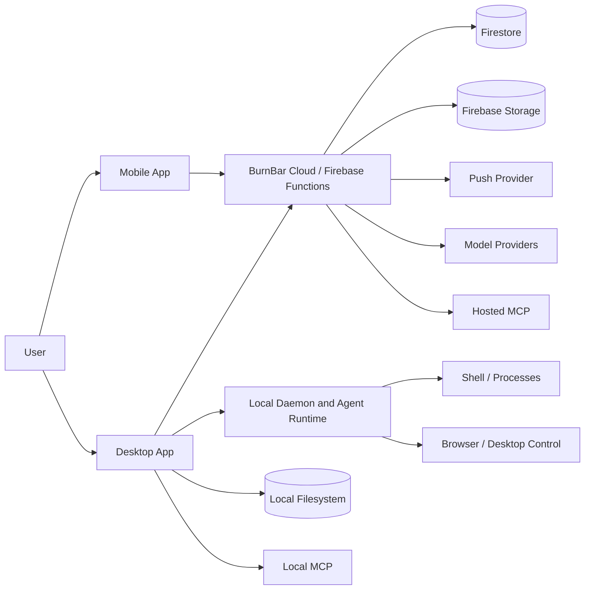
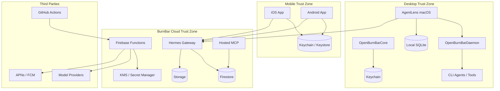
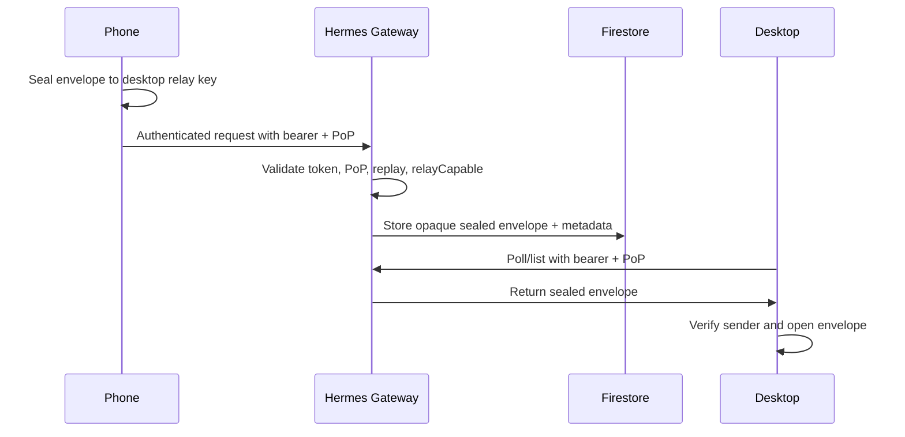
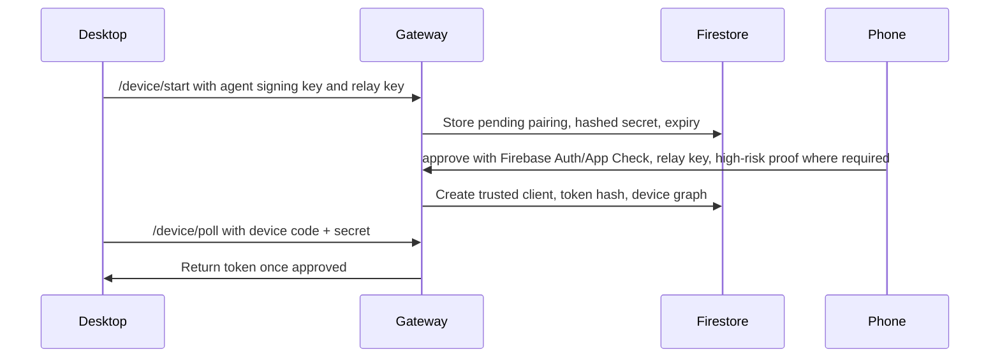
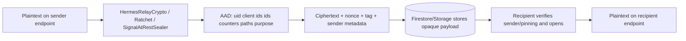
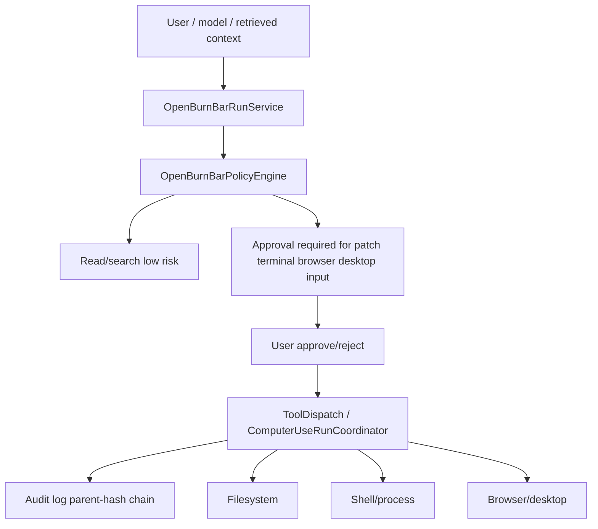
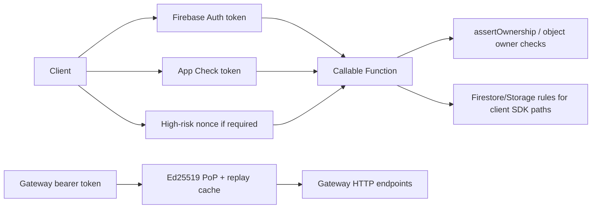

# Architecture

This section decomposes the repository as implemented. It does not assume components listed in product context exist unless code or configuration was found.

## Repository Map

| Area | Paths | Purpose |
| --- | --- | --- |
| macOS app | `AgentLens/`, `AgentLensTests/` | Desktop UI, CLI bridge, insights, browser/computer-use UI, local orchestration. |
| Shared Swift core | `OpenBurnBarCore/` | Shared models, CloudVault crypto, Hermes crypto, Iroh relay, Signal core, tool contracts, policy primitives. |
| Daemon/runtime | `OpenBurnBarDaemon/` | Local daemon RPC, run service, tool dispatch, computer-use coordination, peer authentication. |
| iOS app/extensions | `OpenBurnBarMobile/`, `OpenBurnBarWidget/`, `OpenBurnBarKeyboard/` | Mobile control surface, Hermes Gateway API, notifications, attachment loading. |
| Android app | `android/app/` | Android mobile client, CloudVault/Signal/relay key storage, Hermes attachment encoding. |
| Android relay library | `android/openburnbar-iroh-relay/` | Android Iroh relay support. |
| Firebase backend | `functions/src/` | Callable/HTTP Functions, Auth/App Check, Hermes Gateway, provider credentials, MCP grants, export/delete, panic. |
| Firestore/Storage rules | `firestore.rules`, `storage.rules` | Database and object access controls. |
| Hosted MCP service | `services/hosted-mcp/` | Remote MCP API, bearer verification, tool registry, OAuth refresh, audit. |
| Local/remote MCP tools | `tools/openburnbar-mcp/`, `tools/openburnbar-mcp-remote/` | Local SQLite/cloud decrypt/search/resume tooling and remote local-decrypt shim. |
| Hermes platform tools | `tools/hermes-platform-burnbar/` | Hermes platform integration tooling. |
| Rust transport | `crates/openburnbar-iroh/`, `crates/burnbar-remote/` | Iroh/remote transport components. |
| Contracts/packages | `packages/*` | Signal envelope contracts, libsignal bridge/protocol, e2ee backend policy, entitlements, data domains, design tokens. |
| CI/CD | `.github/workflows/`, `.github/actions/`, `.github/dependabot.yml` | Build, test, release, deploy, security, provenance. |
| Docs/security | `docs/security/`, `docs/OPENBURNBAR_RELEASE_ARCHITECTURE.md`, `SECURITY_CLAIMS_REGISTER.md` | Existing security claims, architecture, provenance, threat-model docs. |
| Scripts | `scripts/`, `functions/scripts/` | Rules tests, CI validators, release/provenance helpers. |
| Generated/build artifacts | `.build-*`, `.spm-cache*`, `.derived-data`, `OpenBurnBar.xcodeproj` | Build outputs/project files; not evidence for production controls except where generated config is used. |

## Security-Sensitive Files

| Topic | Files | Purpose |
| --- | --- | --- |
| Auth/App Check | `functions/src/auth.ts`, `functions/src/config.ts`, `functions/src/appCheckAttestation.ts` | Firebase Auth, ownership, App Check, high-risk nonce enforcement. |
| Authorization/rules | `firestore.rules`, `storage.rules`, `functions/src/callables/*` | Owner namespaces, server-only collections, callable object checks. |
| Device pairing | `functions/src/callables/hermesGateway.ts`, `OpenBurnBarCore/Sources/OpenBurnBarIrohRelay/*`, `functions/src/callables/computerUseSecurity.ts` | Gateway pairing, Iroh signing/freshness, trusted-device proofs. |
| Key generation/storage | `CloudVaultCrypto.swift`, `SignalIdentityKeyStore.swift`, `HermesGatewayRelayKeypair.swift`, Android `*KeyStore.kt` | Vault, Signal, relay, and mobile key storage. |
| Message sealing | `HermesRelayCrypto.swift`, `HermesRatchetCrypto.swift`, `SignalAtRestSealer.swift`, `packages/signal-envelope-contracts` | Relay envelopes, ratchet, Signal-at-rest envelope. |
| Attachments | `functions/src/callables/hermesGateway.ts`, `HermesAttachmentLoader.swift`, `HermesAttachmentEncoder.swift`, `HermesAttachmentEncoder.kt` | Upload/finalize, client decrypt/open, model-compatible encoding. |
| Local execution | `OpenBurnBarDaemon/*RunService*`, `ComputerUseRunCoordinator.swift`, `OpenBurnBarPolicyEngine.swift`, `BurnBarToolContracts.swift` | Tool dispatch, approvals, risk classification, computer-use actions. |
| Desktop IPC | `OpenBurnBarDaemonServer.swift`, `BurnBarDaemonPeerAuthenticator.swift` | Socket permissions, code-signature peer auth, daemon RPC size limits. |
| Provider secrets | `functions/src/secrets.ts`, `functions/src/callables/providerAccounts.ts`, `functions/src/insightsHostedAnswer.ts` | KMS/Secret Manager wrapping, hosted provider calls. |
| Logging/telemetry | `functions/src/logging.ts`, `functions/src/sentry.ts`, `OpenBurnBarDaemonLogger.swift`, Android Crashlytics config | Log/Sentry redaction and residual native crash uncertainty. |
| MCP | `services/hosted-mcp/src/*`, `tools/openburnbar-mcp/server.py`, `tools/openburnbar-mcp-remote/src/*` | Remote/local MCP auth, tools, audit, local decrypt shim. |
| Supply chain | `.github/workflows/*`, `docs/security/SUPPLY_CHAIN_PROVENANCE.md`, `docs/security/AGENT_RUNTIME_PROVENANCE.md`, `scripts/create-corresponding-source.sh` | CI gates, release, SBOM/VEX/provenance, vendored runtime proof. |

## Component Inventory

| Component | Type | Purpose | Trust level | Data/secrets | Interfaces | Auth/Authz | Security notes |
| --- | --- | --- | --- | --- | --- | --- | --- |
| AgentLens macOS app | Desktop app | User UI, local agent control, CLI launch | Trusted endpoint process if first-party signed | Prompts, files, provider routes, local tokens | Daemon RPC, provider APIs, local filesystem | Daemon peer auth, local OS user | Endpoint compromise exposes plaintext. |
| OpenBurnBar daemon | Local agent/runtime | Execute runs and tools, manage approvals | Highly trusted local service | Tool args/results, local logs, workspace files | Unix socket RPC | First-party code-signature gate in production; controller/run checks | High-risk tool gateway. |
| OpenBurnBarCore | Library | Shared crypto/models/policy | Library in trusted clients | Keys, envelopes, AAD, tool contracts | Linked code | N/A | Correctness critical. |
| iOS app | Mobile app | Remote control, pairing approval, attachment open | Trusted paired device | Relay keys, tokens, plaintext after decrypt | Firebase, push, local storage | Firebase Auth/App Check, Gateway token/PoP | Stolen/unlocked phone is high impact. |
| Android app | Mobile app | Android remote client | Trusted paired device | Android Keystore-wrapped keys, tokens | Firebase, Gateway | Firebase Auth/App Check where used | Hardware-backed key claims not proven. |
| Firebase Functions | Backend service | Authz, pairing, relay API, provider/MCP flows | Trusted control plane, not content-trusted for sealed content | Metadata, secrets refs, provider creds | HTTPS callable/HTTP | Firebase Auth, App Check, bearer+PoP, high-risk nonces | Admin SDK bypass means code must enforce auth. |
| Firestore | Database | Metadata, devices, messages/envelopes, audit, indexes | Cloud storage | Ciphertexts, metadata, sealed search | Rules/Admin SDK | Rules for clients; Admin SDK bypass for Functions | Live deployed rules not proven. |
| Firebase Storage | Object storage | Attachment/session encrypted blobs | Cloud storage | Ciphertexts, avatars, paths, metadata | Signed URLs, SDK | Storage rules/signed URL paths | Gateway attachment download path appears inconsistent. |
| Hermes Gateway | Cloud relay | Pair devices, relay sealed messages/events/attachments | Metadata-trusted only | Pairing records, token hashes, sealed envelopes | HTTP/callable | Bearer+PoP, Firebase Auth/App Check, trusted-device proof | Current writes sealed-only; metadata visible. |
| CloudVault | Client crypto/storage scheme | Seal selected cloud records | Cryptographic boundary | Vault keys, sealed records | Client libraries/Firestore | Owner rules + local keys | Legacy/backfill state uncertain. |
| Hosted MCP | Backend service | Remote MCP tools over cloud data | Trusted service with scoped grants | Access tokens, encrypted search metadata, audit | HTTP JSON-RPC | Bearer Ed25519/HMAC, scopes, entitlements | Token theft exposes scoped metadata/ciphertexts. |
| Local MCP | Local tool server | Local history/search/decrypt/resume | Highly trusted local interface | SQLite, local vault key, history, memory | Local MCP protocol | Local environment/process trust | Treat as privileged, not safe for untrusted agents. |
| Model providers/OpenRouter | Third-party API | Model inference | Untrusted processor | Prompts, digests, attachments when encoded | HTTPS API | Provider API keys | Provider sees data routed to it. |
| Push provider | Third-party API | Notifications | Metadata processor | Push tokens, notification metadata | APNs/FCM | Platform credentials | Generic previews reduce but do not eliminate metadata. |
| GitHub Actions | CI/CD | Build/test/release/deploy | Trusted build plane | CI secrets, artifacts | Workflows | GitHub OIDC/secrets/envs | Some actions unpinned; live protection not proven. |

## C4 Diagrams

### System Context



### Container Diagram



### Cloud Relay / Message Path



### Device Pairing



### Message Sealing / Encryption



### Attachment Flow

```mermaid
sequenceDiagram
  participant Sender
  participant Gateway
  participant Storage
  participant Recipient
  Sender->>Sender: Encrypt manifest and body with distinct AAD
  Sender->>Gateway: init upload with sealed envelope and opaque metadata
  Gateway->>Storage: Mint short write URL / store expected object metadata
  Sender->>Storage: Upload application/octet-stream ciphertext
  Sender->>Gateway: finalize with size/hash/status
  Recipient->>Storage: Download ciphertext (authorization path uncertain for Gateway attachments)
  Recipient->>Recipient: Open manifest/body; plaintext enters local app workspace
```

### Local Agent / Tool Execution



### Authentication / Session Management



## Data Flow Summary

| Flow | Sender -> Receiver | Protocol | Auth/Authz | Encryption | Plaintext locations | Metadata exposed | Replay/integrity | Failure behavior | Evidence |
| --- | --- | --- | --- | --- | --- | --- | --- | --- | --- |
| User login | Client -> Firebase Auth | HTTPS | Firebase provider session | TLS | Client, Firebase Auth | uid, device, IP | Provider-managed | Unknown from repo | `functions/src/auth.ts` consumers |
| Device registration | Client -> Functions/Firestore | Callable/HTTPS | Auth, App Check, owner checks | TLS; keys local | Client only for private keys | uid, client id, keys, platform | Server writes, immutable checks | Reject missing auth/App Check | `appCheckAttestation.ts`, `computerUseSecurity.ts` |
| Device pairing | Desktop/Phone -> Gateway | HTTPS | device code/secret, Auth/App Check, relay keys | TLS plus sealed keys | Endpoints | pairing code status, public keys, expiry | hash secret, expiry, server writes | Reject plaintext-only/expired | `hermesGateway.ts` |
| Phone to desktop message | Phone -> Gateway -> Desktop | HTTPS/Firestore | bearer+PoP, relayCapable | AES-GCM/HPKE/ratchet envelope plus TLS | Phone before seal; Desktop after open | uid, client IDs, message IDs, sizes, timestamps | PoP replay cache, AAD, create-if-absent | Reject unsealed/plaintext fields | `HermesRelayCrypto.swift`, `callables/hermesGateway.ts` |
| Desktop response | Desktop -> Gateway -> Phone | HTTPS/Firestore | bearer+PoP | Same as above | Desktop, Phone | Same as above | Same as above | Same as above | same |
| Attachment upload | Sender -> Gateway/Storage | HTTPS signed URL | bearer+PoP; signed URL | Client-side sealed body/manifest plus TLS | Sender before seal | object path, size, hash, status | manifest/body AAD, finalize checks | Reject missing envelope/hash mismatch | `callables/hermesGateway.ts` |
| Attachment download | Recipient -> Storage | Storage SDK/signed URL | Uncertain for Gateway attachment bodies | Ciphertext at rest; local open | Recipient after open | storage path, size | AES-GCM AAD detects tamper | Uncertain; rules may deny | `HermesSettingsView.swift`, `storage.rules` |
| Agent tool call | Model/run -> Daemon tool | Local RPC | controller/run checks; policy | Local IPC only | Daemon/tool/process | audit metadata | approval state and invocation IDs | Deny or request approval | `BurnBarRunService+ToolDispatch.swift` |
| Local file access | Daemon/tool -> filesystem | Local file API | Workspace/tool policy | OS/filesystem | Local endpoint | paths, hashes in logs/audit | OS permissions, policy | Depends on tool | `AgentCapabilityGrant.swift`, `OpenBurnBarPolicyEngine.swift` |
| Memory write | Local/remote MCP -> Functions/Firestore | Local MCP or callable | Local trust or Auth/App Check | sealed/cloaked server memory where implemented | Local before seal | sourceKind, byteCount, model fields | Owner-scoped docs | Partial | `knowledgeMemory.ts`, `memoryHook.ts` |
| Memory read | MCP/client -> Firestore/local | MCP/callable/local DB | bearer scopes/owner/local trust | sealed or local plaintext | Local after decrypt | result metadata | owner/scopes | Reject missing grant | `services/hosted-mcp/src/*` |
| Push notification | Cloud -> APNs/FCM -> device | Provider push | Platform tokens | Provider TLS | Cloud payload before push | token, notification metadata | Provider-managed | Best effort | `AgentReplyNotificationService.swift` |
| Revocation | User/client -> Functions | Callable/HTTPS | Auth/App Check, high-risk proofs | TLS | Cloud metadata | revocation event | transactions, token deletion | Partial/best-effort cleanup | `computerUseSecurity.ts`, `hermesGateway.ts` |
| Key rotation | Client/Functions | Callable/local crypto | Trusted devices | TLS plus local wrapping | Endpoints | key versions, rotation status | partial | May block without survivor | `CloudVaultKeyAccess.swift`, `computerUseSecurity.ts` |
| Logout/session expiration | Client/provider | Firebase/platform | Provider-managed | TLS | Client/server session state | auth metadata | Provider-managed | Unknown | Unknown from repo |
| Error/crash/logging | App/Functions -> logs/Sentry | HTTPS/log API | service credentials | TLS | Before scrub in process | hashed/truncated ids, errors | best-effort scrub | Log sanitized or dropped | `logging.ts`, `sentry.ts`, daemon logger |
| Model provider request | Client/Function -> provider | HTTPS API | provider API key | TLS | Client/function/provider | model, usage, prompt digest | Provider-managed | fallback/error | `insightsHostedAnswer.ts`, `InsightsMacEnvironment.swift` |

## Unknowns

- Whether deployed Firebase rules and Functions match repository files.
- Whether App Check enforcement is enabled in production.
- Whether live KMS/IAM grants are least privilege and logged.
- Whether production branch/environment protections require all security gates.
- Whether all local SQLite stores are encrypted at rest.
- Whether mobile/native crash reports contain prompts, files, screenshots, or tool args.
- Whether user-visible pairing safety-code verification is mandatory in all pairing paths.
- Whether attachment download works securely in production or relies on undeclared deployed rules.
