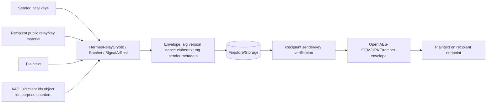
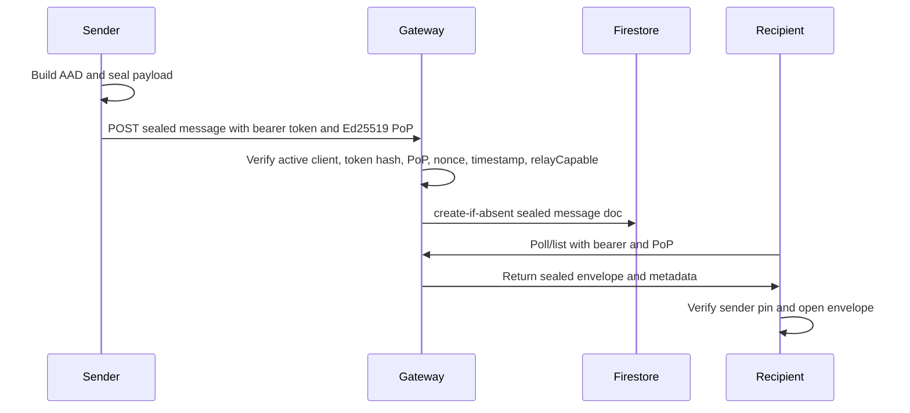
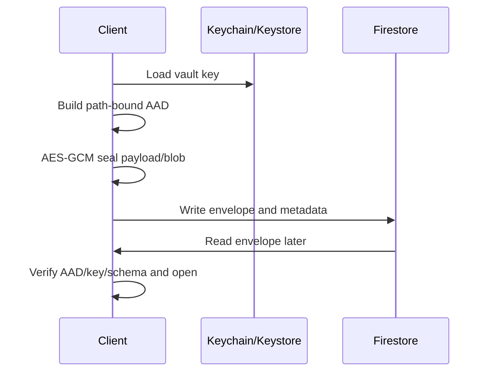
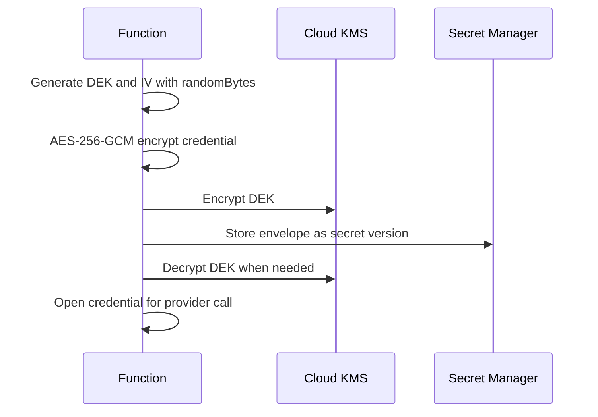

# Cryptographic and Protocol Review

This review analyzes cryptographic code found in the repository. It is not a formal proof. Cure53 should treat all bespoke protocol code as high-priority review scope.

## Crypto Inventory

| Area | Algorithms/libraries | Key sizes | Nonce/IV/randomness | AAD/serialization | Evidence | Confidence |
| --- | --- | --- | --- | --- | --- | --- |
| CloudVault sealed payload/blob | AES-GCM, HMAC-SHA256, SHA-256 legacy support | 32-byte vault keys | `SecRandomCopyBytes`/platform RNG; Swift vault key path does not check RNG status | Path-bound AAD: uid, collection, doc, field, purpose | `CloudVaultCrypto.swift`, `CloudVaultCrypto.kt` | Medium |
| CloudVault key wrap | P-256 ECDH, HKDF-SHA256, AES-GCM | 32-byte vault key; P-256 ephemeral | Ephemeral P-256 keypair | wrapped key includes ephemeral public key | `CloudVaultCrypto.swift`, `CloudVaultCrypto.kt` | Medium |
| Hermes relay v2 | Bespoke P-256 authenticated 2-DH, HKDF-SHA256, AES-GCM | P-256, AES-256 | ephemeral sender key | uid/client/id/counter/key ID AAD | `HermesRelayCrypto.swift` | Medium |
| Hermes relay v3 | RFC 9180 HPKE Auth, DHKEM(P-256, HKDF-SHA256), AES-256-GCM | P-256, AES-256 | HPKE ephemeral | domain-separated AAD | `HermesRelayCrypto.swift`, HPKE tests | Medium/High |
| Hermes ratchet | P-256 DH ratchet, HKDF-SHA256 root KDF, HMAC-SHA256 chain KDF, AES-GCM | P-256, AES-256 | per-message chain keys | session/device IDs, ratchet pubkey, counters, epoch | `HermesRatchetCrypto.swift` | Medium |
| Signal-at-rest | AES-GCM content key, HPKE wraps, sender signature | content key 32 bytes | per envelope | binding context and sender auth | `SignalAtRestSealer.swift` | Medium |
| Iroh pairing | Ed25519 signatures over canonical payload | Ed25519 | publishedAt freshness | uid, connectionId, nodeId, relayURL, addresses, timestamp | `IrohRelayPairing.swift` | Medium |
| Gateway PoP | Ed25519 signatures, SHA-256 hashes, timing-safe compare | Ed25519, 32-byte token secret | nonce replay cache and timestamp skew | method/path/query/body hash binding in v2 | `callables/hermesGateway.ts` | Medium/High |
| Provider credential envelope | AES-256-GCM DEK, KMS-wrapped DEK, Secret Manager | 32-byte DEK | Node `randomBytes(32)`, `randomBytes(12)` | envelope JSON | `functions/src/secrets.ts` | Medium |
| Hosted MCP tokens | Ed25519 or legacy HMAC token verification | Ed25519/HMAC | JWT-like exp/jti | header/payload/signature | `services/hosted-mcp/src/auth.ts` | Medium |

## Key Lifecycle

| Key | Generated by | Stored | Exportable? | Rotation/revocation | Compromise impact | Forward secrecy/PCR |
| --- | --- | --- | --- | --- | --- | --- |
| CloudVault vault key | Client | Keychain/Keystore; wrapped to devices | Exportable in process once unlocked | Rotation paths exist but may need surviving device | Decrypts sealed CloudVault data for that scope | No full FS for stored data |
| CloudVault escrow key | Device | Keychain/Keystore; public key in Firestore | Private key export not intended, but not hardware-proven | Immutable public key; revocation partial | Allows vault key unwrap for device | None for old wrapped records |
| Hermes relay private key | Device | Keychain/Keystore | Not hardware-proven | Pairing/revocation invalidates server token; local key may remain | Opens current relay envelopes to that device | v2/v3 docs limit FS to ephemeral leg |
| Hermes ratchet keys | Device/session store | Local secure/session store | In-process exportable | Session reset/revocation partial | Decrypts active session and skipped keys | Ratchet provides message-key evolution, not universal PCR proof |
| Signal identity key | Device | Keychain/Keystore; public identity pinned | Not hardware-proven | Immutable identity; cleanup best-effort | Sender impersonation if stolen | Signal Gateway writes not production-ready |
| Gateway bearer token secret | Gateway/clients | Client local; server SHA-256 hash/token index | Client token extractable on compromised endpoint | TTL/revocation/deletion | Authenticates API requests if PoP key also available | No |
| Gateway PoP signing key | Client device | Local key store | Not hardware-proven | Device revocation | Signs Gateway requests | No |
| Provider credential DEK | Function | Secret Manager envelope, KMS-wrapped | Backend can unwrap if IAM allows | Destroy secret version; rotation unknown | Provider API key exposure | No |
| Hosted MCP refresh/access tokens | Hosted MCP service | Client; Firestore hash for refresh grants | Client token extractable | Refresh rotation, expiry, revoke client | Scoped data/tool access until expiry/revoke | No |
| CI signing/deploy keys | CI/GitHub/operator | GitHub secrets/local signing stores | Depends on provider | Unknown/live | Malicious release/deploy | N/A |

## Message Sealing Analysis

Protocol participants:

- Sender endpoint: phone, desktop, or agent runtime.
- Hermes Gateway relay: stores and forwards sealed envelopes and metadata.
- Recipient endpoint: paired device with private relay/key material.

Trust assumptions:

- Endpoints are trusted while uncompromised.
- Cloud relay is trusted for availability, metadata storage, sequencing, and authorization, but not for sealed plaintext confidentiality.
- Firebase Auth/App Check and Gateway token/PoP checks are trusted to identify active clients.

Properties supported by code:

- New Gateway writes reject plaintext fields on current paths.
- Sender encrypts message or attachment data before cloud storage.
- AAD binds envelopes to uid/client/message/attachment identifiers and domains.
- Gateway bearer requests require active token, PoP signature, timestamp and nonce checks, and body hash.
- Firestore rules mark Gateway client/message/session/token collections server-only.
- Attachments use separate manifest/body sealing and upload finalize checks.

Properties not fully achieved or not proven:

- Full forward secrecy for relay v2/v3.
- Post-compromise recovery after endpoint key theft.
- Signal-level messaging for Gateway writes.
- Mandatory user-visible safety-code verification for every pairing path.
- Complete deployed proof of no legacy plaintext Gateway docs.
- Complete protection from at-rest old-envelope replay at the same path.
- Confidentiality of metadata from BurnBar Cloud.

## Crypto Architecture Diagram

## Protocol Sequences

### Gateway Message

### CloudVault Write

### Provider Credential Storage

## Crypto Red Flags

| Red flag | Finding |
| --- | --- |
| Hardcoded keys | Not found in reviewed crypto paths. Full repo secret scan not rerun here. |
| Static IVs | Not found in reviewed paths. |
| Nonce reuse | No direct evidence found; add property tests. |
| AES-CBC/no auth | Not found in reviewed paths. |
| Homegrown crypto | Hermes relay v2 and ratchet are bespoke and require expert review. |
| Weak randomness | Swift `CloudVaultCrypto.generateVaultKey()` ignores `SecRandomCopyBytes` status. |
| Plaintext key storage | Local process can access keys; hardware-backed/non-exportable not proven. |
| Keys in logs | Redactors exist; full native/mobile proof missing. |
| Catch-and-continue on crypto failure | Need targeted review of all open/decrypt callers. |
| TLS verification disabled | Not identified in reviewed paths. |
| Missing algorithm agility | Versions exist, but Signal v4 production readiness is disabled. |
| Ambiguous serialization | Canonical payloads exist for Iroh/PoP; bespoke envelope formats need review. |
| Unauthenticated metadata | Metadata is visible and not all metadata is cryptographically bound. |
| Replayable payloads | PoP/replay and create-if-absent exist; at-rest old-envelope replay needs more proof. |
| Downgrade-prone versioning | Gateway rejects legacy/plaintext writes; verify all read fallbacks. |

## Security Properties Achieved

- Sealed Gateway payload confidentiality against passive cloud storage for current write paths, assuming endpoint keys stay secret.
- AES-GCM integrity for sealed payloads and attachments.
- Sender/recipient context binding through AAD for many paths.
- PoP-based request authentication and replay cache for Gateway bearer requests.
- Server-only Firestore rule posture for Gateway relay documents.
- KMS/Secret Manager envelope encryption for hosted provider credentials.

## Security Properties Not Achieved

- Confidentiality from compromised endpoints.
- Full metadata privacy from BurnBar Cloud.
- Full forward secrecy and post-compromise recovery for all relay content.
- Signal-equivalent Gateway security.
- Guaranteed secure attachment preview/parsing.
- Hardware-backed key protection.
- Complete production proof from repository alone.

## Questions For Cure53

1. Does Hermes relay v2/v3 AAD bind every field needed to prevent replay, mix-and-match, and cross-context decryption?
2. Are Gateway PoP canonicalization and query binding resistant to parser differentials and downgrade?
3. Can a cloud operator replay old sealed envelopes at the same Firestore path and cause client acceptance?
4. Are CloudVault legacy SHA/plaintext fallbacks reachable in production write or read paths?
5. Does attachment manifest/body AAD prevent swapping across users, devices, messages, and storage objects?
6. Are the ratchet skip window and skipped-message-key storage safe against DoS and replay?
7. Can device revocation force key rotation for future records without a surviving trusted device?
8. Are Secret Manager/KMS envelopes sufficient if Functions IAM is compromised?
9. Is any encryption error swallowed and converted into plaintext fallback?
10. Is any Signal/libsignal path exposed while runtime readiness is `not_ready`?
