> **CONFIDENTIAL — BurnBar security package.** Independently code-verified at HEAD `5416ef780`. Share with Cure53 out-of-band; do not publish. Generated from `_evidence/` raw findings.

# BurnBar / OpenBurnBar — Architecture & Data-Flow Reference (Phase 1)

This is the Phase-1 architecture spine for the Cure53 engagement. It is the structural ground truth the rest of the package (threats, claims, framework lenses) hangs off. Everything here is derived from current HEAD code via the per-domain evidence files (`_evidence/NN-*.md`), `_threats.tsv`, `_claims.json`, and the in-tree data-flow table at `docs/security/BurnBar-threat-model.md` §3. Component IDs (C1–C16), trust-boundary IDs (B1–B9 + B2-iroh), and threat IDs are canonical from `_evidence/_INDEX.md`; they are **not** renumbered here.

**One-paragraph orientation.** BurnBar (product) / OpenBurnBar (codebase) is a **local-first** system to run AI coding / computer-use agents on the user's own Mac and observe/control them from iPhone, iPad, Android, and a web console. The canonical store is **local SQLite on the Mac**; every cloud feature is **opt-in**. When cloud sync is on, content fields are **sealed client-side** (AES-256-GCM under a per-user "CloudVault" key the servers never hold) before reaching Firestore; phone⇄Mac control lanes carry **HPKE-sealed ciphertext** (v3 RFC 9180 Auth mode on the realtime/iroh lane); push is content-minimized. It is **not** a single universal E2EE product — it is a local-first multi-device agent-control system with several sealed sub-flows, a Firebase control plane that sees rich metadata, a cloud-rooted trusted-device graph, and powerful local agent runtimes that necessarily see plaintext.

---

## 1. Component Inventory (C1–C16)

Canonical component IDs from `_evidence/_INDEX.md §2`. Note the C1–C16 namespace **skips C13/C14** (the spine table jumps C12 → C15) so those numbers do not collide with claim IDs C13/C14; they are reserved, not components. The table below carries exactly the components the spine defines.

| ID | Component | Type | Purpose | Languages | Trust level | Data handled | Secrets handled | Interfaces | AuthN method | AuthZ model | Key file paths | Security notes |
|---|---|---|---|---|---|---|---|---|---|---|---|---|
| **C1** | macOS app "AgentLens" | Native desktop app (canonical endpoint) | Hosts canonical local SQLite store; runs/observes agents; UI for grants, pairing, approvals; rotation pickup | Swift | Fully-trusted endpoint; **NOT sandboxed** in Developer-ID builds (`app-sandbox=false`) | Message plaintext, prompts/responses, vault key, escrow keys, provider creds (local), session logs, memory | CloudVault key, escrow/identity private keys, relay sender keys, controller-pin store, daemon socket bearer token | Unix sockets to daemon (C2); Firestore/Functions (C8); iroh host (C6); HID via daemon | Firebase Auth + App Check (cloud); local OS user session | Owner-scoped (uid) on cloud; local UI is trust root for grants | `AgentLens/` | Plaintext intentionally in scope (B6, endpoint); identity/vault keys extractable on compromised unlocked endpoint (T-CVS-03) |
| **C2** | Daemon (launchd, Unix socket) | Privileged local service | Executes Computer-Use/HID actions, runtime spawns, config/provider-cred writes on behalf of C1 | Swift | Same-user trust domain; **unsandboxed**; token-auth socket | Run dispatch, provider creds, HID input, computer-use actions | Daemon socket bearer token, HPKE remote-unlock credential envelopes | Main JSON-RPC Unix socket (0600); privileged HID/input socket (0600); root-bridge HID forward | Code-sign DR peer-auth (Team ID `4Y367DF25B` + exact bundle IDs) + bearer token + hardened-runtime/library-validation CD-flag check | **Code-signature == authorization**; no per-op capability attenuation (T-DMN-01) | `OpenBurnBarDaemon/` | Unsandboxed login-user agency (T-DMN-02); does NOT re-verify phone proof (T-DMN-04); `OPENBURNBAR_DAEMON_DISABLE_PEER_CODESIG=1` escape hatch ships (T-DMN-05) |
| **C3** | Shared core (crypto/wire) | Security-critical library | Implements CloudVault seal, HPKE relay crypto, pairing signatures, trust-chain verify, capability-gate primitives | Swift (+ Kotlin mirror) | Security-critical | All ciphertext constructions, AAD constructors, replay caches | Operates over keys held by C1/C4/C5 | Linked into C1/C2/C4 | n/a (library) | n/a | `OpenBurnBarCore/` (`HermesRelayCrypto.swift`, `CloudVaultCrypto.swift`, `IrohRelayPairing.swift`, `PhoneControlAuthorityValidator.swift`) | Primitives clean (CryptoKit, no homegrown AEAD/curve); caveats in lane wiring; no static-leg PFS / no KCI protection (self-documented, T-CRY-05) |
| **C4** | iOS / iPadOS app | Native mobile app | Phone controller for agent control; CloudVault sync; iroh client; chat | Swift | Trusted endpoint (weaker physical assumptions) | Message plaintext, vault key, controller signing key, push token | CloudVault key, controller Ed25519/SE-P256 signing key, relay keys (Keychain) | Firestore/Functions (C8); iroh client to C1 (C6); Gateway HTTP (C9) | Firebase Auth + App Check; PoP (Ed25519) for Gateway | Owner-scoped (uid); single-use local-auth proof for high-risk grants | `OpenBurnBarMobile/` (+ Keyboard/Widget) | **Host pairing key in-memory TOFU, not pinned** (T-TRN-01 / T-PTR-03) — asymmetric vs Keychain-pinned Mac→phone controller key |
| **C5** | Android app | Native mobile app | Android parity of C4 | Kotlin | Trusted endpoint; **parity gaps** | Same classes as C4 | Vault/Signal/relay keys in AndroidKeyStore-wrapped SharedPreferences | Firestore/Functions; iroh client | Firebase Auth + App Check; PoP | Owner-scoped | `android/app/` | Keys recoverable on rooted/forensic device (no StrongBox/user-auth, T-AND-01); cleartext base-config to non-deny hosts (T-AND-02); rotation pickup Devices-screen-gated (T-PTR-02) |
| **C6** | iroh transport | P2P transport (UniFFI Rust + Swift) | QUIC/TLS1.3 P2P control + media plane; NodeId = Ed25519 pubkey | Rust, Swift | Transport; relays untrusted | Sealed app frames only (transport does not inspect) | Endpoint/pairing private keys (Keychain) | Direct QUIC + n0 relay; Firestore fallback cascade | NodeId crypto-bound on connect/accept; allowlist gate on Mac host | Inbound NodeId allowlist (cloud-sourced); payload authZ is app-layer | `crates/openburnbar-iroh/`, `OpenBurnBarIrohRelay/`, `AgentLens/Services/IrohRelay/` | Cloud-controlled allowlist (T-TRN-02); silent downgrade to Firestore (T-TRN-03); metadata leak (T-TRN-04); on iroh `1.0.0-rc.0` (T-TRN-07) |
| **C7** | iroh relays | Network relay (external) | NAT-traversal / packet mux; n0 public set or optional hosted | n/a | **Untrusted** (metadata only) | NodeIds, relay URL, IPs, sizes, timing | none (never a TLS terminator) | QUIC relay | n/a | n/a | n0 public relay set / hosted | Sees IP+NodeId+sizes+timing → localization/presence correlation (T-TRN-04); cannot read or forge stream bytes |
| **C8** | Firebase backend | Cloud control plane (Functions + Firestore + Storage) | Auth, callables, rules-gated sync store, signed-URL minting, push fan-out | TypeScript (Functions); rules | **Untrusted for content; trusted for availability / ordering / authz-metadata**; Admin SDK bypasses rules | Sealed ciphertext + rich plaintext metadata (IDs, timestamps, sizes, counters, statuses, facets, hashes) | KMS-wrapped provider DEKs (Secret Manager); never holds vault/relay private keys | HTTPS callables (~100 onCall + 8 onRequest); Firestore SDK datapath; Storage | Firebase Auth + App Check (callables fail-closed in prod); `request.auth` in rules | `ownsUserNamespace(uid)` rules + per-handler `assertOwnership`; server-only trust roots | `functions/`, `firestore.rules`, `storage.rules` | Admin SDK bypasses rules (T-AZ-05); App Check console enforcement UNKNOWN from repo (T-AZ-06); avatar cross-read (T-AZ-01); metadata cleartext by design (T-AZ-03) |
| **C9** | Hermes Gateway (hosted lane) | Cloud HTTP store-and-forward | Blind relay for phone⇄agent messages/events when not on direct iroh | TypeScript | Blind store-and-forward; untrusted for content | Sealed envelopes only on writes; routing metadata plaintext | Bearer token hash (sha256), pinned client signing pubkey | HTTP `burnBarHermesGateway` (onRequest); Firestore | Bearer token + **mandatory Ed25519 PoP** over the pinned pairing key | PoP-before-entitlement; per-route grant resolver; sealed-only writes | `functions/src/callables/hermesGateway.ts` | Bearer alone insufficient (C4 Defensible); v3→v2 downgrade has no version floor (T-CRY-01); no App Check on HTTP edge by design (T-GW-01) |
| **C10** | Hermes agent runtime (model loop) | Local agent runtime | The model/tool loop driving agent actions | Python (`.pyc` vendored) | Trusted endpoint; **source not fully in-repo** | Prompts, tool results, plaintext context | Provider creds at runtime | Tool broker → C2 sinks; provider APIs (C16) | n/a (local process) | Grants/approvals + runtime allowlists | vendored `~/.hermes/hermes-agent` | Indirect prompt injection unwrapped (T-AI-01/02, T-TOOL-05); YOLO → unsandboxed shell (T-TOOL-02 / T-AI-07); source not fully auditable |
| **C11** | Hosted MCP | Cloud MCP server | Remote MCP tool/search surface | TypeScript | Untrusted for content (no decrypt path) | Request metadata, supplied hashes | HMAC access tokens, hashed refresh tokens | HTTPS MCP | HMAC access token (audience/sub/client/scope/expiry) | Scopes + Pro entitlement + rate limit | `services/hosted-mcp/` | Default path cannot derive vault trapdoors without local shim; access token valid until expiry |
| **C12** | Web console | Browser SPA | Console UI; semi-trusted once a native device approves its wrap | TypeScript/web | Semi-trusted once a native device approves the wrap | Sealed material via approved wrap | Wrapped vault material (post-approval) | Firestore/Functions; native approval | Firebase Auth + App Check; native-device-approved wrap | Web always needs a distinct trusted **native** approver (B3) | `apps/console/` | Web cannot self-promote; trust elevation requires native XEdDSA approver signature |
| **C15** | CI/CD + release | Build & release pipeline | PR gates, tag-gated deploys, signing, notarization | YAML/shell | Supply-chain critical; **solo operator** | Source, artifacts, signing keys | Signing keys, deploy creds | GitHub Actions; Firebase deploy | GitHub identity; tag-gated | Single CODEOWNER (no SoD, T-SC-03) | `.github/workflows/` | Mutable action tags (T-SC-01); `cargo deny` no-ops (T-SC-02); GPG checksum best-effort (T-SC-06) |
| **C16** | Model providers | External third party | LLM/computer-use inference | external | **Untrusted third party, by design** (see plaintext) | Everything routed to them (plaintext) | BYOK keys (do NOT transit BurnBar servers on gateway lane) | HTTPS | Provider API key | n/a (provider sees everything) | external | Providers see plaintext (B9); no zero-retention/no-train header asserted in code (T-AI-06) |

---

## 2. C4 Model Diagrams

C4 levels: **System Context** (people + external systems), **Container** (deployable/runnable units inside the trust perimeter), and **Component** (internal structure of the security-critical flows). Trust boundaries B1–B9 (+ B2-iroh) from `_INDEX.md §3` are annotated.

### 2.1 System Context

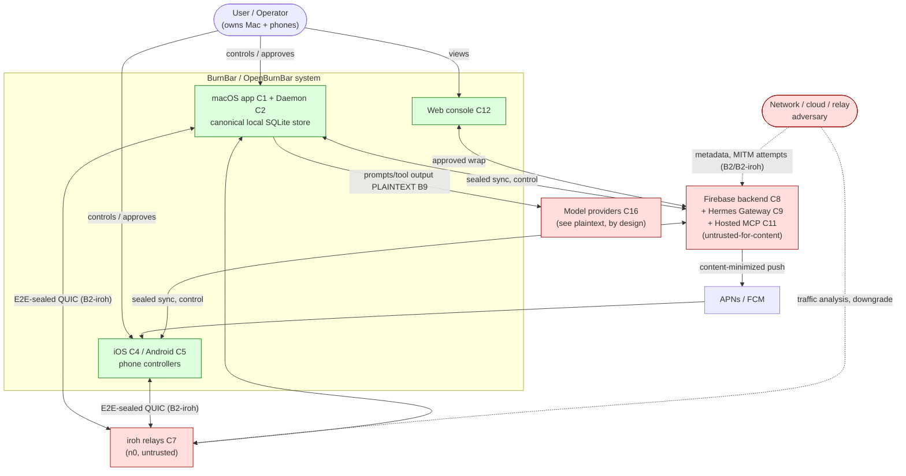

### 2.2 Container Diagram

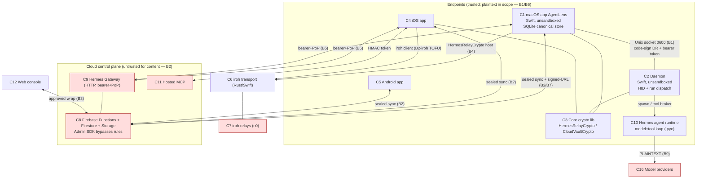

### 2.3 Component Diagrams (per security-critical flow)

#### (a) Cloud relay / message path (C9 Hermes Gateway)

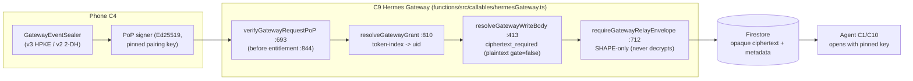
Evidence: `01-crypto-relay.md`, `05-gateway-pop.md`; claims C1/C4 in `_claims.json`.

#### (b) Device pairing (B3 trust graph + B2-iroh)

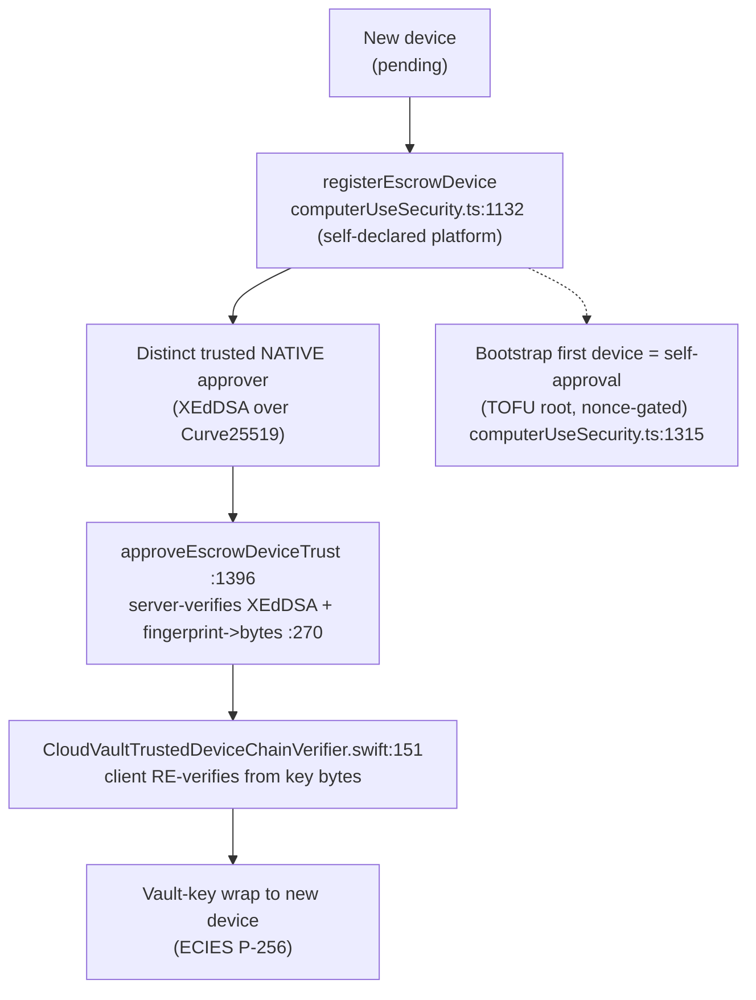
Evidence: `03-pairing-trust-revocation.md`; claim C9.

#### (c) Message sealing / encryption (CloudVault + relay)

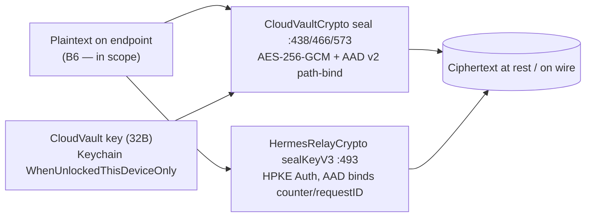
Evidence: `01-crypto-relay.md`, `_INDEX.md §4`; claims C2/C8.

#### (d) Attachment flow

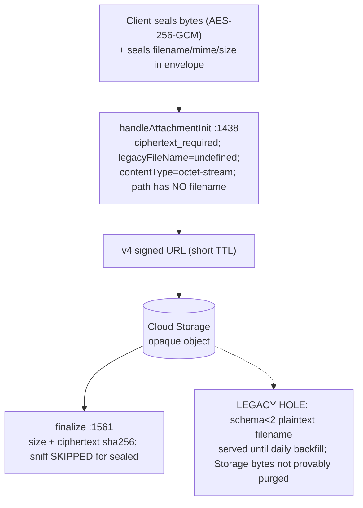
Evidence: `12-attachments` (via `_threats.tsv` T-ATT-*); claim C3.

#### (e) Local agent execution

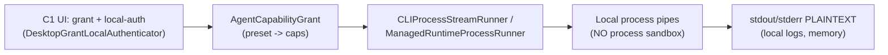
Evidence: `08-agent-runtime-tools` (via `_threats.tsv` T-TOOL-*); §3 row "Local agent runtime invocation".

#### (f) Agent tool execution

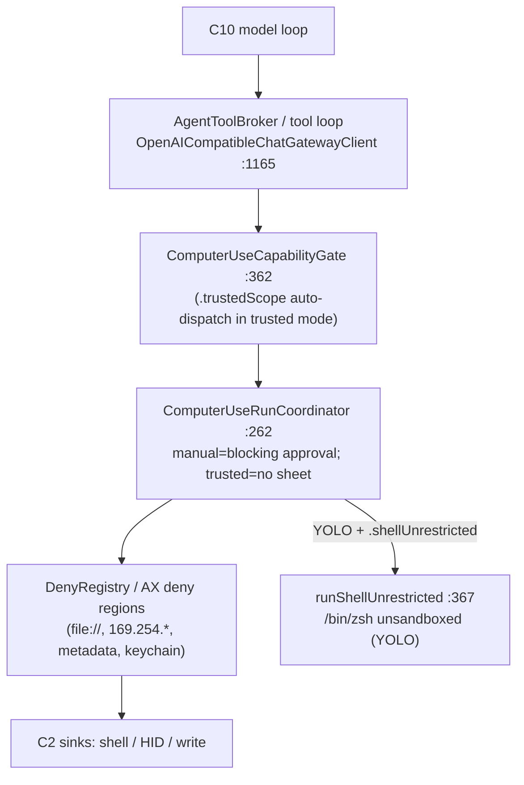
Evidence: `07-daemon-privsocket.md`, `08-agent-runtime-tools`; claims C6/C7; threats T-TOOL-02/T-AI-07.

#### (g) Auth / session

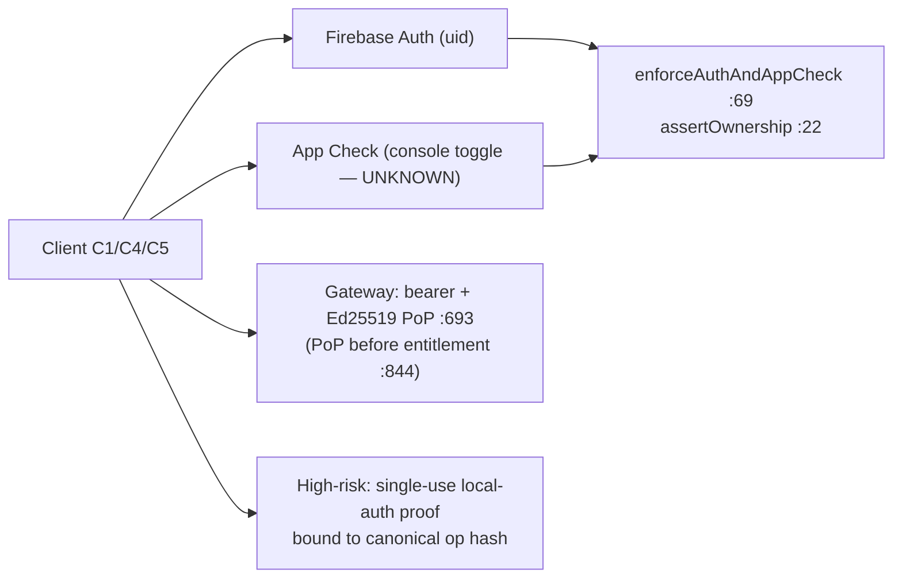
Evidence: `05-gateway-pop.md`, `06-cloud-authz.md`, `03-pairing-trust-revocation.md`; claims C4/C7/C11.

---

## 3. Data-Flow Diagrams (with trust-boundary subgraphs)

Each DFD below is a Mermaid flowchart with trust-boundary subgraphs, followed by a compact attribute table. Flows are grounded in `docs/security/BurnBar-threat-model.md §3` rows and the named evidence files. Where a flow is **not currently guaranteed**, the table says so explicitly and cites the canonical threat ID.

Trust boundaries (canonical, `_INDEX.md §3`):
**B1** same-user processes ↔ Mac app/daemon · **B2** device ↔ cloud · **B3** device ↔ device (pairing/escrow) · **B4** phone ↔ Mac control · **B5** gateway ↔ agent · **B6** user ↔ agent (model output) · **B7** cloud ↔ storage · **B8** repo/CI ↔ artifacts · **B9** BurnBar ↔ model providers · **B2-iroh** cloud-published iroh pairing key / allowlist ↔ phone.

### 3.1 Login

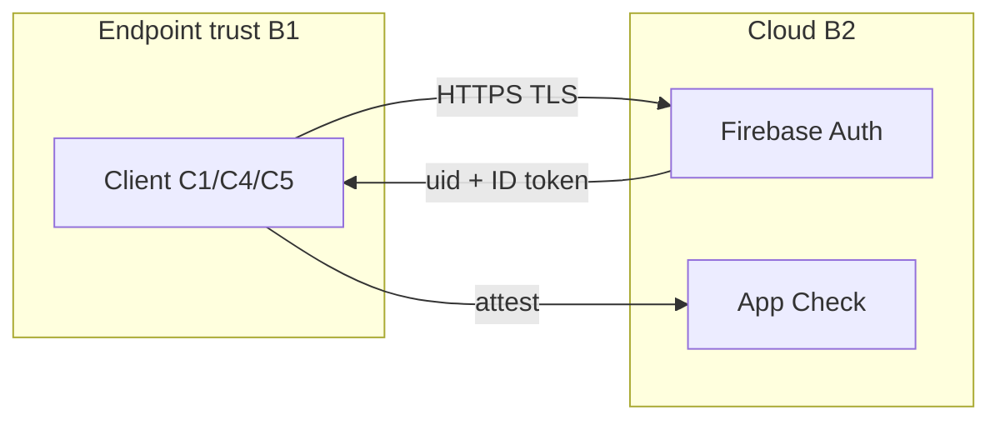

| Attr | Value |
|---|---|
| Sender → Receiver | Client (C1/C4/C5) → Firebase Auth (C8) |
| Protocol | HTTPS (Firebase Auth SDK) |
| AuthN | Firebase Auth credential; App Check attestation via `enforceAuthAndAppCheck` |
| AuthZ | n/a (establishes the uid that all later AuthZ keys off) |
| Enc in transit | TLS |
| Enc at rest | Auth state in platform keystore; no app secrets minted here |
| Plaintext locations | Credentials on endpoint + Auth handler |
| Metadata exposed | uid, client/app identifiers, timestamps to cloud |
| Replay/integrity | TLS; **App Check console enforcement UNKNOWN from repo** (T-AZ-06) |
| Failure behavior | No session minted; later callables fail closed in prod (`config.ts:78-84`) |
| File paths | `functions/src/auth.ts:22-72`, `functions/src/config.ts:68-106` |

### 3.2 Device Registration

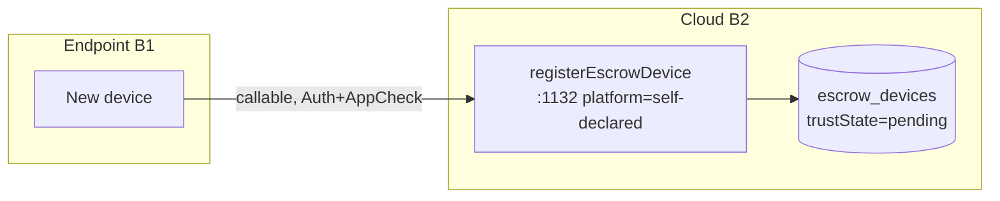

| Attr | Value |
|---|---|
| Sender → Receiver | New device (C4/C5/C1) → Functions (C8) → Firestore |
| Protocol | HTTPS callable + Admin-SDK write |
| AuthN | Firebase Auth + App Check |
| AuthZ | Owner-scoped; device written as `pending` (cannot self-promote, `firestore.rules:3448`) |
| Enc in transit | TLS |
| Enc at rest | Device identity public keys + metadata (no private keys) |
| Plaintext locations | Public-key material + self-declared platform string |
| Metadata exposed | deviceId, platform, key fingerprints, timestamps |
| Replay/integrity | High-risk nonce on sensitive variants; **platform is self-declared, no Mac attestation** (C9 caveat) |
| Failure behavior | Fail-closed; trust elevation impossible client-side |
| File paths | `computerUseSecurity.ts:1132,1154`; `firestore.rules:3448-3451` |

### 3.3 Device Pairing (trust-graph promotion)

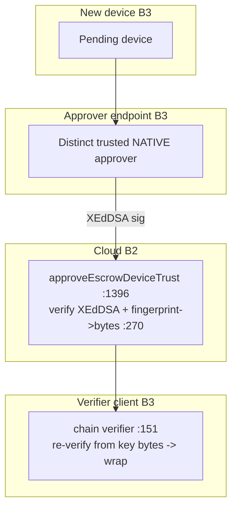

| Attr | Value |
|---|---|
| Sender → Receiver | Approver (native) → Functions (C8) → target device |
| Protocol | HTTPS callable + Admin-SDK; client re-verify |
| AuthN | Auth + App Check; high-risk nonce; **distinct trusted native approver** required |
| AuthZ | Server-verified XEdDSA trust-chain sig + server fingerprint→bytes binding; client re-verifies before any vault wrap (B3) |
| Enc in transit | TLS; vault key wrapped ECIES-P256 to target pubkey |
| Enc at rest | Trusted-device record + wrapped key blobs |
| Plaintext locations | Public keys/fingerprints (cloud); vault key plaintext only on source+target endpoints |
| Metadata exposed | Approver/target IDs, fingerprints, keyVersion, timestamps |
| Replay/integrity | Bootstrap self-approval nonce-gated (TOFU root); approve-time **OOB safety-code compare defaults OFF** (T-PTR-04) |
| Failure behavior | Fail-closed on bad signature/fingerprint |
| File paths | `computerUseSecurity.ts:1263-1423`; `CloudVaultTrustedDeviceChainVerifier.swift:151-199` |

### 3.4 Phone → Cloud → Desktop message

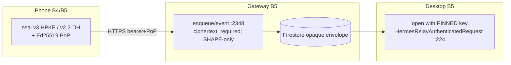

| Attr | Value |
|---|---|
| Sender → Receiver | Phone (C4) → Gateway Functions (C9) → Firestore → agent/Mac (C1) |
| Protocol | HTTPS / Firestore listener |
| AuthN | Bearer token + **mandatory Ed25519 PoP** over pinned pairing key (owner-auth on enqueue callable) |
| AuthZ | PoP-before-entitlement (`:844`); pinned-key byte-match on open |
| Enc in transit | Relay v3 HPKE Auth (or v2 2-DH); TLS underneath |
| Enc at rest | Ciphertext envelope + metadata |
| Plaintext locations | Sender + recipient endpoints only |
| Metadata exposed | destinationId, senderId, sequence, kind, timestamps, attachment counts (plaintext by design) |
| Replay/integrity | Counter+requestID AAD-bound replay cache; nonce single-use; **v3→v2 downgrade has no floor** (T-CRY-01) |
| Failure behavior | Fail-closed: non-v3 sender-unauth → `senderAuthRequired`; plaintext write → `ciphertext_required` |
| File paths | `hermesGateway.ts:2348-2395`; `HermesRelayAuthenticatedRequest.swift:195-246` |

### 3.5 Desktop → Cloud → Phone reply

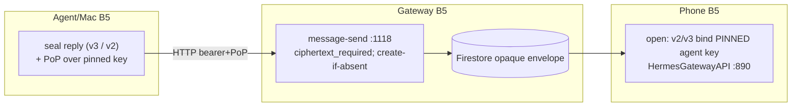

| Attr | Value |
|---|---|
| Sender → Receiver | Agent/Mac (C1) → Gateway Functions (C9) → Firestore → phone (C4) |
| Protocol | HTTPS HTTP route / Firestore |
| AuthN | Bearer + PoP; active client/destination check |
| AuthZ | Replay/sequence checks; pinned-key open |
| Enc in transit | Relay/ratchet envelope; plaintext `text` rejected on new writes |
| Enc at rest | Ciphertext + sequence/status metadata |
| Plaintext locations | Agent + phone endpoints only |
| Metadata exposed | sequence, status, client/destination IDs, timestamps |
| Replay/integrity | message create-if-absent (`message_already_sent` 409); monotonic sequence cursor |
| Failure behavior | Fail-closed; **legacy schema-1 plaintext READ fallback exists for pre-cutoff docs only** (C1 caveat) |
| File paths | `callables/hermesGateway.ts:810-865,1116-1193`; `HermesGatewayAPI.swift:890-911` |

### 3.6 Attachment upload

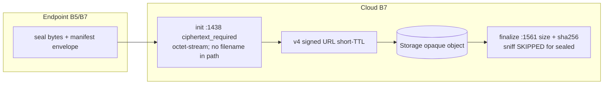

| Attr | Value |
|---|---|
| Sender → Receiver | Client → signed URL → Storage (B7); finalize → Functions/Firestore |
| Protocol | HTTPS signed URL + callable |
| AuthN | Gateway bearer+PoP for init/finalize; signed URL for the byte upload |
| AuthZ | `assertUserStoragePath` uid-scope; server-only path (no filename segment) |
| Enc in transit | Bytes sealed before upload (AES-256-GCM); manifest seals filename/mime/size |
| Enc at rest | Ciphertext object; size/path/ciphertext-hash/status visible |
| Plaintext locations | Endpoint only (for current schema-2+) |
| Metadata exposed | byteCount (ciphertext), storagePath, status, ciphertext sha256, storageGeneration |
| Replay/integrity | sha256 finalize gate; **client-enforced sealing, cloud cannot prove ciphertext** (C3 Partial) |
| Failure behavior | Unsealed write rejected; **legacy plaintext Storage bytes not provably purged** (T-ATT-* / C3) |
| File paths | `callables/hermesGateway.ts:1409-1605`; `privacyBackfill.ts:95-99` |

### 3.7 Attachment download

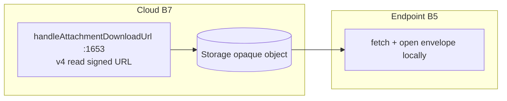

| Attr | Value |
|---|---|
| Sender → Receiver | Storage (C8/B7) → endpoint (C1/C4/C5) |
| Protocol | HTTPS v4 signed URL |
| AuthN | Gateway bearer+PoP to mint URL |
| AuthZ | uid-scoped object key; short TTL (10–15 min) |
| Enc in transit | TLS; object is ciphertext |
| Enc at rest | Ciphertext (sealed objects are octet-stream) |
| Plaintext locations | Endpoint after local decrypt |
| Metadata exposed | object path, size, ciphertext hash |
| Replay/integrity | Short-TTL URL; **download URL lacks forced Content-Disposition** for legacy non-octet objects (T-ATT-08) |
| Failure behavior | Existence-checked before URL mint; deny-by-default rules |
| File paths | `callables/hermesGateway.ts:1653-1658`; `encryptedSearch.ts:135-141` |

### 3.8 Agent tool call

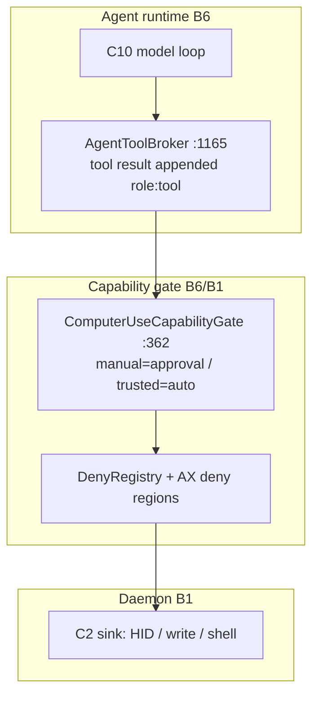

| Attr | Value |
|---|---|
| Sender → Receiver | Model (C10) → tool broker → capability gate → daemon sink (C2) |
| Protocol | In-process + Unix socket (B1) |
| AuthN | Code-sign DR + bearer on daemon socket |
| AuthZ | Capability grant + deny registry; manual mode = blocking human approval |
| Enc in transit | Local sockets (0600); HPKE for remote-unlock creds |
| Enc at rest | Audit log (hashed); no body plaintext required |
| Plaintext locations | Tool args/results in model context (endpoint) |
| Metadata exposed | action class, target, audit attribution |
| Replay/integrity | Audit-before-action fail-closed; **tool results outside 2-tool allowlist injected UNWRAPPED** (T-AI-01); **trusted mode auto-dispatches scope-allowed actions, no per-action approval** (C6 Partial); **daemon does NOT re-verify phone proof** (T-DMN-04) |
| Failure behavior | Manual/step fail-closed; **YOLO → unsandboxed shell, no approval** (T-TOOL-02/T-AI-07) |
| File paths | `OpenAICompatibleChatGatewayClient.swift:367,1165`; `ComputerUseRunCoordinator.swift:262-374` |

### 3.9 Local file access (by agent)

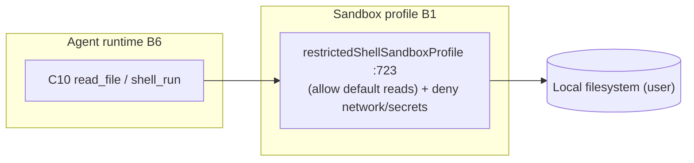

| Attr | Value |
|---|---|
| Sender → Receiver | Agent runtime (C10) → local FS (user-owned) |
| Protocol | Local file syscalls / sandbox-exec profile |
| AuthN | Local OS user session |
| AuthZ | Capability grant + sandbox profile deny-list (not allow-list for reads) |
| Enc in transit | n/a (local) |
| Enc at rest | Per device-disk encryption; agent reads plaintext |
| Plaintext locations | File contents in agent/model context |
| Metadata exposed | file paths accessed (local) |
| Replay/integrity | n/a |
| Failure behavior | **Deny-list reads → sensitive files outside curated list remain readable** (T-TOOL-10); **no hard process sandbox** on Dev-ID (T-DMN-02) |
| File paths | `OpenAICompatibleChatGatewayClient.swift:672-723`; §3 row "Local agent runtime invocation" |

### 3.10 Memory write (RAG / log ingest)

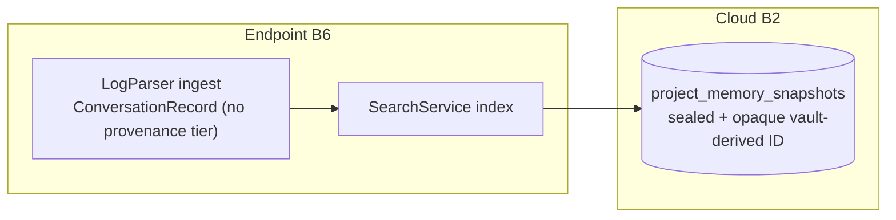

| Attr | Value |
|---|---|
| Sender → Receiver | Client (C1) → Firestore (C8); local RAG corpus |
| Protocol | HTTPS callable / local index |
| AuthN | Auth + App Check + entitlement |
| AuthZ | Owner-scoped; sealed snapshot, content-free facets |
| Enc in transit | Sealed snapshot with opaque vault-key-derived doc ID |
| Enc at rest | Ciphertext snapshot; counts/timestamps cleartext |
| Plaintext locations | Endpoint before seal; RAG corpus locally |
| Metadata exposed | facets, counts, opaque ID, projectKeyHash trapdoor |
| Replay/integrity | **No write-time provenance/trust tier; poisoned third-party log text enters corpus** (T-AI-03); **at-rest binding has no revision/sequence → rollback** (C12 / RR-8) |
| Failure behavior | Plaintext-name create fail-closed (`firestore.rules:1163-1165`) |
| File paths | `encryptedSearch.ts:364-568`; `LogParserProtocol.swift`; `firestore.rules:1962-1963` |

### 3.11 Memory read (retrieval)

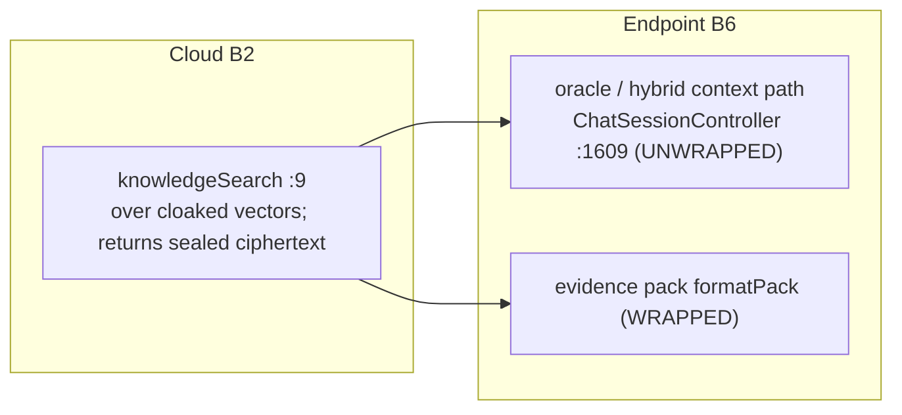

| Attr | Value |
|---|---|
| Sender → Receiver | Firestore/Functions (C8) → endpoint (C1) → model context |
| Protocol | HTTPS callable; local retrieval |
| AuthN | Auth + App Check + entitlement |
| AuthZ | Owner-scoped; server never sees plaintext/query/vault key |
| Enc in transit | Sealed ciphertext returned; token/semantic hashes plaintext indexes |
| Enc at rest | Sealed previews/snippets; hashes/facets cleartext |
| Plaintext locations | Endpoint after local open |
| Metadata exposed | search token/semantic hashes, facets, access patterns |
| Replay/integrity | **Oracle "authoritative findings" inject snippets UNWRAPPED** (T-AI-02) even though evidence-pack path wraps them |
| Failure behavior | Server returns ciphertext only; no decrypt path |
| File paths | `knowledgeSearch.ts:9-15`; `ChatSessionController.swift:1609-1614,2411` |

### 3.12 Push notification

```mermaid
flowchart LR
  subgraph CL[Cloud B2]
    E["createEventFromThreadWrite :310<br/>preview=GENERIC_PREVIEW"]
    FCM["buildFcmMessage :234,257"]
  end
  PROV["APNs / FCM"]
  subgraph EP[Phone]
    P["C4/C5"]
  end
  E --> FCM --> PROV --> P
```

| Attr | Value |
|---|---|
| Sender → Receiver | Functions (C8) → APNs/FCM → device (C4/C5) |
| Protocol | APNs / FCM |
| AuthN | Server credentials; push token |
| AuthZ | Token ownership/resolution |
| Enc in transit | Provider transport encryption only |
| Enc at rest | Notification event metadata in Firestore; generic preview avoids reply text |
| Plaintext locations | Notification metadata visible to BurnBar + push provider |
| Metadata exposed | thread/call IDs, timestamps; **VoIP caller displayName is caller-controlled free text** (C13 caveat) |
| Replay/integrity | Reply text never written into preview (`GENERIC_PREVIEW`) |
| Failure behavior | Content-minimized by design; no body in push (C13 Partial) |
| File paths | `agentNotifications.ts:137,234,257,310`; `callables/voipPush.ts:71-72` |

### 3.13 Account / device revocation

```mermaid
flowchart TB
  subgraph CL[Cloud B2/B3]
    R["revokeEscrowDeviceTrust :1456 (atomic batch)<br/>revoked + wrappers revoked :1508<br/>+ rotation requirement :1532"]
  end
  subgraph EP[Survivor Mac B3]
    S["pickUpPendingCloudVaultRotations :370<br/>rotateCloudVaultKey -> rewrap/reseal"]
  end
  revdev["Revoked device<br/>(cached key still decrypts pre-revocation)"]
  R --> S
  R -.->|no claw-back| revdev
```

| Attr | Value |
|---|---|
| Sender → Receiver | Operator → Functions (C8) → Firestore; survivor Mac performs rotation |
| Protocol | HTTPS callable + Admin-SDK batch |
| AuthN | Auth + App Check + high-risk nonce |
| AuthZ | Owner-scoped; trust roots server-only |
| Enc in transit | TLS; new vault key wrapped to survivors only |
| Enc at rest | New-key ciphertext after rewrap |
| Plaintext locations | Endpoints; revoked device retains cached key |
| Metadata exposed | revocation receipt, device IDs, rotation requirement status |
| Replay/integrity | Rotation generation monotonic (current+1); old wrappers revoked |
| Failure behavior | **Rotation is client-driven (survivor Mac), not synchronous/server-driven; no claw-back of pre-revocation cached key** (C5 Partial, T-PTR-01/02); no Firebase session revocation tied to escrow revoke |
| File paths | `computerUseSecurity.ts:1456-1591`; `cloudVaultRotation.ts:185-309`; `ComputerUseSecurityCallableClient.swift:370` |

### 3.14 Key rotation

```mermaid
flowchart LR
  subgraph EP[Survivor Mac B3]
    G["generate NEW vault key locally"]
    W["wrap to survivors (ECIES P-256)"]
    RW["CloudVaultRotationRewrapWorker :36<br/>reseal all domains under new key"]
  end
  subgraph CL[Cloud B2]
    RT["rotateCloudVaultKey :111<br/>generation+1; set current :220; revoke old :294"]
  end
  G --> W --> RT --> RW
```

| Attr | Value |
|---|---|
| Sender → Receiver | Survivor Mac (C1) → Functions (C8) → Firestore; client reseals |
| Protocol | HTTPS callable + Admin-SDK |
| AuthN | Auth + App Check; caller + every survivor target must be `trusted` |
| AuthZ | Generation monotonicity + requirement match; revoked device cannot wrap to itself |
| Enc in transit | New key wrapped ECIES-P256 to survivor pubkeys |
| Enc at rest | New-key ciphertext; old-gen wrappers revoked |
| Plaintext locations | New vault key plaintext only on survivor endpoints |
| Metadata exposed | vaultKeyID, vaultGeneration, survivor set |
| Replay/integrity | Generation advances by exactly one; rules enforce vaultKeyID continuity |
| Failure behavior | If no surviving trusted device → `no_surviving_trusted_device`, **old key never retired** (C5 caveat); rewrap is client-checkpointed |
| File paths | `cloudVaultRotation.ts:111-309`; `CloudVaultRotationRewrapWorker.swift:36-124` |

### 3.15 Logout

```mermaid
flowchart LR
  subgraph EP[Endpoint B1]
    A["Client clears Auth session<br/>(local keys remain in Keychain)"]
  end
  subgraph CL[Cloud B2]
    F["Firebase Auth session invalidated (client-side)"]
  end
  A --> F
```

| Attr | Value |
|---|---|
| Sender → Receiver | Client (C1/C4/C5) → Firebase Auth (C8) |
| Protocol | HTTPS (Auth SDK) |
| AuthN | Existing session |
| AuthZ | n/a |
| Enc in transit | TLS |
| Enc at rest | Local keys persist in Keychain/Keystore (not wiped on logout) |
| Plaintext locations | Local store remains until device wipe |
| Metadata exposed | Auth state change |
| Replay/integrity | **No `revokeRefreshTokens` observed wired to escrow revoke** — a revoked device keeps its Firebase session (C5 gap) |
| Failure behavior | Local-first: logout does not clear canonical SQLite store or cached vault key |
| File paths | (no server-side escrow→session-revoke path found, `03-pairing-trust-revocation.md` open question) |

### 3.16 Error / crash / logging

```mermaid
flowchart LR
  subgraph EP[Endpoint B1]
    AL["AppLogger.sanitizeMetadata :45<br/>OSLog .private(mask:.hash)"]
    SC["client Sentry (NO beforeSend)"]
  end
  subgraph CL[Cloud B2]
    SL["logging.ts scrub :16,32,75<br/>known shapes only"]
    SS["sanitizeSentryEvent :82-141"]
  end
  AL --> SC
  SL --> SS
```

| Attr | Value |
|---|---|
| Sender → Receiver | Endpoints (C1/C4/C5) + Functions (C8) → Sentry / logs |
| Protocol | HTTPS to Sentry; OSLog/server logs |
| AuthN | Sentry DSN (CI-injected) |
| AuthZ | n/a |
| Enc in transit | TLS |
| Enc at rest | Logs/crash reports retained server-side |
| Plaintext locations | Scrubbed; residual free-form error strings |
| Metadata exposed | callable name, trace_id, uid hash |
| Replay/integrity | **Redaction is key/pattern allow-listing, not structural**; free-form `Error.message` and `silentFailure` "error" key bypass scrubbers; **client Sentry has no `beforeSend`/`maxBreadcrumbs`** (C13 Partial) |
| Failure behavior | Generic preview in push; request-body capture removed; pattern scrub catches known secret shapes only |
| File paths | `functions/src/logging.ts:16-192`; `functions/src/sentry.ts:41-141`; `AppLogger.swift:45-149` |

### 3.17 Model-provider request

```mermaid
flowchart LR
  subgraph EP[Endpoint B6/B9]
    A["chat prompt assembly<br/>(untrusted content WRAPPED, secrets NOT redacted)"]
  end
  PROV["C16 Model providers<br/>(see PLAINTEXT)"]
  A -->|HTTPS TLS| PROV
```

| Attr | Value |
|---|---|
| Sender → Receiver | Endpoint (C1/C10) → model providers (C16) |
| Protocol | HTTPS (provider API; gateway lane keeps BYOK off BurnBar servers) |
| AuthN | Provider API key (BYOK) |
| AuthZ | n/a (provider has full visibility, by design — B9) |
| Enc in transit | TLS |
| Enc at rest | Provider-side retention UNKNOWN (deployment-dependent) |
| Plaintext locations | **Everything routed is plaintext at the provider** (B9) |
| Metadata exposed | Full prompt + tool context; model/provider/cost facets |
| Replay/integrity | n/a |
| Failure behavior | **No content-level secret redaction before provider send** (chat path); **no zero-retention/no-train header asserted in code** (T-AI-06); insights path sends digest only |
| File paths | chat prompt assembly + provider calls; `CLILaunchRedactor` exists for log display only, not prompt payload |

---

## 4. Cross-flow security posture summary

| Property | Where it holds | Where it is NOT currently guaranteed | Canonical threat / claim |
|---|---|---|---|
| Content confidentiality vs cloud | CloudVault at-rest + relay v3 lane (sealed-only writes) | Metadata always cleartext; legacy plaintext rows/objects; endpoint compromise | C2/C3, T-AZ-03 |
| Sender authentication | Realtime/iroh v3 HPKE-Auth opener (pinned key, fail-closed) | Gateway v2 downgrade (no floor); Pi-agent v1 (no sender-auth); relay trust resolver trusts cloud-written keys | T-CRY-01, T-CRY-02, C8 |
| Transport identity (phone→Mac) | Mac→phone controller key Keychain-pinned | **Phone→Mac host key in-memory TOFU, cloud-substitutable** | **T-TRN-01 / T-PTR-03 (Critical/High)** |
| High-impact action gating | Manual approval mode (fail-closed) | Trusted/YOLO auto-dispatch; daemon no proof re-verify; CLI no in-process gate | T-TOOL-02/T-AI-07, T-DMN-04, T-TOOL-01 |
| Prompt-injection isolation | Evidence-pack/RAG wrapped | CU tool results, oracle findings, CLI lane UNWRAPPED | T-AI-01/02, T-TOOL-05 (RR-15 partial) |
| Revocation effectiveness | New wraps blocked after rotation | Client-driven rotation lag; no claw-back; no session revoke | C5, T-PTR-01/02 |
| Replay/freshness | Live relay (counter+requestID), gateway nonces | At-rest rollback (no revision); 3-min iroh pairing replay window | C12, T-TRN-05 |
| Key custody | Keychain WhenUnlockedThisDeviceOnly; KMS-wrapped provider DEKs | Extractable on compromised unlocked endpoint; provider creds backend-decryptable | T-CVS-03, T-AND-01, C10 |

---

## 5. Authoring notes / cross-file consistency

- **Component-ID gap is real, not an error**: the canonical spine table (`_INDEX.md §2`) jumps from **C12 directly to C15** — there are no components numbered C13/C14, which avoids collision with claim IDs C13/C14. This file preserves that exactly and does not invent C13/C14 components.
- **B2-iroh** is a transport-specific boundary added in `_INDEX.md §3` beyond the B1–B9 set; it carries the headline Critical finding (T-TRN-01). All DFDs touching the iroh control channel annotate it.
- Every flow here maps to a row in `docs/security/BurnBar-threat-model.md §3` (the in-tree data-flow table, lines 121–141); the **Logout** DFD (3.15) is the one flow with no dedicated §3 row — it is derived from the revocation/auth rows plus the `03-pairing-trust-revocation.md` open question that no `revokeRefreshTokens` is wired to escrow revoke.
- Conservative wording is used throughout: flows that depend on client correctness (attachment sealing, C3) or deployed-config (App Check enforcement, T-AZ-06) are marked "not currently guaranteed" rather than asserted.
