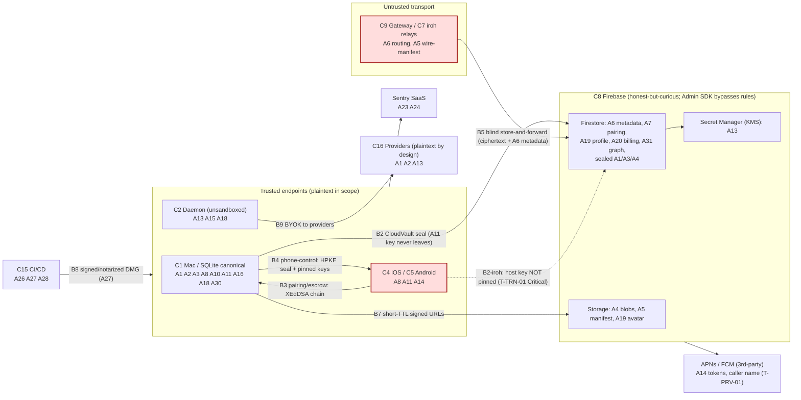

> **CONFIDENTIAL — BurnBar security package.** Independently code-verified at HEAD `5416ef780`. Share with Cure53 out-of-band; do not publish. Generated — see `_evidence/` for raw findings.

# BurnBar / OpenBurnBar — Asset Inventory (Phase 2)

This is the canonical asset register for the threat model. It enumerates every data and secret asset that crosses a trust boundary (B1–B9), the owner, where it lives **at rest** and **in transit**, the **C/I/A** requirement (High/Medium/Low), retention and deletion expectations, regulatory/privacy sensitivity, the **existing controls** that protect it (with code `file:line` citations pulled from the evidence files), the **gaps**, and the canonical threat/claim IDs that bear on it.

**Source-of-truth discipline.** Every load-bearing claim cites a real `file:line` drawn from `_evidence/` (primarily `02-cloudvault-signal.md`, `03-pairing-trust-revocation.md`, `06-cloud-authz.md`, `13-privacy-logging.md`, plus `_threats.tsv` / `_claims.json`). Where the package's marketing/doc wording outruns the code, the asset row is annotated **OVERCLAIM** and the conservative reading is given. C/I/A ratings reflect the data's sensitivity *if exposed/tampered/lost*, not whether a control currently meets it — the **Gaps** column records the delta.

## 0. Conventions, owners, and locations

- **Owners**: `User` (the human account holder); `Operator` (BurnBar/Alberto as service operator); `Provider` (external model providers, C16); `CI` (release pipeline, C15). Several assets are co-owned (e.g. push tokens are User-generated, Operator-custodied, Provider-relayed).
- **At-rest locations** (canonical components from `_INDEX.md §2`):
  - **C1 Mac (AgentLens)** — local SQLite canonical store + macOS Keychain. The Mac is the **local-first source of truth**; cloud is opt-in (`_INDEX.md:12`).
  - **C2 Daemon** — `~/.../daemon/` config store; holds provider creds in plaintext locally by design.
  - **C4 iOS / C5 Android** — Keychain (`WhenUnlockedThisDeviceOnly`) / AndroidKeyStore-wrapped SharedPreferences.
  - **C8 Firebase** — Firestore (metadata + sealed ciphertext) + Cloud Storage (sealed blobs) + Secret Manager (KMS-wrapped creds). Honest-but-curious for content; **Admin SDK bypasses rules** (B2).
  - **C7 iroh relays / C9 Hermes Gateway** — blind store-and-forward; ciphertext + routing metadata only.
  - **C16 Providers** — see plaintext by design (B9).
- **In-transit lanes**: HPKE-Auth relay seal (phone⇄Mac, `HermesRelayCrypto.swift`); CloudVault AES-256-GCM at-rest seal synced to Firestore; iroh QUIC P2P; Firestore long-poll fallback; APNs/FCM push; TLS to providers.
- **C/I/A key**: **H** = compromise = many/one user's sensitive plaintext, RCE, key/identity loss, billing fraud, or erasure-contract breach; **M** = meaningful impact with preconditions or metadata-level inference; **L** = hardening / low-impact leak.

---

## 1. Master asset table

| # | Asset | Description | Owner | At rest | In transit | C | I | A | Retention | Deletion expectation | Reg / privacy | Existing controls (file:line) | Gaps | Threats / Claims |
|---|---|---|---|---|---|---|---|---|---|---|---|---|---|---|
| A1 | **User messages (prompt bodies)** | Human chat/agent prompt text | User | C1 local SQLite (canonical); C8 Storage `users/{uid}/session_logs/.../bodies/*.json.aesgcm` + sealed snippets/titles when synced | HPKE-Auth relay seal; CloudVault AES-GCM in Firestore | H | M | M | Until user deletes; cloud copy until account erase | Hard-delete local + `eraseUserCloudData` tree | GDPR/CCPA content; possibly special-category by topic | Bodies sealed AES-256-GCM under vault key, "nobody w/o vault key" (`13-…:36`); path-bound AAD (CloudVaultCrypto.swift:1087-1092, `02-…:21`); vault key never uploaded cleartext (CloudVaultCrypto.swift:420,1426); plaintext write rejected `ciphertext_required` (hermesGateway.ts:439-446) | Local SQLite at-rest = **SQLCipher status unresolved** (see §2.1); endpoint compromise = plaintext (T-CVS-03); no PFS (T-CVS-05) | C2 (Partial); T-CVS-03/05; T-AI-06 |
| A2 | **Agent responses (model output bodies)** | LLM/agent reply text + tool-call narration | User/Provider | Same as A1 (`session_logs` bodies, sealed) | Same as A1 | H | M | M | Same as A1 | Same as A1 | Content; provider-derived | Generic push preview, reply text never copied to push (agentNotifications.ts:310, `13-…:57`); sealed bodies (`13-…:36`) | Model output is **untrusted** (B6) — injection steers within scope; output rendered as actions un-revalidated (T-AI-05) | C13 (Partial); T-AI-05; T-PRV-* |
| A3 | **Conversation history / RAG corpus** | Indexed past conversations, parsed agent logs, project memory | User | C1 SQLite + RAG index; C8 `conversations`,`mobile_assistant_chats`,`cli_sessions` (`contentSealed==true`) | CloudVault seal | H | H | M | Long-lived (memory) | Per-collection `dataDeletion.ts`; account erase | Content + behavioral profile | Sealed-content rules require `contentSealed==true`,`sealedSchemaVersion==2` (firestore.rules:1274-1277); plaintext-name fail-closed create (firestore.rules:1163-1165) | **Memory/RAG poisoning** — no write-time provenance/trust tier (T-AI-03); oracle injects unwrapped "authoritative findings" (T-AI-02); at-rest **rollback** — binding has no revision/seq (signal-envelope-contracts/src/index.ts:30-40, C12) | C2; C12 (Partial); T-AI-02/03 |
| A4 | **Attachments (file bytes)** | Files uploaded to/produced by agents | User | C8 Storage `users/{uid}/hermes_gateway_attachments/...` (sealed octet-stream); C1 local | Sealed-blob upload to GCS; iroh blob (Mercury) | H | M | M | Until deleted | Storage prefix cleanup `accountDeletion.ts` | Content; file names sensitive | Sealed client-side AES-256-GCM, `legacyFileName=undefined`, `application/octet-stream`, no fileName in storagePath (hermesGateway.ts:1447-1472); finalize skips sniff for sealed (hermesGateway.ts:1574-1580) | **Legacy plaintext fileName + bytes** stored/served; backfill strips manifest field on 24h lag but **no code deletes legacy plaintext Storage objects** (privacyBackfill.ts:95-99,234-236); seal is client-enforced, cloud can't prove ciphertext | C3 (Partial); T-ATT-02/06 |
| A5 | **Attachment metadata (manifest)** | Filename, MIME, size, peerDeviceId, byteCount, ciphertext sha256, storagePath | User/Operator | C8 manifest docs + Storage object metadata | Mercury advertise frame (iroh); Firestore | M | M | M | With attachment | With attachment | Linkability (filename leak) | At-rest Firestore manifest seals filename (T-ATT-03 mitigation); ciphertext size/path/hash always visible by design (hermesGateway.ts:1588-1602) | Wire manifest **unsealed at transport layer** — filename/mime/size leak to relay if frame not E2EE (T-ATT-03); manifest has **no MAC** → spoofable file identity (T-ATT-04); MIME trusted from extension (T-ATT-05) | T-ATT-03/04/05; C3 |
| A6 | **Message / routing metadata** | destinationId, senderId, sequence, kind, timestamps, attachmentIds, counters, deviceIds, projectKeyHash | User/Operator | C8 Firestore (cleartext by design); C7/C9 relay | Plaintext at rest in Firestore; relay frame headers | M | M | M | Per-collection | Account erase tree | **LINDDUN Linkability/Detectability**; traffic analysis | Owner-scoped reads `ownsUserNamespace` (firestore.rules:52); sealed-envelope structural validator on content fields only (firestore.rules:462-500) | Metadata **cleartext by design** — counts/timestamps/deviceIds/projectKeyHash operator-readable (T-AZ-03, `06-…:52`); **OVERCLAIM**: "ciphertext only" understates metadata exposure (`06-…:68`) | C2/C11; T-AZ-03; T-TRN-04 |
| A7 | **Pairing records (iroh)** | Signed iroh pairing record: host NodeAddr, relay URL, direct IPs, publishedAtMillis | User/Operator | C8 `iroh_pairing_keys/host`, `iroh_pairing/{conn}` (server-only-write); iOS **in-memory only** | Firestore fetch; Ed25519-signed record | M | H | M | Long-lived; republished ≤60s | Deleted on device revoke (controllers) | Linkability (persistent NodeIds) | Trust roots server-only-write (firestore.rules:2661-2665,2774); Ed25519 sig over canonical payload incl publishedAtMillis, 180s freshness (IrohRelayPairing.swift:133-168); Mac republishes ≤60s | **CRITICAL: iOS host key in-memory TOFU, not pinned/persisted** → cloud-substituted key MITMs control channel (FirestoreIrohPairingPublicKeyProvider.swift:27-47, T-TRN-01); stale-record replay in 3-min window (T-TRN-05); raw NodeIds/IPs/relayURL plaintext in Firestore (T-TRN-04) | **T-TRN-01 (Critical)**; T-PTR-03 (High); C9 (Partial) |
| A8 | **Device identity keys** | Per-device long-term Curve25519/P-256 identity keypair; escrow fingerprints | User | iOS Keychain `WhenUnlockedThisDeviceOnly`; AndroidKeyStore-wrapped SharedPrefs; C8 publishes **public** key only | Public key published to Firestore; signed in trust chain | H | H | M | Device lifetime | Removed from `trustedSenderPublicKeys` on revoke | Identity / non-repudiation | Server holds **public keys only**, cannot forge (SignalAtRestSealer.swift:226, `02-…:25`); fingerprint→bytes re-bind both sides (computerUseSecurity.ts:287; CloudVaultTrustedDeviceChainVerifier.swift:109,137); device-only Keychain blocks iCloud/backup exfil | **Private key extractable on compromised unlocked endpoint** — no Secure Enclave/`SecAccessControl`/StrongBox/user-auth (SignalIdentityKeyStore.swift:88-94; CloudVaultCrypto.kt:1206-1221, T-CVS-03); **OVERCLAIM**: "private key never leaves device" / "Secure Enclave/StrongBox" not realized (`02-…:61-62`) | **T-CVS-03 (High)**; T-AND-01; C5 |
| A9 | **Session / content keys** | Per-message random AES-256-GCM content keys; per-doc keys | User | Ephemeral in memory; HPKE-wrapped per recipient at rest | Wrapped to recipient public key | H | H | L | Per message | N/A (ephemeral) | — | Fresh random key per seal, no nonce reuse (`02-…:66`); content key HPKE-sealed per recipient (SignalAtRestSealer.swift:67-85) | No forward secrecy — content keys wrap to **static** recipient identity key (T-CVS-05); no ratchet at rest | T-CVS-05; C1/C2 |
| A10 | **Long-term signing keys** | Phone-control Ed25519/SE-P256; XEdDSA trust-chain key; gateway PoP Ed25519; controller key | User | iOS Keychain / Secure Enclave (`.biometryCurrentSet` SE-P256 controller); pinned in `ControllerKeyPinStore` | Signatures over intent hashes / PoP payloads | H | H | M | Long-lived | Revoked on device revoke | Authority root | Controller key Keychain-pinned, mismatch always refused (ControllerKeyPinStore.swift:96,198; PhoneControlAuthorityValidator.swift:216-217); monotonic counter + single-use proof persisted, fail-closed (PhoneControlAuthorityValidator.swift:133-143); PoP key server-only, immutable `write:if false` (firestore.rules:2580-2582) | **Asymmetric trust** — Mac→phone controller key pinned, phone→Mac host key not (T-PTR-03); SE-P256 controllers **exempt** explicit single-use proof (PhoneControlAuthorityValidator.swift:493-503, C7 Partial); first-pairing TOFU window (T-PTR-05) | C4/C7 (Partial); T-PTR-03/05 |
| A11 | **Encryption / vault keys (CloudVault)** | Per-user 32-byte CloudVault master key; DB key; recovery KEK | User | iOS Keychain `WhenUnlockedThisDeviceOnly` (CloudVaultCrypto.swift:1416,1426); Android KeyStore-wrapped; **never uploaded cleartext** | Wrapped ECIES-P256 to peer device pubkey, or recovery-KEK | H | H | H | Long-lived; rotated on revoke | Rotation retires old key; **no claw-back** of cached copies | **Crown-jewel** — decrypts all at-rest content | `SecRandomCopyBytes`/`SecureRandom` CSPRNG (`02-…:20`); wrong-key envelope fails closed (CloudVaultCrypto.swift:599); rotation enforces generation+1 + revokes old wrappers (cloudVaultRotation.ts:185,299-307); wrappers `delete:if false`, continuity check (firestore.rules:2204-2205,2254) | **No claw-back** — revoked device's cached vault key keeps decrypting until a survivor finishes rotation+rewrap (cloudVaultRotationResilience.ts:214-215, T-PTR-01); rotation **Mac-dependent / not server-driven**, starves on iOS-only or Devices-screen-avoidant survivors (T-PTR-02); key extractable on unlocked endpoint (T-CVS-03) | C5 (Partial); **T-PTR-01/02**; T-CVS-03 |
| A12 | **Refresh / access tokens** | Firebase Auth session token; gateway bearer token | User | Client secure storage; C8 `hermes_gateway_token_index` (hash, server-only) | TLS to Firebase; bearer in HTTP header | H | M | M | Session lifetime | Should revoke on device revoke | Auth credential | Bearer alone insufficient — per-request Ed25519 **PoP** on every active route (hermesGateway.ts:697-699,755-756, C4 Defensible); token index `read,write:if false` (firestore.rules:4250-4251); nonce single-use replay guard (hermesGateway.ts:758-771) | **No Firebase session revocation on escrow revoke** — `revokeRefreshTokens` not wired; revoked device keeps read access to ciphertext (C5 refutation, computerUseSecurity.ts revoke path); UNKNOWN if deployed Auth limits it | C4 (Defensible); C5 (Partial); T-GW-01 |
| A13 | **Provider API keys / credentials (BYOK)** | User's model-provider API keys, OAuth tokens, hosted-quota creds | User | C8 **Secret Manager** (KMS-wrapped DEK); C2 **daemon plaintext locally** (by design); Firestore stores **version name only** | TLS to Secret Manager; plaintext to provider at call time (B9) | H | H | M | Until disconnected | `eraseUserCloudData` deletes secret refs + Secret Manager versions (`13-…:61`) | Third-party credential; financial | Envelope: per-cred DEK, AES-256-GCM, KMS-wrapped DEK → Secret Manager version; Firestore holds only `secretVersionName` (secrets.ts:98-122,216-223; shared.ts:1537-1545); fail-closed if KMS unset (secrets.ts:100-102); `provider_account_secret_refs` `read,write:if false` (firestore.rules:1086-1088); plaintext-field denylist (firestore.rules:56-69) | **Server-side envelope, NOT E2E** — backend reconstructs plaintext in memory for quota refresh; KMS-decrypt + Secret-Manager-accessor IAM sees plaintext (secrets.ts:238-250; quota.ts:94); **daemon holds plaintext locally** ("plaintext vault fallback", see §2.2); **OVERCLAIM**: "never seen in plaintext" false | C10 (Defensible w/ caveat); T-DMN-01 |
| A14 | **Push tokens** | APNs VoIP token, FCM registration token | User/Operator/Provider | C8 `users/{uid}/devices/*`, `voip_outbound`, `fcm_outbound` (cleartext — must be) | TLS to APNs/FCM | M | M | M | Device lifetime; rotate on reinstall | With device / account erase | Stable cross-session correlator | Per-user scoping; tokens rotate on reinstall (`13-…:140`) | Stable `pairedDeviceId`/`connection_id` correlators flow to Apple+Google (T-PRV-07); **root `voip_outbound`/`fcm_outbound` not deleted on account erase, no TTL** (voipPush.ts:57,78; accountDeletion.ts:112-113, T-PRV-02) | **T-PRV-02 (High)**; T-PRV-07; C13 |
| A15 | **Local agent credentials** | Daemon socket bearer token; CLI-agent launch creds; HID root-bridge auth | User | C2 daemon socket token; launchd plist 0600 | Unix socket (token-auth) | H | H | M | Process lifetime | N/A | Local trust domain | Token-auth socket + DR code-sign gate (`_INDEX.md:18,33`); hardened runtime + library validation block dylib injection (T-DMN-01 mitigation); peer code-sig gate, launchd plist 0600 (T-DMN-05) | **Code-signature == authorization, no capability attenuation; daemon unsandboxed** — one signed-app RCE = full local agency + cred access (**T-DMN-01/02**); prod env escape hatch `OPENBURNBAR_DAEMON_DISABLE_PEER_CODESIG=1` (T-DMN-05); daemon doesn't re-verify phone proof (T-DMN-04) | **T-DMN-01/02 (High)**; T-DMN-04/05 |
| A16 | **Agent memory** | Persistent agent/project memory snapshots, `project_memory_snapshots` | User | C1 local; C8 sealed (`pm_`+HMAC doc IDs) | CloudVault seal | H | H | M | Long-lived | Account erase tree | Behavioral/content | Opaque vault-key-derived doc IDs (CloudVaultCrypto.swift:803-807, `13-…:74`); plaintext-field denylist on `project_memory_snapshots` (firestore.rules:1962-1963) | **Durable cross-session poisoning** via parsed third-party agent logs, no provenance/quarantine (T-AI-03); reaches model unwrapped via oracle (T-AI-02) | T-AI-02/03; C2 |
| A17 | **RAG sources** | Parsed third-party agent CLI logs ingested into corpus | User | C1 local parse → RAG index | N/A (local) | M | H | M | Long-lived | With corpus | Provenance integrity | Retrieval output wrapped at `formatPack` (T-AI-03 mitigation) | **No write-time validation / trust tier** — attacker text in a coding-agent log enters RAG with no provenance (LogParserProtocol.swift `ConversationRecord`, T-AI-03) | T-AI-02/03 |
| A18 | **Tool registry / config** | Capability grants, scope allow rules, deny registry, CLI flag presets | User | C1 grant store; daemon config | Signed grant requests (queued/live) | M | H | M | Grant TTL | Revoked on device revoke | Authority config | Server-only trust elevation (firestore.rules:3448-3451); grant authority pinned via controller pin (AgentCapabilityGrantQueueListener, T-TOOL-06); deny registry built-in rules; high-risk grants need single-use proof bound to op hash (computerUseSecurity.ts:911-922,2193-2196) | Grant **authority pubkey TOFU from Firestore** before first pin (T-TOOL-06); **YOLO** preset emits `--dangerously-skip-permissions` / unsandboxed shell (CLIArgumentBuilder.swift:52,87, **T-TOOL-02 Critical**); **revoke ≠ kill** in-flight CLI (T-TOOL-03); path denies heuristic (T-TOOL-08) | **T-TOOL-02 (Critical)**; T-TOOL-01/03/06; T-AI-07 |
| A19 | **User profile** | Root `users/{uid}` profile doc, display name, avatar | User | C8 `users/{uid}` root doc; Storage `avatars/{uid}/profile.jpg` | TLS | M | M | M | Account lifetime | Account erase tree | PII (name, photo) | Root write allowlist + field caps + `uid` pinned (firestore.rules:77-113,1151); secret-field denylist (firestore.rules:56-69) — remediates legacy RR-6 | **Avatar cross-tenant readable** — any authed user reads any `avatars/{userId}/profile.jpg` (storage.rules:19, T-AZ-01); macOS Sentry anon-id seeds from `NSFullUserName()` real name (T-PRV-03) | T-AZ-01; T-PRV-03; C11 (Partial) |
| A20 | **Billing / entitlements** | Pro/quota entitlement state, Stripe bindings, usage counters | User/Operator | C8 entitlements + events + bindings | TLS; Stripe webhooks | M | H | M | Account lifetime | Account erase | Financial | Entitlements **server-write-only** — `allow write:if false`, read owner-scoped (firestore.rules:3364-3367,3373-3383) — clients cannot self-grant Pro | Usage facets (cost/tokens/provider) cleartext metadata, operator-readable (T-AZ-03; T-PRV-05) | C11 (Defensible); T-AZ-03 |
| A21 | **Logs (server)** | Structured Cloud Function logs | Operator | GCP logging | N/A | M | M | L | Per log policy | Per policy | Disclosure if PII leaks | PII scrubber: email/IPv4/known-prefix/CC patterns, key-redaction, UID→8 chars, 1024 truncate (logging.ts:48-99,32-45); callable logs mostly `event/callable/trace_id/user_id_hash` | **Pattern-based, not allowlist** — numeric fields + non-pattern PII pass through; new provider key formats uncovered; free-form `String(error)` may carry tokens/paths (logging.ts:72-90,163-170, T-PRV-04) | T-PRV-04; C13 (Partial) |
| A22 | **Analytics / telemetry** | Media analytics events, search facets, posting graph | User/Operator | C8 `cloud_search_chunks`/`postings`; facet fields cleartext | TLS | M | L | L | Long-lived (no TTL on some) | Account erase (in `users/{uid}`) | LINDDUN Linking/Detecting | Media analytics content-free + no-op default sink (MediaAnalyticsEvent.swift:10-12,59, `13-…:60`); no Firebase Analytics/Amplitude wired; keyed search trapdoors HMAC per-user (CloudVaultCrypto.swift:850-859) | **Search facets cleartext** (provider/model/device/cost/time) + hash co-occurrence + query hashes in clear → inference (T-PRV-05); **OVERCLAIM**: "zero-knowledge" overstated (`13-…:163`); agent-notification events provider label, **no TTL** (T-PRV-06) | T-PRV-05/06; C13 |
| A23 | **Crash reports (client)** | iOS/macOS Sentry crash payloads, breadcrumbs | User/Operator | Sentry SaaS (3rd-party) | TLS to Sentry | M | L | L | Sentry retention | Sentry-side | **Disclosure + Unawareness** | `tracesSampleRate=0`; DSN absent in OSS builds → disabled; server-side Sentry **is** scrubbed (sentry.ts:82-152) | **No client `beforeSend`/breadcrumb scrubber, no consent gate** on iOS/macOS — default breadcrumbs (network URLs, params, console) + exception strings ship unscrubbed; client/server **asymmetric** (AppDelegate.swift:53-85, AgentLensApp.swift:1168-1202, T-PRV-03); **OVERCLAIM**: "no PII" / "consent posture" false (`13-…:162`) | **T-PRV-03 (High; Critical if prod DSN)**; T-AND-06; C13 |
| A24 | **Crash reports (server)** | Cloud Function Sentry events | Operator | Sentry SaaS | TLS | L | L | L | Sentry retention | Sentry-side | Disclosure | `sanitizeSentryEvent` deletes `request.data/cookies/env/query_string`, redacts body/payload/data, `sendDefaultPii:false`; UID `sha256[:16]` (sentry.ts:82-152,175-183) | Free-form `Error.message` residual risk if it embeds user content (C13 gap) | C13 (Partial); T-PRV-04 |
| A25 | **Admin credentials** | Firebase Admin SDK service-account creds; `burnbarOperator` custom claim | Operator | GCP IAM / service-account keys (deployed; **not in repo**) | GCP auth | H | H | M | Operator-managed | Operator-managed | **Bypasses all Firestore rules (B2)** | Operator claim server-minted, gates only ops aggregate collections (firestore.rules:38-40,3068-3074); centralized `assertOwnership` + `enforceAuthAndAppCheck` (auth.ts:22-31,69-73) | **Admin SDK bypasses rules** — a callable deriving uid from body without `assertOwnership` = cross-tenant (T-AZ-05, 100 handlers not all verified); `burnbarOperator` **issuance custody UNKNOWN from repo** (T-AZ-07) | T-AZ-05/07; C11 (Partial) |
| A26 | **CI/CD credentials** | GitHub Actions repo token, deploy creds, signing keys (Sparkle Ed25519, GPG, cosign) | CI/Operator | GitHub secrets; KMS (deployed) | CI runners | H | H | M | Operator-managed | Operator-managed | **Supply-chain critical (B8)** | Most actions SHA-pinned; tag-gated deploys from signed tag; `npm ci` from committed lockfile; least-priv tokens (T-SC-01/07 mitigations); release attests actual DMG/zip (release.yml:707-737) | **Mutable action tags** in several workflows (fast-feedback.yml:478 etc., T-SC-01); **`cargo deny` silently no-ops** = false assurance (T-SC-02); **single CODEOWNER** = no separation of duties (T-SC-03); GPG signing best-effort/optional (T-SC-06) | T-SC-01/02/03/06 |
| A27 | **Build artifacts** | Released DMG/zip, AAR, iroh xcframework | CI | GitHub Releases; live update feed | HTTPS download | M | H | H | Release lifetime | Superseded by new release | Integrity / authenticity | DMG Ed25519 vs pinned key + notarization + cosign + post-publish live-feed verify (release.yml, `_INDEX.md:56`); AAR diff-checked | xcframework lacks rebuild-parity gate if vendored (T-SC-05); provenance SBOM attests source tree not as-shipped bytes (T-SC-08); production E2E transport on iroh `1.0.0-rc.0` (T-TRN-07) | T-SC-05/08; T-TRN-07 |
| A28 | **Env-var secrets** | `KMS_KEY_NAME`, `SENTRY_DSN`, gateway/relay config, RC flags | Operator | Deployed function env / Remote Config (**not in repo**) | Deploy pipeline | H | M | M | Operator-managed | Operator-managed | Config-as-secret | `firebase.json` predeploy from signed tag; strict-secret gate (release.yml:139-170) | `firebase.json` predeploy runs arbitrary npm build with deploy creds (T-SC-07); **deployed RC values UNKNOWN** — could flip `signal_at_rest_*_enabled`, `requireHighRiskNonce`, App Check off (see §2.4) | T-SC-07; multiple UNKNOWNs (§2.4) |
| A29 | **DB backups / PITR** | Firestore point-in-time-recovery, scheduled backups, delete-protection | Operator | GCP (deployed; **not in repo**) | N/A | M | M | **H** | Operator-managed | Operator-managed | Loss = unrecoverable user data | None provable from code | **No PITR/backup/delete-protection determinable from repo** — operational availability risk; legacy RR-4/T-CL-1 flagged absent 2026-06-11 (`06-…:78`). `cloud_vault_state/current` corruption/delete with no PITR = **permanent loss of decrypt continuity** for synced data; vault-key continuity rule (firestore.rules:2204-2205) protects vs client rotation, not backend data loss | §2.3; T-AZ; UNKNOWN |
| A30 | **Recovery bundle** | PBKDF2-wrapped export of the SQLCipher DB key | User | Exported file (disk/cloud, user-controlled) | User-transferred | H | M | M | Until user discards | User-controlled | Crown-jewel-adjacent | PBKDF2-HMAC-SHA256, random 16-byte salt, AES-GCM wrap of DB key (DatabaseEncryptionService.swift:161-205) | **100k iterations < OWASP 600k**; no passphrase-strength gate; **import trusts attacker-supplied iteration count, no floor** → leaked bundle + weak passphrase = offline-grindable DB key (DatabaseEncryptionService.swift:161-166,223-225, T-CVS-04) | T-CVS-04 (Medium) |
| A31 | **Pairing / trusted-device graph** | `escrow_devices`, trust-chain sigs, controller pins, revocation receipts | User/Operator | C8 escrow/trust collections (server-only-write); C1 controller pin store | XEdDSA trust-chain sigs; Firestore | M | H | M | Device lifetime | Atomic revoke severs grants/controllers/sessions | Identity graph | Server-only trust elevation, every identity field byte-frozen on update (firestore.rules:3448-3514); XEdDSA verified server-side + client re-verified from bytes (computerUseSecurity.ts:1396,706; CloudVaultTrustedDeviceChainVerifier.swift); atomic revoke (computerUseSecurity.ts:1456-1617) | **Approve-time safety-code compare UI defaults OFF** (EscrowDeviceSafetyCode.swift:202, T-PTR-04); cloud-controlled inbound allowlist admits/locks out (T-TRN-02); `cloud_vault_key_wrappers` client-write lacks generation-monotonicity in rules (T-PTR-06) | C5; T-PTR-04/06; T-TRN-02 |

---

## 2. At-rest reality reconciliation (mandated)

The spec requires reconciling the table above with four specific local-at-rest realities. Each is a **first-class availability/confidentiality consideration**, not a footnote.

### 2.1 SQLCipher / local-DB-at-rest status (RR-1) — **conservative: not currently guaranteed from code at HEAD**

The Mac is the **canonical store** (`_INDEX.md:12`), so the local SQLite DB holds the broadest plaintext set of any single location: messages (A1), responses (A2), history/RAG (A3), agent memory (A16). The DB key is managed by `DatabaseEncryptionService.swift` (held at `WhenUnlockedThisDeviceOnly`, `02-…:31` cites `DatabaseEncryptionService.swift:110`) and a PBKDF2 recovery bundle wraps it (A30). However, `_INDEX.md:95` (RR-1) explicitly flags: *"verify SQLCipher codec status at HEAD … 'encrypted database' still likely unsafe wording."* The reviewed evidence (`02`, `10`) establishes that **a DB key exists and a recovery bundle wraps it**, but does **not** independently confirm the SQLCipher codec is engaged on the live DB file at HEAD.

**Conservative reading for the asset table:** treat A1/A2/A3/A16's **local at-rest C** as protected by macOS Keychain custody of the DB key *only if* SQLCipher is active; the phrase "encrypted local database" is **unsafe wording** until the codec status is confirmed against the live build. This is consistent with the package-wide rule that endpoint compromise on an unlocked device defeats local confidentiality regardless (T-CVS-03; `_INDEX.md:100`). **Action for Cure53:** confirm the SQLCipher codec is loaded and the DB file is not plaintext-readable at HEAD; resolve RR-1 from the live build, not the register.

### 2.2 Plaintext continuity-credential file (if still present) — **flag against A13/A15**

`_claims.json` C10 records that the **macOS daemon necessarily handles provider credentials in plaintext locally**, with a documented *"plaintext vault fallback"* (TECH_DEBT_AUDIT_2026-06-11.md) and tests asserting *"legacy local plaintext vaults are scrubbed"* (`OpenBurnBarConfigStoreTests.swift`) — see `_claims.json` C10 refutation. This is the **plaintext continuity-credential reality**: provider API keys and connection/continuity creds (A13) live in plaintext in the daemon's local config store (C2), out of Firestore scope, but in clear reach of any same-UID process (B1) and of a compromised/unsandboxed daemon (T-DMN-01/02).

**Conservative reading:** A13's "never seen in plaintext" wording is **false** for the local plane; the Secret-Manager/KMS guarantee (C10 Defensible) is a **Firestore-exposure** boundary, not an end-to-end or local-plaintext guarantee. **Action for Cure53:** confirm whether any residual plaintext continuity-credential file still exists in shipping builds — the test asserts scrubbing of *legacy* vaults; verify completeness and that no current write path re-creates a plaintext vault. This is the second place (after SQLCipher) where "encrypted at rest" marketing must be qualified.

### 2.3 No-PITR / no-backups operational risk — **A29, Availability = High**

`06-…:78` and `_INDEX.md:97` mark **Firestore PITR / backup / delete-protection as UNKNOWN-from-repo** (legacy RR-4/T-CL-1 flagged absent 2026-06-11). Because the architecture is local-first (Mac canonical), an isolated Firestore loss is partly survivable for users with a live Mac — but two compounding factors make this **Availability-High** for the cloud plane:

1. **`cloud_vault_state/current`** is the single doc naming the active `vaultKeyID`. The rules enforce client-side continuity (firestore.rules:2204-2205) but **cannot protect against a backend delete/corruption**. With no PITR, loss of this doc or the wrapper set (A11) breaks **decrypt continuity** for all cloud-synced sealed data for users without a surviving Mac that still holds the raw key.
2. The **erasure-contract gap** (T-PRV-02) is the inverse problem: root `voip_outbound`/`fcm_outbound` (A14) persist *forever* with cleartext caller metadata and **no TTL**, so the cloud plane simultaneously **over-retains** identifying push payloads while **under-protecting** key-continuity.

**Action for Cure53:** confirm deployed PITR/backup/delete-protection state and TTL policies via GCP console export — none are provable from the repo.

### 2.4 Deployed-config UNKNOWNs that move asset ratings (A28)

Several asset protections are **code-default-secure but deployment-overridable**; the live values are not in the repo and would change the ratings:

| Flag / setting | Code default | Risk if flipped | Affected assets |
|---|---|---|---|
| `signal_at_rest_<domain>_enabled` (RC) | **OFF** (MobileCloudVaultSignalPayloads.swift:117-119, `02-…:29`) | Signal sender-auth is **inert** until ON; once ON, legacy-strip downgrade (T-CVS-01) bites | A1/A3/A16 |
| `requireHighRiskNonce` / `ENFORCE_APP_CHECK` | **prod-ON** (config.ts:92-95,78-84) | Replay/attestation defense disabled; high-risk grant + pairing replay | A10/A12/A31 |
| App Check **console** SDK-datapath enforcement | **UNKNOWN from repo** (firestore.rules:20-23) | Non-app client w/ stolen token writes via SDK (T-AZ-06) | A6/A19/A20 + all owner-writable |
| `ControllerKeyPinEnforcementFlag` / `EscrowDeviceTrustSafetyCheckFlag` | ON / **OFF** (`03-…:82`) | First-contact key poisoning / unconfirmed approvals | A10/A31 |
| `SENTRY_DSN` (client) | absent in OSS | If set for **public** App-Store builds, T-PRV-03 is **Critical** for real users | A23 |

---

## 3. Asset → trust-boundary map

The two red-edged nodes carry the package's headline asset risks: the **iOS↔Firestore iroh host-key lane (B2-iroh, T-TRN-01 Critical)** where A7's host pairing key is in-memory TOFU, and the **relay/gateway lane** where A6 routing metadata and A5 wire manifests are observable.

---

## 4. Framework lens mapping (mapped, not name-dropped)

| Framework | Lens applied to assets | Representative assets & threats |
|---|---|---|
| **STRIDE** | Information Disclosure dominates the data assets; Tampering on A3 (at-rest rollback, C12), A5 (unsigned manifest, T-ATT-04); Elevation on A15/A18 (daemon authZ, T-DMN-01; YOLO, T-TOOL-02); Spoofing on A7/A10 (host-key MITM, T-TRN-01) | A1/A6/A13/A22/A23 (Disclosure); A15/A18 (Elevation) |
| **LINDDUN** | **Linking** A6/A14/A22 (deviceIds, push correlators, facets); **Detecting** A6/A22 (access-pattern inference, T-PRV-05); **Disclosure** A1/A4/A13/A23; **Unawareness** A23 (no consent gate); **Non-compliance** A14 (erasure breach, T-PRV-02); **Non-repudiation** A14 (call-attempt timestamps) | A14 (Non-compliance + Linking); A22 (Detecting) |
| **OWASP LLM Apps 2025** | LLM01 prompt injection (A2/A3/A16/A17 via T-AI-01/02/03); LLM02 sensitive-info disclosure (A1/A13 to providers, T-AI-06); LLM06 excessive agency (A18, T-AI-07/T-TOOL-02); LLM08 vector/embedding & memory poisoning (A3/A16/A17) | A18 (excessive agency); A16/A17 (memory poisoning) |
| **OWASP Agentic Apps 2026** | Tool-config/registry integrity (A18); memory-poisoning durability (A16/A17); kill-switch/loss-of-control (A18, T-TOOL-03/04) | A18 |
| **MITRE ATLAS** | AML.T0051 LLM prompt injection (A2/A3); AML.T0070 RAG poisoning (A17); AML.T0048 gateway downgrade (T-CRY-01) | A17 |
| **OWASP ASVS 5.0** | V6 stored crypto (A8/A11 extractable keys, T-CVS-03; A30 weak KDF, T-CVS-04); V8 data protection (A6/A13 metadata/plaintext); V4 access control (A19/A31) | A11/A30 (crypto-at-rest) |
| **OWASP API Security 2023** | API1 BOLA (A19 avatar cross-read, T-AZ-01; A4 path); API3 BOPLA (A6/A13 non-denylisted fields, T-AZ-04); API5 BFLA (A25 Admin-SDK bypass, T-AZ-05) | A19/A25 |
| **OWASP MASVS/MASTG** | STORAGE-1/CRYPTO-2 (A8/A11 Android key recovery, T-AND-01); NETWORK-1 (T-AND-02 cleartext); PRIVACY (A23 client crash, T-AND-06) | A8/A11 (mobile key storage) |
| **MITRE CWE Top 25 2025** | CWE-312 cleartext storage (A4 legacy, A13 daemon, A23 unscrubbed); CWE-400/770 resource exhaustion (A4 Mercury, T-ATT-01); CWE-409 decompression (T-ATT-01); CWE-345 insufficient integrity (A5, T-ATT-04) | A4/A13 (CWE-312); A4 (CWE-400) |
| **NIST CSF 2.0** | **Identify** = this inventory itself; **Protect** = A11 seal / A13 KMS; **Detect** = A21/A23 logging gaps; **Respond** = A31 revoke; **Recover** = A29/A30 (PITR gap, recovery bundle) | A29 (Recover); A11 (Protect) |
| **NIST Zero Trust** | Cloud untrusted-for-content (A6 metadata still leaks); transport identity = "whatever Firestore returns" violates ZT for A7 (T-TRN-01); B1 "all UID processes equally trusted" is the explicit ZT exception (A15) | A7/A15 |
| **NIST SSDF** | A26/A27/A28 build-integrity (PW.4/PS.2/PO.3) — mutable tags (T-SC-01), optional signing (T-SC-06), single CODEOWNER (T-SC-03) | A26 |
| **OWASP SCVS / SLSA** | A27 provenance (SBOM-of-source not as-shipped, T-SC-08; rebuild-parity gap, T-SC-05); A26 ecosystem-deny no-op (T-SC-02) | A27 |

---

## 5. Asset priority ranking (for Cure53 triage)

| Rank | Asset(s) | Why | Driving threats |
|---|---|---|---|
| 1 | **A11 vault keys + A7 pairing key** | Crown-jewel key + the one transport-identity anchor that is **not pinned** on iOS | T-TRN-01 (Critical); T-PTR-01/02; T-CVS-03 |
| 2 | **A15 local agent creds + A18 tool registry** | Code-sign-as-authZ + unsandboxed daemon + YOLO shell = injection-to-RCE | T-DMN-01/02; T-TOOL-02; T-AI-07 |
| 3 | **A13 provider creds** | Server-decryptable + daemon plaintext fallback; financial blast radius | C10 caveats; T-DMN-01 |
| 4 | **A1/A3/A16 content + A23 crash** | Broadest plaintext set; SQLCipher status open + unscrubbed client crash egress | RR-1 (§2.1); T-PRV-03; T-CVS-03 |
| 5 | **A14 push tokens / A29 backups** | Erasure-contract breach (over-retention) + PITR availability gap (under-recovery) | T-PRV-02; §2.3 (PITR UNKNOWN) |

---

## 6. Open questions (deployed evidence required — none resolvable from repo)

1. **SQLCipher codec engaged on the live local DB at HEAD?** (resolves §2.1 / RR-1; "encrypted local database" is unsafe wording until confirmed.)
2. **Any residual plaintext continuity-credential / "plaintext vault fallback" file in shipping builds?** (resolves §2.2 / A13 local plane.)
3. **Firestore PITR / scheduled backups / delete-protection + TTL policies** state in prod (resolves §2.3 / A29; T-PRV-02/06 retention).
4. **Deployed Remote Config / env values** for the flags in §2.4 (App Check console enforcement, `requireHighRiskNonce`, `signal_at_rest_*_enabled`, controller/safety-code flags, client `SENTRY_DSN`).
5. **IAM bindings** on the KMS key and Secret Manager secrets (who can decrypt A13) and **`burnbarOperator` claim issuance custody** (A25/T-AZ-07).
6. **Legacy data state**: residual plaintext Firestore docs / Storage objects (A4 legacy attachment bytes, A6 legacy plaintext metadata) and whether `privacyBackfill` has converged fleet-wide.
