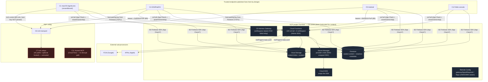
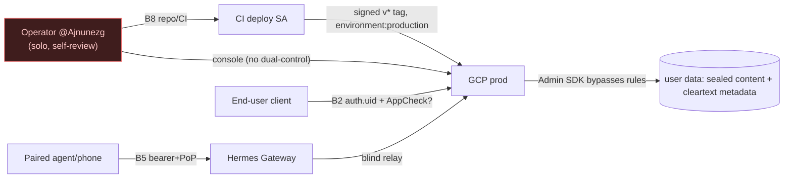

> **CONFIDENTIAL — BurnBar security package.** Independently code-verified at HEAD `5416ef780`. Share with Cure53 out-of-band; do not publish. Generated — see `_evidence/` for raw findings.

# Cloud & Operations Threat Model (Phase 10)

Scope: the **cloud control plane** (Firebase / GCP project `burnbar`), the **operational reality** of running it, and **detection & response** for the high-risk threats that land in the cloud. BurnBar is local-first: the canonical store is local SQLite on the Mac, every cloud feature is opt-in, content fields are sealed client-side before they reach Firestore, and the cloud (C8) is trusted only for **availability, ordering, and authz-metadata**, never for content (B2). This document treats the cloud as **honest-but-curious for content and a first-class adversary for confidentiality** (`_INDEX.md §3 B2`), and the operator as a **solo individual** (`@Ajnunezg`, single CODEOWNER — `_evidence/14-supply-chain.md:57`).

CODE is the source of truth. Every load-bearing claim cites a real `file:line` pulled from the evidence files. Where a control's effectiveness depends on **deployed state not in the repo** (App Check console enforcement, Firestore PITR/backups, alert channels, Remote Config values, branch protection), it is marked **UNKNOWN** and routed to `open-questions.md`. Conservative posture throughout: "not currently guaranteed" beats "secure."

Component IDs (C1–C16), trust boundaries (B1–B9), and threat IDs (T-AZ / T-GW / T-SC / T-PRV / T-TRN / T-CVS) are canonical from `_INDEX.md`, `_threats.tsv`, and `_claims.json`. They are **not** renumbered here.

---

## 10.0 Cloud surface at a glance

---

## 10.1 Cloud Asset Inventory

Single project, single region (accepted risk — see §10.4). "Externally exposed?" means reachable by a non-operator principal (an end-user client or the public internet), **not** that it is unauthenticated. "Logs" and "Backup" columns are marked **UNKNOWN** where they depend on deployed GCP console state the repo cannot prove.

| # | Resource | Purpose | Env | Externally exposed? | Data stored | IAM / authz model | Encryption | Logs | Backup / DR | Owner | Evidence |
|---|---|---|---|---|---|---|---|---|---|---|---|
| A1 | **Firestore** (default db) | Sealed content + cleartext routing/metadata; authz-metadata; ordering | prod (single project) | Yes — via Firebase SDK with `request.auth` (App Check console-toggle UNKNOWN) | Sealed AES-256-GCM content fields; **cleartext** metadata: counts, timestamps, deviceIds, projectKeyHash, provider/model/cost facets, push tokens, search token/semantic hashes | `firestore.rules` (4254 lines) deny-by-default; `ownsUserNamespace(uid)` on every user collection; server-only/`if false` for indexes, nonces, secret refs | Google-managed at-rest (default); content also client-sealed | Firestore audit logs **UNKNOWN** (deployed config) | **PITR / delete-protection UNKNOWN** — flagged absent 2026-06-11 (legacy RR-4/T-CL-1) | `@Ajnunezg` (solo) | `06-cloud-authz.md:20-36,78`; `13-privacy-logging.md:34-46` |
| A2 | **Cloud Storage** | Sealed session-log bodies, sealed attachments, avatars, export blobs | prod | Yes — `storage.rules` + short-TTL signed URLs | `users/{uid}/session_logs/.../bodies/*.json.aesgcm` (sealed); sealed attachment objects (octet-stream, no filename in path); `avatars/{uid}/profile.jpg` (**not** sealed) | `storage.rules` (30 lines) owner-only + size/contentType caps; default-deny `{allPaths=**}`; **avatars `read: if request.auth != null` (cross-tenant)** | Google-managed at-rest; bodies/attachments client-sealed; **avatars cleartext** | Storage access logs **UNKNOWN** | Object versioning / retention **UNKNOWN** | `@Ajnunezg` | `06-cloud-authz.md:33-36,50,60`; `13-privacy-logging.md:36` |
| A3 | **Cloud Functions** (~100 onCall + 8 onRequest) | Connect/quota/search/export/account-deletion/pairing/approval callables; Admin SDK I/O | prod | Yes — onCall (auth+AppCheck) + onRequest (some public) | Transient plaintext in memory (quota refresh decrypts creds); no persistent secrets in code | `enforceAuthAndAppCheck` + `assertOwnership` per-handler **convention**; `enforceAppCheck` defaults true, prod fail-closed | TLS in transit; runs with Admin SDK (bypasses rules) | Structured logs via `logging.ts` scrubber (pattern-based) | N/A (stateless); source in repo | `@Ajnunezg` | `06-cloud-authz.md:31-32,54`; `13-privacy-logging.md:52-54` |
| A4 | **Secret Manager** | Provider API credentials (BYOK / hosted-quota) at rest | prod | No — server-only (`provider_account_secret_refs read,write: if false`) | Envelope `[encDEK\|iv\|ct\|tag]` as Secret Manager version; Firestore holds only `secretVersionName` | Admin SDK + `secretmanager.secretAccessor`; rules-locked refs | **AES-256-GCM DEK wrapped by Cloud KMS** (envelope, server-decryptable) | Secret access audit logs **UNKNOWN** | Managed by GCP; version history | `@Ajnunezg` | `_claims.json` C10 `secrets.ts:98-122,216-223`; `06-cloud-authz.md:28` |
| A5 | **Cloud KMS** | Wraps the per-credential DEK | prod | No — Function ADC only (`cloudkms` scope) | Key material (not exportable) | `roles/cloudkms.cryptoKeyDecrypter` on the Function SA — **deployed bindings UNKNOWN** | HSM/software level **UNKNOWN**; rotation **UNKNOWN** | KMS audit logs **UNKNOWN** | Managed | `@Ajnunezg` | `_claims.json` C10 `secrets.ts:39,100-102,111-119`; `06-cloud-authz.md:79` |
| A6 | **Remote Config** | `gatewaySignalRequiredMode()`, App-Check / high-risk-nonce flags, gateway version floors | prod | Indirect (drives server behavior) | Flag values | Operator-managed in console | N/A | Change history **UNKNOWN** | N/A | `@Ajnunezg` | `05-gateway-pop.md:71`; `_claims.json` C12 `config.ts:92-95` |
| A7 | **APNs (VoIP push)** | Wake-up call delivery to iOS | prod (external) | Yes — Apple sub-processor | **Cleartext** `callId, connectionId, pairedDeviceId, displayName, isVideo`; APNs JWT ES256 (`.p8`) | Apple-side; BurnBar holds `.p8` signing key | TLS HTTP/2; payload **not** sealed | `lastFailureReason` captured server-side (may carry tokens) | Apple retention **UNKNOWN** (DPA) | `@Ajnunezg` | `13-privacy-logging.md:42,70,84-88` (T-PRV-01) |
| A8 | **FCM (Android push)** | Agent-reply + VoIP data messages | prod (external) | Yes — Google sub-processor | Agent-reply: generic preview only; VoIP: **cleartext** `caller_name, call_id, connection_id, paired_device_id` | Google-side; FCM server key | TLS; agent-reply content-minimized, VoIP **not** sealed | Google-side | Google retention **UNKNOWN** (DPA) | `@Ajnunezg` | `13-privacy-logging.md:42,57,70` (T-PRV-01) |
| A9 | **Hosted MCP** (Cloud Run, C11) | Hosted Model Context Protocol surface | prod | Yes | No decrypt path — untrusted for content | Per-service (`services/hosted-mcp/`) | TLS; no plaintext content access | **UNKNOWN** | N/A | `@Ajnunezg` | `_INDEX.md §2 C11` |
| A10 | **iroh relays** (C7) | NAT-traversal / relay for iroh P2P control + media | prod (n0 public set / optional hosted) | Yes — **untrusted** | Observes IP + NodeId + sizes + timing (**metadata only**); payload E2E-sealed | None (relays are not a trust anchor) | Payload sealed by `HermesRelayCrypto`; relay sees ciphertext | n0-side / hosted-side **UNKNOWN** | N/A | `@Ajnunezg` | `_threats.tsv` T-TRN-04 `FirestoreIrohPairingDirectory.swift:42-81` |
| A11 | **Firebase Hosting → Cloud Run** (gateway edge, C9) | `burnBarHermesGateway` onRequest dispatcher | prod | Yes — bearer + Ed25519 PoP only (no App Check by design) | Forwards sealed envelopes; never decrypts | Bearer token (sha256-indexed) + per-request PoP pinned at pairing | TLS; envelope shape-validated, never opened | Function logs (scrubbed) | N/A | `@Ajnunezg` | `05-gateway-pop.md:13-22,46` (T-GW-01) |

**Inventory caveats that are accepted risks (call them out to Cure53):**
- **Single project + single region** — Firestore/Storage/Functions/Secret Manager all live in one GCP project, one region. No cross-region replica, no project-level blast-radius separation between prod data and ops telemetry. Accepted for a solo-operator local-first product; the compensating control is that **content is client-sealed**, so a region/project loss is an availability event, not a confidentiality event — except for the cleartext metadata and the legacy/avatar surfaces below.
- **Admin SDK bypasses `firestore.rules` everywhere** (B2). The ~100 onCall + 8 onRequest handlers are the real authz boundary, enforced by **per-handler convention** (`assertOwnership`), not a structural guarantee (T-AZ-05).
- **Avatars are cross-tenant readable** (T-AZ-01) — accepted-risk profile-photo BOLA.

---

## 10.2 Production Access Model

### 10.2.1 Solo-operator reality

There is **one** human operator and **one** CODEOWNER (`@Ajnunezg`) who owns everything including `.github/workflows/` (`_evidence/14-supply-chain.md:57`, `.github/CODEOWNERS:4,18`). This is the dominant operational risk: **no separation of duties** (T-SC-03, High). Every "who reviews / who approves / break-glass" answer below collapses to the same person, so the model leans on **automated gates** (CI, signed tags, fail-closed callables, sealed content) rather than human dual-control.

### 10.2.2 Who/what can reach prod, and how it is gated

| Principal | What it can reach | Grant mechanism | Logged? | Reviewed? | Break-glass | Evidence |
|---|---|---|---|---|---|---|
| **Operator `@Ajnunezg`** (human) | GCP console (Firestore/Storage/Functions/Secret Manager/KMS), Firebase console (App Check, Remote Config), GitHub repo+secrets | Google account + GitHub account | GCP/Firebase admin activity logs **UNKNOWN**; git history yes | **Self-review** (single CODEOWNER) — T-SC-03 | None defined in repo; operator *is* break-glass | `14-supply-chain.md:57,62` |
| **CI deploy SA** (`GCP_SA_KEY`) | Deploys Functions/rules/indexes from a signed `v*` tag | `google-github-actions/auth` in `deploy-production.yml`; gated `environment: production` | GitHub Actions logs | Tag-gated, not human-gated | n/a | `14-supply-chain.md:24,93-94` |
| **End-user client** (C1/C4/C5/C12) | Own namespace only | Firebase Auth (`request.auth.uid`) + App Check (console enforcement UNKNOWN) | Function logs | Rules + `assertOwnership` | n/a | `06-cloud-authz.md:20,31-33` |
| **Paired agent / phone** (gateway, B5) | Gateway relay surface for its own account | Bearer token + Ed25519 PoP pinned at pairing | Function logs | PoP-before-entitlement ordering | n/a | `05-gateway-pop.md:13-21` |
| **`burnbarOperator` custom-claim holder** | `ops/*` aggregate metrics across tenants (telemetry, **not** user content) | Server-minted claim — **issuance custody UNKNOWN** | n/a | n/a | n/a | `06-cloud-authz.md:56` (T-AZ-07) |
| **Admin SDK** (in every Function) | Anything, ignoring rules | Implicit in Functions runtime | Function logs | Per-handler `assertOwnership` convention | n/a | `06-cloud-authz.md:54` (T-AZ-05) |

### 10.2.3 Admin / data / key / deploy capabilities

- **Admin capabilities:** the operator can read/write any Firestore doc and Storage object via the GCP console or an Admin-SDK script — **rules do not constrain the operator**. The confidentiality wall is **encryption**, not IAM: sealed content is unreadable even to the operator without a device vault key (C2 Partial); but **cleartext metadata, avatars, and any legacy plaintext** are fully operator-visible (`_claims.json` C2 `privacyBackfill.ts:95-109`; T-AZ-03).
- **Data access:** end-users reach only their own namespace (C11 Partial — object authz holds at the rules layer with the avatar exception). The operator and Admin SDK reach all of it (by design for availability/migration; the seal is the boundary).
- **Key access:** the **KMS-wrap of provider-credential DEKs is server-decryptable** — the Function SA holds `cloudkms` + `secretmanager.secretAccessor` and reconstructs plaintext in memory during quota refresh (C10 Defensible-but-bounded; `secrets.ts:39,238-250`). So "provider creds are never plaintext" is **false at the server**; the correct claim is "not in Firestore plaintext; KMS/IAM is the boundary, not zero-knowledge" (`_INDEX.md §8`). **Deployed IAM bindings on the KMS key and secrets are UNKNOWN** — blast radius of a Function-SA compromise depends on them (route to open-questions).
- **Deploy perms:** prod deploys only from a signed `v*` tag behind `environment: production` (`deploy-production.yml:7-10,56-59`), fail-closed secret validation (`:139-170`), post-deploy health gate + Sentry-required (`:188-203`). **Branch protection / required reviews / required status checks are NOT provable from the repo** (T-SC-03 residual High) — UNKNOWN, route to open-questions. The single CODEOWNER can self-merge a `firestore.rules` or workflow change (T-SC-03).

### 10.2.4 Trust boundaries crossed in the access model

---

## 10.3 Detection & Response

For each cloud-landing high-risk threat: **log source → detection rule → alert → owner → response → forensics → containment → recovery → user-notification.** The recurring honest gap is that **alert channels and deployed log sinks are UNKNOWN from the repo** — these rows specify what *should* fire; whether a sink/alert is wired is **deployed evidence** (routed to open-questions). Owner is `@Ajnunezg` for all rows (solo operator).

### 10.3.1 T-TRN-01 / T-PTR-03 — Cloud-substituted iroh host pairing key (Critical/High)

A compromised cloud/admin writes `users/{uid}/iroh_pairing_keys/host` + a matching signed pairing record at an attacker NodeId; iOS fetches it with **no Keychain pin / no persistence** (`FirestoreIrohPairingPublicKeyProvider.swift:27-47`, in-memory TOFU) and dials the attacker QUIC endpoint — MITM/redirect of the control channel and forced downgrade. Payload confidentiality survives via the independent E2E relay layer (`_threats.tsv` T-TRN-01).

- **Log source:** Firestore writes to `iroh_pairing_keys/host` and `iroh_pairing/{conn}/...`; iroh audit details logging `localNodeId/targetNodeId/relayURL` (`HermesIrohRelayTransport.swift:441-447`); fallback-to-Firestore audit events (T-TRN-03 `HermesCompositeRelayTransport.swift:134-148`).
- **Detection rule:** alert on **any change** to a `host` pairing key for an already-paired account (key-rotation that the user did not initiate); alert on a spike in iroh→Firestore fallbacks for an account (T-TRN-03 has **no in-code fallback-rate alarm** today — gap).
- **Alert / owner:** channel **UNKNOWN** → operator.
- **Response:** treat as suspected cloud/admin compromise; freeze the affected account's pairing docs; force re-pair with an **out-of-band safety code** (the missing control — `_INDEX.md §5 C8/C9 caveat`).
- **Forensics:** Firestore document history for the pairing key/record; admin-activity audit logs (**UNKNOWN if enabled**); n0 relay logs (not retained by BurnBar).
- **Containment:** delete the substituted host key; the Mac-side controller key is Keychain-pinned (asymmetric — Mac→phone is pinned, phone→Mac is not, `B2-iroh`), so the Mac side is not redirected.
- **Recovery:** persist + pin the host key (the remediation), re-pair under safety-code confirmation.
- **User-notification:** notify the affected user that their control channel may have been redirected; payload bodies were not exposed (independent E2E layer).

### 10.3.2 T-AZ-05 / T-AZ-06 — Admin-SDK IDOR + App Check console enforcement unknown (Medium)

One of ~100 callables that derives `uid` from a request body without `assertOwnership` is a cross-tenant read/write (Admin SDK ignores rules) — T-AZ-05. Separately, if **App Check console enforcement is OFF** (datapath toggle absent from repo), a non-app client with a stolen/forged ID token writes directly via the SDK — T-AZ-06.

- **Log source:** Function structured logs (`callable/trace_id/user_id_hash` — `logging.ts:186-195`); Firestore/Storage access patterns; App Check verdict metrics (console).
- **Detection rule:** alert on a callable performing I/O where the resolved `uid` ≠ `request.auth.uid` (requires a lint/CI gate that does not yet exist — recommend one); alert on App Check **failure rate** or a sudden share of non-attested SDK traffic (requires App Check enforcement to be *on* to even observe).
- **Alert / owner:** **UNKNOWN** → operator.
- **Response:** disable the offending callable (Functions deploy of a no-op or `assertOwnership` patch from a signed tag); flip App Check to **enforced** in console if it is off.
- **Forensics:** which uids were touched by the offending handler; App Check denial logs.
- **Containment:** rotate any data leaked cross-tenant; revoke the abusing token (`revokeRefreshTokens` is **not currently wired** to anything — `_claims.json` C5 gap).
- **Recovery:** ship the `assertOwnership`/lint gate; confirm App Check enforced for **both Firestore and Storage** datapaths.
- **User-notification:** notify any user whose namespace was read/written by another principal.
- **Hard dependency:** **Is App Check console enforcement ON for Firestore + Storage in prod? UNKNOWN** — the single most load-bearing deployed-evidence item for the whole cloud authz story (`06-cloud-authz.md:77`). Route to open-questions.

### 10.3.3 T-AZ-01 — Cross-tenant avatar read / BOLA (Low, accepted)

`storage.rules:19` — any authenticated user reads any `avatars/{userId}/profile.jpg`. Accepted-risk but a real profile-photo enumeration correlatable to UIDs (`06-cloud-authz.md:46,50`).

- **Log source:** Storage access logs (**UNKNOWN if enabled**).
- **Detection rule:** alert on a single principal enumerating avatars across many UIDs.
- **Response:** migrate avatars to short-TTL signed URLs with an owner/visibility check (the prescribed fix); rate-limit.
- **Containment / recovery:** rotate to a follow/visibility model.
- **User-notification:** low-sensitivity; document in privacy notice that profile photos are visible to signed-in users.

### 10.3.4 T-AZ-03 / T-PRV-05 — Metadata leakage & search-pattern inference (Medium)

Sealed sync still exposes cleartext metadata (counts, timestamps, deviceIds, projectKeyHash) and **cleartext search facets** (provider/model/deviceId/cost/source/time) plus observable token-hash co-occurrence and query-time access patterns (`06-cloud-authz.md:52`; `13-privacy-logging.md:117-124`). An honest-but-curious or compromised operator builds behavioral/provider-usage profiles.

- **Log source:** Firestore read patterns by the operator/Admin SDK; `searchEncryptedSessionLogs` request logs.
- **Detection rule:** this is an **insider/operator** threat — detection is weak by construction (the operator is the threat). Mitigate by *reducing* what is cleartext, not by detecting reads.
- **Response / recovery:** minimize cleartext facets; add padding/dummy postings; this is a **design** remediation, not a runbook.
- **User-notification:** keep the honest non-claim ("cloud sees rich metadata") in `_INDEX.md §8` — do **not** market this as zero-knowledge.

### 10.3.5 T-PRV-01 / T-PRV-02 — VoIP push leaks cleartext caller name + undeletable push-queue docs (High)

VoIP/agent push ships cleartext `displayName/caller_name` + stable `connection_id/paired_device_id` to **Apple and Google** (T-PRV-01); the root `voip_outbound` / `fcm_outbound` collections are **never deleted on account erase and have no TTL** (T-PRV-02) — an erasure-contract violation (GDPR Art.17).

- **Log source:** `voip_outbound` / `fcm_outbound` doc writes; `apnsSender`/`fcmAndroidSender` `lastFailureReason` (`13-privacy-logging.md:84-94`).
- **Detection rule:** alert on push-queue docs persisting past terminal state (`status:"sent"/"rejected"`) beyond N days (no TTL exists today — gap).
- **Response:** add `ttl:true` on a `deleteAt` field; include both collections in `eraseUserCloudData` (`accountDeletion.ts:112-113`); make `displayName` a sealed token or generic "Incoming call."
- **Forensics:** the queue docs themselves are the forensic record of who-called-whom and when.
- **Containment / recovery:** scheduled purge of terminal-state docs; backfill-delete existing residue for already-erased accounts.
- **User-notification:** for any user who requested erasure before the fix, disclose that call-metadata docs persisted; surface the Apple/Google sub-processor list (`13-privacy-logging.md` gap #8).
- **Dependency:** **Is there an out-of-band Firestore TTL policy at the GCP console level for these collections? UNKNOWN** (`13-privacy-logging.md:183`). Route to open-questions.

### 10.3.6 T-PRV-03 / T-PRV-04 — Client crash reports unscrubbed; server log scrubber pattern-only (High / Medium)

iOS+macOS Sentry has **no `beforeSend`, no consent gate**, and macOS seeds the "anonymized" id from `NSFullUserName()` (real name) — unscrubbed prompt/path/token egress to Sentry SaaS (T-PRV-03). The server scrubber is **pattern/key-name based** and lets numeric fields and non-pattern secrets through (T-PRV-04).

- **Log source:** Sentry SaaS (client + server projects); Function logs.
- **Detection rule:** Sentry server-side Data Scrubber / sensitive-fields config (**UNKNOWN** — could compensate for the missing client `beforeSend`).
- **Response:** add client `beforeSend` + breadcrumb scrubbing + consent gate; switch macOS id seed to `identifierForVendor`-equivalent; move the log scrubber to an allowlist model.
- **Forensics:** Sentry event history.
- **Containment:** if `SENTRY_DSN` is set for **public** App-Store builds (vs internal/CI only), T-PRV-03 is **Critical for real users** — confirm the deployed `Info.plist` `sentry.dsn` per distribution channel.
- **Dependency:** **Is `SENTRY_DSN` set for client production builds? UNKNOWN** (`13-privacy-logging.md:181`). Route to open-questions.

### 10.3.7 T-GW-* — Hermes Gateway edge (mostly Low/Info, but operationally relevant)

The gateway is bearer+PoP only (no App Check, by design for non-Firebase clients — T-GW-01). Replay is defended by single-use nonce + 5-min skew, but **Firestore TTL on `pop_nonces.expireAt` and `hermes_gateway_approvals` is a deployed setting** (T-GW Q4 / `05-gateway-pop.md:73`).

- **Log source:** gateway Function logs (`relay_key_change_rejected`, `pop_nonce_replay`, `legacy_pop_required`, 401 reasons — `05-gateway-pop.md:21,26,38`).
- **Detection rule:** alert on `relay_key_change_rejected` bursts (attempted key swap), `pop_nonce_replay` spikes (replay attempt), and a spike of `legacy_pop_required` (stale/forced-downgrade clients).
- **Response:** the controls are fail-closed in code; the operational action is to confirm TTL/Remote Config and watch the rejection metrics.
- **Dependencies (UNKNOWN, route to open-questions):** deployed `OPENBURNBAR_GATEWAY_SIGNAL_REQUIRED` / Remote Config `gatewaySignalRequiredMode()`; `getConfig().enforceAppCheck` actual value; Firestore TTL on nonce/approval collections (`05-gateway-pop.md:71-73`).

### 10.3.8 T-SC-01 / T-SC-02 / T-SC-03 — Supply-chain / CI (High)

Mutable action tags (T-SC-01), the **silently no-op ecosystem-deny** (`cargo deny`/`osv-scanner` not installed on the provenance runner — false assurance, T-SC-02), and the **single CODEOWNER** (T-SC-03).

- **Log source:** GitHub Actions run logs; deploy-production health gate + Sentry-required (`deploy-production.yml:188-203`); the post-publish live update-feed Ed25519 verify (`release.yml:1167-1271`).
- **Detection rule:** alert on a prod deploy not originating from a signed `v*` tag (the workflow already rejects this — `:56-59`); alert on a release where the live feed fails Ed25519 verify (fail-closed already); **add** a CI gate that fails if `cargo-deny`/`osv-scanner` did not actually run (closes the T-SC-02 false-assurance).
- **Response:** SHA-pin the mutable tags (`@stable`/`@v2`/`@v4`/`@v0.x`); install + run `cargo deny check` for real; add a second reviewer or, minimally, branch-protection required reviews/required status checks.
- **Forensics:** git history (signed commits — enforcement UNKNOWN); Actions logs; cosign/Rekor transparency log for attestations (`release.yml:704-737`).
- **Containment:** revoke the CI deploy SA key; re-deploy from a known-good signed tag.
- **Recovery:** rotate `GCP_SA_KEY`, `APPLE_*`, `OPENBURNBAR_SPARKLE_PRIVATE_KEY_BASE64`; verify environment-scoped secrets with required approvals.
- **Dependencies (UNKNOWN, route to open-questions):** branch protection / required reviews / required checks / signed-commit enforcement; Dependabot/Renovate for actions; environment-protection rules on `production` secrets; least-privilege of the deploy SA (`14-supply-chain.md:91-95`).

### 10.3.9 T-AZ-08 — Unauthenticated public HTTP endpoints (Info)

`latestRouterRundown` (cors, no auth) and `healthLive` (public invoker) — intentional public pricing/health data, `maxInstances` cap is the only throttle, **no per-IP rate limit** (`06-cloud-authz.md:57`). Cost/DoS only, no tenant data.

- **Detection rule:** alert on anomalous request volume / cost on these functions.
- **Response:** add per-IP rate limiting; rely on `maxInstances` as the cost ceiling meanwhile.

---

## 10.4 Authz model, signed-URL scope, and accepted single-region/single-project risk

### 10.4.1 `firestore.rules` authz model (4254 lines)

The model is **deny-by-default + per-namespace ownership + structural sealed-envelope validation + server-only collections**. Strong controls (`06-cloud-authz.md:20-36`):

- `ownsUserNamespace(userId)` = `request.auth.uid == userId` on every `users/{userId}/**` read/write (`:52`).
- Root user-profile write allowlist `validRootUserProfileWrite` (`:77-113`, `:1151`) with `keys().hasOnly([...])`, per-field caps, `uid` pinned to path, secret-field denylist — **closes legacy T-CL-6/RR-6** (tested `rr12-...:163-185`).
- Sealed-envelope validator `validCloudSealedText` (`:462-500`) forces AES-256-GCM + base64 + bounded sizes + **required AAD at schemaVersion≥2**.
- Vault key wrappers: owner-read, server-gated create requiring **both** source+target trusted escrow devices, **delete denied** (`:2209-2255`) — **closes legacy RR-12** (tested `rr12-...:141`).
- Entitlements/billing **server-write-only** (`:3366` `allow write: if false`) — clients cannot self-grant Pro.
- Escrow trust elevation **server-only** (`:3450,:3465`) — no client self-approval.
- Provider secret refs + root index/nonce/rate-limit collections **`read,write: if false`** (`:1086-1088`, `:4226-4248`).

**Residual / Partial verdicts (cite to Cure53 exactly):**

| Threat | Sev | Gap | Evidence |
|---|---|---|---|
| T-AZ-01 | Low | Avatars `read: if request.auth != null` — cross-tenant profile-photo BOLA (accepted) | `storage.rules:19` |
| T-AZ-02 | Low | `sharedArtifactOwnerWrite` (`:1073-1080`) never binds `workspaceId` to a uid — write-pollution into another tenant's path; **zero rules-test coverage**; collection may be vestigial | `firestore.rules:1073-1080` |
| T-AZ-03 | Medium | Sealing covers **named fields only**; surrounding metadata cleartext by design | `:462-500`, `:74` |
| T-AZ-04 | Medium | Plaintext-secret denylist is **exact-top-level-name only** (`:56-69`); nested/renamed secret keys not covered — defense-in-depth only | `:56-69` |
| T-AZ-05 | Medium | No structural guarantee all ~100 callables call `assertOwnership` before Admin-SDK I/O — **per-handler convention** | `auth.ts:22-31`; not all 100 enumerated |
| T-AZ-06 | Medium | Rule-layer `request.auth` does **not** attest the app; SDK-datapath App Check is a **console toggle absent from repo** | `firestore.rules:20-23` |
| T-AZ-07 | Low | `burnbarOperator` claim reads `ops/*` across tenants; **issuance custody UNKNOWN** | `:38-40,:3068-3074` |

**Recommended hardening (not yet in code):** explicit `match /{document=**} { allow read, write: if false }` belt-and-suspenders (relies on implicit default-deny today — `06-cloud-authz.md:65`); a CI lint gate asserting every Admin-SDK callable calls `assertOwnership`/`assertUserStoragePath`; bind `workspaceId` to a uid on the shared-artifact write path or delete the vestigial collection.

### 10.4.2 Signed-URL scope

Signed URLs are **v4, short-TTL, uid-scoped, and server-path-bound** — a strong IDOR control (`06-cloud-authz.md:33-34`):

- `assertUserStoragePath` (`shared.ts:514-541`) rejects when `parts[1] !== uid` — blocks IDOR on download-URL minting.
- Write URLs: 10-min, path `users/${uid}/...` (`encryptedSearch.ts:87-94`); read URLs: 10-min after an existence check (`:135-141`); export URLs: 15-min, prefix `users/${uid}/${prefix}/` (`dataExport.ts:240,601`).

**Caveats:** the GCS bucket-side enforcement of the pinned content type and object immutability before finalize is **deployed config not verified in code** (`_claims.json` C3 gap); the gateway attachment download URL lacks a forced `Content-Disposition: attachment` (T-ATT-08, Low) — a legacy non-octet object could render inline in a web client.

### 10.4.3 Accepted single-region / single-project risks

| Accepted risk | Why accepted | Compensating control | Residual / what Cure53 should weigh |
|---|---|---|---|
| **Single GCP project** (prod data + ops telemetry together) | Solo operator, local-first; canonical store is local SQLite | Content client-sealed; rules deny-by-default; secret refs server-only | A project-takeover/admin compromise exposes **all cleartext metadata, avatars, and any legacy plaintext** at once (T-TRN-01 threat actor is exactly "compromised cloud/admin") |
| **Single region** | Operational simplicity | Cloud loss is an **availability** event, not confidentiality (content sealed) | No DR replica; PITR/backup **UNKNOWN** — a region-level data-loss could be unrecoverable if PITR is off (legacy RR-4/T-CL-1) |
| **Admin SDK bypasses rules** | Migrations, quota refresh, relay routing need it | `assertOwnership` per handler; signed-URL path guard | One un-audited handler = cross-tenant IDOR (T-AZ-05) |
| **App Check NOT enforced by rules** | Rules can only see `request.auth` | Callables fail-closed in prod; console enforcement *may* be on | If console enforcement is **off**, a stolen/forged ID token writes directly via SDK (T-AZ-06) — **UNKNOWN** |
| **KMS-wrap is server-decryptable** | Server must refresh quota with provider creds | Secret Manager + KMS + rules-locked refs; not in Firestore plaintext | Not zero-knowledge; Function-SA / IAM compromise reads creds — **deployed IAM UNKNOWN** (C10) |

---

## 10.5 Framework mapping

### 10.5.1 NIST CSF 2.0

| Function | What BurnBar's cloud-ops does (mapped) | Evidence | Gap → action |
|---|---|---|---|
| **GOVERN (GV)** | Solo operator + **single CODEOWNER**; no documented SoD, no in-repo break-glass, no sub-processor/DPA list | `14-supply-chain.md:57,62`; `13-privacy-logging.md` gap #8 | Add second reviewer / branch protection (T-SC-03); publish sub-processor list (Apple/Google/Sentry/Stripe/Firebase) |
| **IDENTIFY (ID)** | Asset inventory exists (§10.1); trust boundaries B1–B9 enumerated; **deployed IAM / KMS bindings UNKNOWN** | `_INDEX.md §2-3`; `06-cloud-authz.md:79` | Export GCP IAM, KMS key config, environment-protection rules → open-questions |
| **PROTECT (PR)** | Deny-by-default rules; client-sealed content; envelope-encrypted creds (KMS); signed-URL scope; bearer+PoP; fail-closed prod App Check on callables; signed-tag deploys | `06-cloud-authz.md:20-36`; `05-gateway-pop.md:13-22`; `14-supply-chain.md:24,52` | **App Check SDK-datapath enforcement UNKNOWN** (T-AZ-06); avatars cross-read (T-AZ-01); KMS server-decryptable (C10) |
| **DETECT (DE)** | Function logs with PII scrubber; gateway rejection events (`relay_key_change_rejected`, `pop_nonce_replay`); release live-feed Ed25519 verify; Sentry (server scrubbed) | `13-privacy-logging.md:52-55`; `05-gateway-pop.md:26`; `release.yml:1167-1271` | **Alert channels UNKNOWN**; no fallback-rate alarm (T-TRN-03); scrubber pattern-only (T-PRV-04); client Sentry unscrubbed (T-PRV-03) |
| **RESPOND (RS)** | Callable revoke/rotate paths; escrow revoke → rotation requirement; gateway token rotation; CI revoke-and-redeploy | `_claims.json` C5; `05-gateway-pop.md` | **No `revokeRefreshTokens` wired to escrow revoke** (C5 gap); rotation is client-driven, deferred, no claw-back |
| **RECOVER (RC)** | Recovery bundle (PBKDF2→AES-GCM); rotation rewrap; signed-tag re-deploy | `_INDEX.md §4`; `14-supply-chain.md:52` | **PITR/backups UNKNOWN** (RR-4/T-CL-1); no documented region-loss DR plan |

### 10.5.2 NIST Zero Trust (SP 800-207) mapping

| ZT tenet | BurnBar cloud posture | Verdict |
|---|---|---|
| **Every request authenticated + authorized** | `request.auth.uid` + `assertOwnership` on callables; bearer+PoP on gateway | **Strong at the boundary**; weakened by Admin-SDK bypass (per-handler convention) and unknown App Check datapath enforcement |
| **Per-request, not per-session, trust** | Gateway PoP is per-request (nonce + skew + body hash); high-risk callables single-use nonce | **Strong** (T-GW; `_claims.json` C12) |
| **Least privilege** | Server-only collections (`if false`); signed-URL uid-scoping; least-priv top-level CI `permissions` | **Mostly**; KMS/Secret-Manager SA scope and deploy-SA IAM **UNKNOWN** (least-priv unproven) |
| **Assume breach / encrypt everywhere** | Content client-sealed; cloud untrusted for content; KMS-wrapped creds | **Partial** — assume-breach holds for *content*, but cleartext metadata + avatars + legacy plaintext + server-decryptable creds are exposed under operator/cloud compromise |
| **Device identity / attestation** | App Check intended as device attestation | **UNKNOWN** — console enforcement not provable from repo (T-AZ-06); iroh host key not pinned on iOS (T-TRN-01) breaks device-identity trust on the control channel |
| **Continuous monitoring / telemetry** | Function logs + gateway rejection events + release verify | **Weak** — alert channels and log sinks UNKNOWN; insider/operator threats (T-AZ-03) are weakly detectable by design |

**Zero-Trust bottom line:** BurnBar's cloud is a credible *data-plane* zero-trust design (per-request auth, least-priv collections, sealed content) but the **control plane trusts the operator and the deployed-config state absolutely** — and several of the load-bearing tenets (device attestation via App Check, host-key pinning, least-priv IAM, alerting) are **UNKNOWN or not-yet-enforced**, which is exactly where T-TRN-01 (Critical) and T-AZ-05/06 (Medium) live.

---

## 10.6 Open-questions routing (deployed evidence required)

These cannot be resolved from the repo and are routed to `open-questions.md`. They are the gating items for upgrading the Partial/UNKNOWN verdicts above.

1. **App Check console enforcement** ON for Firestore **and** Storage in prod? (`06-cloud-authz.md:77`) — gates T-AZ-06, C11.
2. **Firestore PITR / backup / delete-protection** enabled? (legacy RR-4/T-CL-1, `06-cloud-authz.md:78`) — gates RECOVER.
3. **Deployed IAM** on the KMS key + secrets (who holds `cloudkms.cryptoKeyDecrypter` / `secretmanager.secretAccessor`); deploy-SA least-privilege (`14-supply-chain.md:94`; C10 gap) — gates least-priv / C10 blast radius.
4. **Alert channels / log sinks** wired for the §10.3 detection rules? (Firestore audit logs, Storage access logs, KMS audit logs, Sentry server-side scrubber config).
5. **Remote Config / Functions env**: `OPENBURNBAR_GATEWAY_SIGNAL_REQUIRED`, `gatewaySignalRequiredMode()`, `getConfig().enforceAppCheck`, `requireHighRiskNonce` actual prod values (`05-gateway-pop.md:71-73`; `_claims.json` C12).
6. **Firestore TTL policies** actually configured for `pop_nonces`, `hermes_gateway_approvals`, and (critically) a *missing* TTL for `voip_outbound`/`fcm_outbound`/`agent_notification_events` (`05-gateway-pop.md:73`; `13-privacy-logging.md:183`).
7. **Branch protection / repo rulesets**: required reviewers, required status checks, signed-commit + linear-history, restrict-who-can-push-to-main; Dependabot/Renovate; environment-protection rules on `production` secrets (`14-supply-chain.md:91-93`) — gates T-SC-03.
8. **`SENTRY_DSN` per distribution channel** — set for public App-Store client builds or internal/CI only? (`13-privacy-logging.md:181`) — if public, T-PRV-03 escalates to Critical.
9. **`burnbarOperator` claim issuance custody** — who mints it, is it ever on end-user accounts? (`06-cloud-authz.md:79`) — gates T-AZ-07.
10. **Legacy plaintext residue** — any un-swept legacy plaintext docs / Storage objects (gateway, attachments, conversations) before backfill convergence? (`_claims.json` C2/C3 gaps) — gates C2/C3 Partials.
