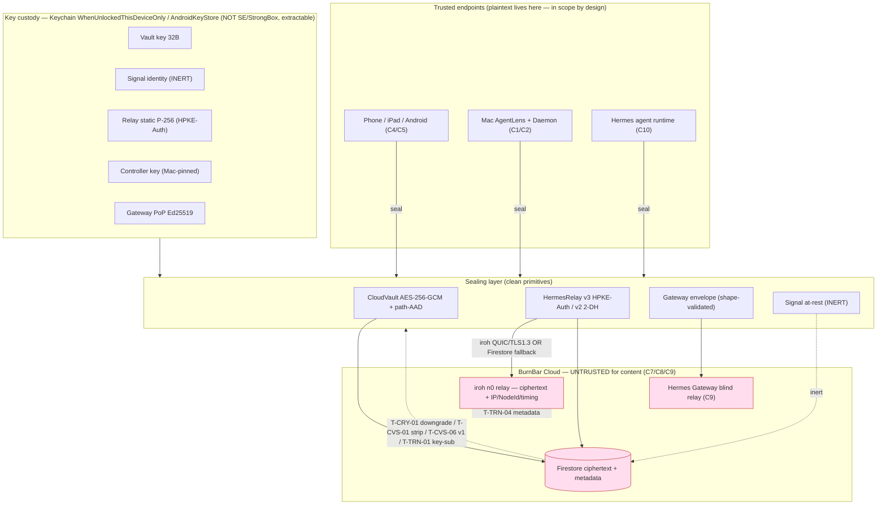

> **CONFIDENTIAL — BurnBar security package.** Independently code-verified at HEAD `5416ef780`. Share with Cure53 out-of-band; do not publish. Generated — see `_evidence/` for raw findings.

# Phase 5 — Cryptographic & Protocol Review

**Scope.** Every cryptographic construction reachable in the shipping code: the at-rest CloudVault seal, the inert Signal-at-rest sealer, the Hermes relay lane (realtime/iroh/Firestore-request), the Hermes Gateway message/event/attachment lane, the Pi-agent relay lane, iroh transport identity & pairing, the trusted-device trust chain, gateway proof-of-possession, the recovery bundle, and provider-credential envelope encryption. **Code is the source of truth.** Every load-bearing claim cites a real `file:line` pulled from the domain evidence files (`_evidence/01-crypto-relay.md`, `02-cloudvault-signal.md`, `03-pairing-trust-revocation.md`, `04-transport-iroh.md`, `05-gateway-pop.md`) and the crypto map in `_INDEX.md §4`. Where the deployed answer is not derivable from source it is marked **UNKNOWN (deployment state)**.

**Headline crypto verdict.** The *primitives are clean* (`_INDEX.md:58`, `_cryptonotes.md` 01): standard Apple CryptoKit / libsignal / Node `crypto` — no homegrown AEAD or curve, no static IV, no nonce reuse, no encrypt-without-MAC, no hardcoded keys, no disabled TLS verification, CSPRNG checked, fail-closed typed error handling on the authenticated open paths. **The risk lives entirely in lane wiring and key custody, not in the math.** This review names each wiring caveat precisely and refuses to credit the product with properties (full E2EE, forward secrecy, post-compromise security, KCI resistance, out-of-band-verified device trust) that the code does not deliver.

---

## 5.1 Crypto Inventory

### 5.1.1 Algorithms, modes, libraries, key sizes

| Lane / use | Construction (as implemented) | Library | Key / param sizes | Evidence |
|---|---|---|---|---|
| CloudVault at-rest payload seal | AES-256-GCM, 12-byte random nonce, 16-byte (128-bit) tag | CryptoKit `AES.GCM` / Android `AES/GCM/NoPadding` | 32-byte per-user vault key | `CloudVaultCrypto.swift:435-441,576-580`; `CloudVaultCrypto.kt:383-385` (`02` Controls) |
| Vault-key device wrap / escrow | ECIES: ephemeral-static **P-256 ECDH** → HKDF-SHA256 (`OpenBurnBar-Escrow-v1`, empty salt) → AES-256-GCM; **no AAD** | CryptoKit | P-256, AES-256 | `CloudVaultCrypto.swift:966-1004` (`02:69`) |
| Recovery-key wrap | HKDF-SHA256, **fixed salt** `recoverySalt` → AES-256-GCM | CryptoKit | high-entropy 35-byte base32 recovery code | `CloudVaultCrypto.swift:403,1009-1014` (`02:69`) |
| Recovery bundle (DB key export) | **PBKDF2-HMAC-SHA256, 100k iters**, random 16-byte salt → AES-256-GCM over the SQLCipher DB key | CryptoKit | 100k iterations (below OWASP-2023 600k) | `DatabaseEncryptionService.swift:148,161-205,167` (`02:30,42,49`) |
| Signal at-rest content seal **(INERT)** | per-doc random 32-byte content key → AES-256-GCM; content key HPKE-sealed per recipient (Curve25519 sealed-sender) | libsignal `PublicKey.seal`/`PrivateKey.open` | content key 32B, Curve25519 | `SignalAtRestSealer.swift:67-85`; `CloudVaultCryptoSupport.kt:46-63` (`02:23`) |
| Signal sender-auth **(INERT)** | XEd25519 (XEdDSA over Curve25519) signature over length-prefixed NFC-canonical message; verified vs **pinned** key | libsignal | Curve25519; 4-byte BE length framing | `SignalAtRestSealer.swift:100-129,172-192,203-242` (`02:25,26`) |
| Relay payload seal/open (realtime/iroh/Firestore-request) | AES-256-GCM, CryptoKit-internal 96-bit random nonce, AAD authenticated | CryptoKit `AES.GCM.seal/open` | 32-byte content key | `HermesRelayCrypto.swift:306-330` (`01:19`) |
| Relay key wrap **v3** (current lane default) | **RFC 9180 HPKE Auth mode**, suite `P256_SHA256_AES_GCM_256`; sender-authenticated by static relay key | CryptoKit `HPKE.Sender/Recipient` | P-256, AES-256, HKDF-SHA256 | `HermesRelayCrypto.swift:493-514,524-557` (`01:21`) |
| Relay key wrap **v2** (legacy; **gateway lane only**) | *bespoke* HPKE-AuthEncap-shaped 2-DH: `ikm = ECDH(eph,R)‖ECDH(skS,R)` → HKDF-SHA256 → AES-256-GCM | CryptoKit primitives (not CryptoKit HPKE) | P-256, AES-256 | `HermesRelayCrypto.swift:439-461` (`01:23,63`) |
| Pi-agent relay key wrap **v1** (legacy, **no sender-auth**) | ephemeral-static ECDH wrap, **no sender key bound** | `PiAgentRelayCrypto.unwrapSymmetricKey` | P-256, AES-256 | `PiAgentCloudRelayHostService.swift:336-340` (`01:45`, T-CRY-02) |
| Phone-control signing | Ed25519 / SE-P256 (`.biometryCurrentSet`); canonical-JSON → BLAKE3 intent hash; monotonic counter; single-use local-auth proof | CryptoKit | Ed25519 / P-256 | `_INDEX.md:52`; `PhoneControlAuthorityValidator.swift:133-143` (`03:42`) |
| Trust-chain signature | **XEdDSA (XEd25519) over Curve25519** identity keys; server-verified + client-re-verified from key bytes | libsignal-style, Node ed25519 | Curve25519 | `computerUseSecurity.ts:616-650,663-699` (`03:28,76`) |
| iroh transport | QUIC + **TLS 1.3**; NodeId = **Ed25519** public key; handshake authenticates remote NodeId | iroh `=1.0.0-rc.0` | Ed25519 NodeId | `lib.rs:302-310,430,481` (`04:22,23`) |
| iroh pairing record signature | **Ed25519** over canonical pipe-delimited string + `publishedAtMillis` | CryptoKit `Curve25519.Signing` | Ed25519 | `IrohRelayPairing.swift:95-98,133-168` (`04:70`) |
| Gateway PoP | **Ed25519** over `tokenHash\|METHOD\|path\|bodyHash\|nonce\|ts` (v1; +canonical query in v2); domain-tagged `OpenBurnBar.HermesGatewayPoP.v1/v2` | Node `crypto` (`verify(null,...)`) | Ed25519 (raw 32B in fixed SPKI DER) | `callables/hermesGateway.ts:608,669,693-757` (`05:13-18`) |
| Gateway bearer token at rest | **SHA-256 only** (no HMAC/pepper); index keyed by hash | Node `crypto` | high-entropy random secret | `hermesGateway.ts:497-498` (`05:33,66`) |
| Provider-credential envelope | AES-256-GCM under per-credential DEK; DEK **KMS-wrapped**; stored as Secret Manager version | Cloud KMS + Secret Manager | AES-256 DEK | `_INDEX.md:72` (claim C10) |
| Update channel | DMG **Ed25519** vs pinned `SUPublicEDKey`; notarization; cosign keyless | Sparkle / `crypto.verify` | Ed25519 (SPKI-wrapped 32B) | `release.yml:1254-1268` (`14` notes) |

### 5.1.2 Nonce / IV generation, randomness, KDFs, hashing, encoding

- **AEAD nonces.** Every AES-GCM seal draws a fresh nonce: CloudVault uses a 12-byte nonce from `SecRandomCopyBytes`/`SecureRandom` (`02:20,66`); the relay lane uses the CryptoKit-internal random 96-bit nonce of the combined GCM box (`01:19,62`). **No static IV, no observed nonce reuse** (`_cryptonotes.md` 01/02). HPKE nonces are managed by the key schedule.
- **CSPRNG.** Content/vault keys come from `SecRandomCopyBytes(kSecRandomDefault,…)` with an `errSecSuccess` check and **no fallback path on RNG failure** (it throws) — `HermesRelayCrypto.swift:138-147` (`01:20`). *Carry-over spot-check from the prior cut: confirm the Swift `generateVaultKey()` vault-key path also checks the RNG status (Cure53 question below).*
- **KDFs.** HKDF-SHA256 is the workhorse: relay v2 `info` binds `prefix‖aad‖enc‖pkR‖pkS`; v3 `info = OpenBurnBar-HermesRelay-HPKE-v3|‖key_aad` (`01:21,23,38`, `HermesRelayCrypto.swift:450-454,584-588`). Empty HKDF salt is **acceptable** because IKM is a fresh DH secret and `info` supplies domain separation (`01:38`, `_cryptonotes.md` 01). PBKDF2-HMAC-SHA256 at **100k** iterations guards the recovery bundle — below current OWASP-2023 guidance of 600k (T-CVS-04). Search/dedup subkeys use empty-salt HKDF with distinct `info` and are **deterministic by design** (trapdoors), not a confidentiality boundary (`02:70`).
- **Hashing.** SHA-256 for fingerprints (`base64(SHA256(keyBytes))`, re-bound to key bytes on both server and client — `03:78`), bearer-token hashing, body-hash binding, attachment integrity (ciphertext SHA-256 at finalize), and `vaultKeyID` (truncated SHA-256 identifier, **not** a security boundary — `_cryptonotes.md` 02). BLAKE3 for control-intent hashes and Mercury content-addressing.
- **Encoding / serialization.** Wire frames are a 4-byte big-endian `u32` length prefix + JSON, 512 KiB hard cap both directions (`lib.rs:171-209`, `04:72`). Sender-auth and trust-chain messages use **length-prefixed (4-byte BE) NFC-normalized byte-canonical** framing with reserved-char (`| CR LF`) fail-closed rejection — eliminating separator-injection (`02:24,26`; `03:76`). iroh pairing canonicalizes a pipe-delimited string with sorted/deduped addresses and a version prefix (`04:70`). PoP joins fields with LF under a version-tagged domain separator (`05:13`).

### 5.1.3 Signing, AAD design, domain separation

The **AAD design is the single strongest control** in the relay lane. A large set of distinct labels (`request-v3`, `key-v3`, `chunk`, `gatewayEvent[Key]`, `gatewayMessage[Key]`, `gatewayAttachment{Manifest,Body,Key}`, `mediaSealKey`, `controlSealKey`), each prefixed `OpenBurnBar-HermesRelay-v1|`, make cross-lane / cross-slot ciphertext relocation infeasible (the GCM tag fails) — `HermesRelayCrypto.swift:149-304,590-592` (`01:24`). The request AAD binds `uid‖conn‖request‖operation‖senderDevice‖peerNode‖counter‖keyID`, so the **replay counter is cryptographically bound, not merely cache-checked** (`01:25`). CloudVault AAD path-binds `uid|coll|doc|field|schema|purpose|keyVersion|vaultKeyID` and fails closed on the wrong key via a `vaultKeyID` equality check before AES open (`02:21,22`). Signal at-rest embeds the Firestore-path binding inside the HPKE `info`, so even a key-id match cannot replay a document across paths (`02:27`).

### 5.1.4 Protocol versions, backward-compat, migration

| Lane | Versions in code | Production write posture | Read/back-compat posture | Migration / downgrade risk |
|---|---|---|---|---|
| CloudVault AAD | v1 (no-AAD legacy), v2 (path-bound) | v2 sealed | **v1 still accepted on open** (`CloudVaultCrypto.swift:605-606,1094-1102`) | T-CVS-06: v1 open sidesteps path binding (confidentiality intact) |
| Signal at-rest | seal/open + sender-auth | **INERT** — zero data domains carry the Signal scheme; RC default OFF | reader fails OPEN to legacy AES-GCM floor when `signalEnvelope` absent | T-CVS-01: strip-to-legacy bypasses sender-auth (latent until activation) |
| Relay (realtime/iroh) | v1 (echo/loopback), v3 | **v3 hard-required** on open; host advertises v3 only | no v1/v2 on this lane | Fail-closed: `senderAuthRequired` else (`HermesRelayAuthenticatedRequest.swift:195-208`) |
| Gateway message/event | v2 (bespoke 2-DH), v3 (HPKE-Auth), v4 read-tolerant, v5 PQ **unmerged** | relay v2/v3 writable; **Signal/v4 production write set empty** (`hermesGateway.ts:152`) | v2 accepted on open per **server-supplied** version (`HermesGatewayAPI.swift:1114-1118,890-897`) | **T-CRY-01: server can force v3→v2 downgrade** (no version floor) |
| Pi-agent relay | v1 ephemeral-static, **no sender-auth** | live open path | n/a | T-CRY-02: forgeable/injectable within owner namespace |
| iroh / pairing | `iroh.pairing.v1` | Ed25519 signed | 3-min freshness | T-TRN-05 bounded replay; T-PTR-03 host key not pinned |
| Gateway PoP | v1, v2 (+query) | both | both | none material |

**Self-documented non-goals (carried into 5.4):** the relay scheme deliberately has **no static-leg PFS and no KCI protection** (`HermesRelayCrypto.swift:10-19`, `01:36,48`); the at-rest scheme has **no forward secrecy / ratchet** (`02:50`, T-CVS-05); revocation has **no claw-back** of already-cached keys (`03:48,64`); and **production Signal/libsignal E2EE is not claimed** (claim C14, Defensible).

---

## 5.2 Key Lifecycle

Per-key lifecycle. Columns: where generated, where stored, hardware/OS-backed, exportable, rotated, revoked, backup/restore, deletion, compromise impact, past-message (retroactive) impact, forward secrecy / post-compromise recovery (PCR).

| Key | Gen / by whom | Storage | HW/OS-backed | Exportable | Rotated | Revoked | Backup/restore | Deletion | Compromise impact | Past-msg impact | FS / PCR | Evidence |
|---|---|---|---|---|---|---|---|---|---|---|---|---|
| **CloudVault vault key** (32B per-user) | Client, `SecRandomCopyBytes` | iOS Keychain `WhenUnlockedThisDeviceOnly`; Android KeyStore-wrapped; shared to peers only as **ciphertext** | **Partial** — Keychain generic-password, **not** Secure Enclave / not user-auth-gated; Android KeyStore wrap **without StrongBox / without user-auth** | **Yes — extractable in-process on an unlocked compromised endpoint** | Yes — on device revoke (gen+1, client-driven by a survivor Mac) | Indirectly: revoke queues rotation + wrapper revoke | Escrow-wrapped to trusted devices; recovery bundle | Removed on device wipe; old-gen wrappers revoked at rotation | Decrypts **all** at-rest CloudVault content in scope; with identity key, forges sender-auth | **Full retroactive** — long-lived key decrypts historically captured ciphertext | **No FS, No PCR** | `CloudVaultCrypto.swift:1398-1430,1416,1425`; `cloudVaultRotation.ts:185,299-307` (`02:31,40,48`; `03:46,77`; T-CVS-03/05, T-PTR-01) |
| **Device escrow key** (P-256) | Device | Private in Keychain/KeyStore; **public** published to Firestore | Partial (same as vault) | Private not intended-exportable but **not hardware-proven** | Public immutable post-pairing | Atomic revoke flips `trustState`, revokes wrappers, controllers, grants, Signal sessions, emits receipt | Public in `escrow_public_keys` | Doc removed on revoke | Lets the holder unwrap the vault key for that device | Old wrapped records remain readable until rotation+rewrap | None added | `computerUseSecurity.ts:1456,1492,1508,1573-1600,1617`; `firestore.rules:3448,3453` (`03:25,35`) |
| **Signal identity key** (Curve25519) **[INERT]** | Device | iOS Keychain `WhenUnlockedThisDeviceOnly`; Android KeyStore-wrapped blob in SharedPrefs | Partial | **Reconstituted to a raw byte array in app memory on every seal/open** | Identity immutable | Removal from `trustedSenderPublicKeys` (no CRL/blocklist at open time) | Public pinned per device | Best-effort cleanup | Sender impersonation + decrypt of all at-rest once activated | Full retroactive on at-rest docs sealed to it | No FS | `SignalIdentityKeyStore.swift:88-94,105`; `AndroidSignalIdentityKeyStore.kt:16-17`; `AndroidCloudVaultSignalPayloads.kt:79` (`02:43,48,57`; T-CVS-03) |
| **Relay sender / recipient static key** (P-256, HPKE-Auth) | Device | Keychain (`ThisDeviceOnly` per CURE53 assertion — **not re-verified this pass**) | Partial | Not hardware-proven | Pinned at pairing; immutable per CURE53 | Pairing/revocation invalidates server records; local key may persist | Public pinned in `relay_sender_keys` (server-only write) | n/a | **KCI:** static-key compromise both decrypts to that recipient and forges peers toward it (accepted non-goal) | FS exists for **ephemeral leg only** | **FS ephemeral-only; No KCI protection** | `HermesRelayCrypto.swift:484-487,10-19`; `firestore.rules:2784` (`01:36,48`; T-CRY-05) |
| **iroh NodeId key** (Ed25519) | Device (iroh endpoint) | iroh endpoint key material | Software | n/a (transport identity) | **Never auto-rotated** — long-lived stable identifier | n/a | n/a | n/a | Transport identity spoof if stolen; QUIC handshake binds it | Metadata correlation (NodeId is a stable tracker) | n/a | `lib.rs:302-310`; `04:49` (T-TRN-04) |
| **iroh host *pairing* key** (Ed25519, Mac signs records) | Mac publishes | iOS reads from Firestore, caches **IN-MEMORY ONLY — no Keychain pin, no persistence, no rotation surface** | **None on iOS** | n/a | re-fetched fresh every cold session from **untrusted** Firestore | revoke deletes `iroh_pairing_keys`/record (server) | n/a | n/a | **Cloud-substituted key → MITM/redirect of the iroh control channel** (T-TRN-01 Critical) | n/a (payload survives via separate E2E layer) | n/a — **asymmetric** vs Keychain-pinned Mac→phone controller key | `FirestoreIrohPairingPublicKeyProvider.swift:9-11,27-47,45` (`03:49,58,71`; `04:46`; T-PTR-03/T-TRN-01) |
| **Controller key** (phone→Mac authority, Ed25519/SE-P256) | Phone | **Mac Keychain-pinned (TOFU)**, account-scoped `uid\|peerNodeId`; safety-code gate default ON | Mac-side Keychain pin | n/a | First-pin unconfirmed; mismatch always refused thereafter | Revoke deletes controllers, purges streams | Persisted per-peer replay counter survives restart, fail-closed on corruption | n/a | First-contact poison only if enforcement flag force-disabled | n/a | n/a | `ControllerKeyPinStore.swift:96,179,186,198,199-212`; `PhoneControlAuthorityValidator.swift:202-225,133-143` (`03:41,42,60`; T-PTR-05) |
| **Gateway bearer token** (high-entropy secret) | Gateway / client | Client local; server stores **SHA-256 only**, index hash-keyed (no plaintext at rest) | Software | **Extractable on a compromised endpoint** | Rotatable; stale index deleted best-effort | TTL + explicit revoke (revoked/expired/stale → 401) | n/a | Doc/index removal | **Insufficient alone** — every request also needs a fresh PoP signature | n/a | No | `hermesGateway.ts:497-498`; `callables/hermesGateway.ts:828-839` (`05:21,33,46`) |
| **Gateway PoP signing key** (Ed25519) | Client device | Local key store; public pinned at approval into client doc | Software | Not hardware-proven | Device revocation | Revocation severs the client | n/a | n/a | Signs gateway requests; theft of **both** bearer + PoP key needed to impersonate | n/a | No | `callables/hermesGateway.ts:907,1922,2007,693-757` (`05:14,18,46`) |
| **Recovery key / bundle** (PBKDF2-derived) | Client (from user passphrase) | Bundle on disk/cloud; salt + AES-GCM-wrapped DB key | None (passphrase-derived) | Bundle is portable by design | n/a | n/a | **Restores SQLCipher DB key** | User-deletable | Weak/empty passphrase + 100k iters → **offline brute-force** of the DB key | Yields all DB content if cracked | No | `DatabaseEncryptionService.swift:148,161-205,223-225` (`02:30,49`; T-CVS-04) |
| **Provider credential DEK** (AES-256) | Cloud Function | Secret Manager version, DEK **KMS-wrapped**; Firestore holds only the version name + redacted metadata | KMS (server-side) | **Backend can unwrap with KMS-decrypt + Secret-Manager IAM** | Destroy secret version (rotation cadence UNKNOWN) | n/a | n/a | Version destroy | Provider API key exposure to anyone with the IAM | n/a | No (server-side envelope, **not** E2E) | claim C10 Defensible; `_INDEX.md:72` |
| **DMG signing key** (Ed25519) | Operator / CI | Pinned `SUPublicEDKey` in app plist; private in CI secrets | CI secret store | Provider-dependent | Unknown/live | n/a | n/a | n/a | Malicious release if private key stolen | n/a | n/a | `release.yml:1254-1268` (`14` notes) |

**Cross-cutting custody finding (T-CVS-03, High).** None of the confidentiality- or authentication-critical private keys (vault, identity, relay static, escrow, PoP) is **hardware-bound non-extractable** or **per-use-authenticated**. iOS uses Keychain generic-password `WhenUnlockedThisDeviceOnly` with no `kSecAttrAccessControl`/Secure Enclave; Android uses an `AndroidKeyStore` AES-GCM wrap **without** `setIsStrongBoxBacked` or `setUserAuthenticationRequired` (`CloudVaultCrypto.kt:1206-1221,1210-1218`, `02:32,48,55`). Device-only accessibility blocks **off-device/backup** exfiltration, but any code running as the app on an unlocked device reads the raw key bytes. Combined with **no forward secrecy** (5.4), endpoint compromise = total at-rest + sender-auth compromise with full retroactive reach. Marketing/aspirational "Secure Enclave / StrongBox where available" is **not realized in code** (`02:62`, overclaim).

---

## 5.3 Message Sealing Analysis

This section walks the secure-messaging properties for each live sealed flow and compares to the common properties of a mature secure-messenger **without overclaiming**. Three distinct sealed sub-flows exist; they are *not* a single E2EE product (`_INDEX.md:12`).

### 5.3.1 Participants & trust assumptions

| Flow | Participants | Cloud role | Trust boundary |
|---|---|---|---|
| Hermes Gateway message/event | phone/agent sender → Gateway (HTTP + Firestore) → paired recipient | **Blind store-and-forward**; validates envelope *shape* only, never holds a recipient private key, never decrypts (`hermesGateway.ts:712,801`) | B5 (Gateway↔Agent), B2 (Device↔Cloud) |
| Realtime/iroh relay request | controller ↔ Mac host, over iroh QUIC or Firestore fallback | Transport only; payload is HermesRelayCrypto ciphertext (`IrohRelayRequestHandler.swift:303,959`) | B4 (Phone↔Mac), B2-iroh |
| CloudVault / Signal at-rest | a device → Firestore → the same user's devices | Stores ciphertext + wrappers; cannot decrypt (honest-but-curious) | B2 |

**Common trust assumption across all flows:** endpoints are trusted while uncompromised; the cloud is honest-but-curious for *content* but **trusted for availability, ordering, and authz-metadata** — and crucially the cloud is **inside the trust boundary for key distribution** on the iroh pairing and relay-resolver paths (T-TRN-01, claim C8 note).

### 5.3.2 Property-by-property (vs. common secure-messaging properties)

| Property | Gateway lane | Realtime/iroh lane | CloudVault at-rest | Signal at-rest (INERT) |
|---|---|---|---|---|
| **Identity binding** | PoP key pinned at pairing → client doc (`05:14`) | Pinned sender static key; opener binds pinned key not wire field (`01:22`) | vault key + escrow key, trust-chain bound | XEd25519 identity, pinned |
| **Pairing verification** | trust chain (XEdDSA), server + client re-verify (`03:28,34`) | same trust chain; **host key NOT pinned on iOS** (T-PTR-03) | trust chain | trust chain |
| **Key agreement** | v3 HPKE-Auth (P-256) / v2 2-DH | v3 HPKE-Auth (P-256) | P-256 ECDH escrow wrap | Curve25519 sealed-sender |
| **Encryption (AEAD)** | AES-256-GCM | AES-256-GCM | AES-256-GCM | AES-256-GCM |
| **Authentication / sender-auth** | v2/v3 sender-auth; **Pi-agent v1 has NONE** (T-CRY-02) | HPKE-Auth, pinned-sender (`01:35`) | path-AAD integrity (no sender-auth in legacy floor) | XEd25519 vs pinned key — server can't forge (`02:25`) |
| **AAD** | per-slot labels bind uid/client/ids/counter | request AAD binds counter + 8 fields (`01:25`) | path-bound v2 (`02:21`) | path embedded in HPKE info (`02:27`) |
| **Counters / nonces / replay** | per-(uid,client) single-use nonce, 5-min skew==TTL (`05:18,19`) | counter AAD-bound + requestID TTL cache (`01:26`) | **none — at-rest re-serve possible** | n/a (inert) |
| **Downgrade defense** | **WEAK — server picks version (T-CRY-01)** | **hard v3-required, fail-closed** (`01:29`) | **v1 no-AAD still accepted (T-CVS-06)** | strip-to-legacy bypasses auth (T-CVS-01) |
| **Version negotiation** | server-supplied advertisement | host advertises v3 only | schema-version field | RC-gated, default off |
| **Error handling** | typed deny reasons | `openKeyV3` normalizes + **re-throws**, no swallow (`01:31`) | wrong-key fails closed before open (`02:22`) | fail-closed for present-but-broken envelope (`02:28`) |
| **Metadata leakage** | routing, IDs, sizes, ordering visible | NodeIds, relay URL, direct IPs, timing, sizes (T-TRN-04) | path, keyVersion, vaultKeyID, search trapdoors | same as at-rest |
| **Cloud visibility of content** | ciphertext only (C1 Defensible) | ciphertext only | ciphertext only + legacy plaintext residue (C2 Partial) | n/a |
| **Attachment handling** | sealed bytes + sealed filename/type/count; server gates SHA-256 of **ciphertext**; plaintext filename path dead (`05:22,23`) | — | — | — |
| **Multi-device** | escrow graph, per-device wraps | per-device pin | vault key wrapped per trusted device | per-recipient seal |
| **Revocation** | atomic revoke severs grants/controllers/sessions (`03:35`) | allowlist purge + stream teardown (`04:28`) | revoke→rotation+rewrap, **client-driven** (C5 Partial) | removal from pinned set |
| **Lost / new device** | re-pair → trust chain | re-pair | escrow re-wrap to new device | re-publish identity |
| **Recovery** | n/a | n/a | recovery bundle (PBKDF2) / escrow survivor | n/a |
| **Forward secrecy** | **No** (HPKE static recipient) | **ephemeral leg only** | **No** | **No** |
| **Break-in / post-compromise recovery** | **No** | **No** | **No** | **No** |

### 5.3.3 Honest comparison to a mature secure messenger

BurnBar's sealed lanes achieve **confidentiality vs. an honest-but-curious cloud, AEAD integrity, per-slot domain separation, live-traffic replay resistance, and (on the v3 lane) pinned-sender authentication**. They do **not** achieve the properties a Signal-class messenger guarantees: **no forward secrecy**, **no post-compromise / break-in recovery** (no double-ratchet on the live lanes; the homegrown ratchet lane is gateway-legacy and not the active path), **no out-of-band-verified device identity** (TOFU with no default safety number — T-PTR-04, claims C1/C8/C9 all Partial), and **rich metadata exposure by design**. The product correctly **does not claim** production Signal/libsignal E2EE (claim C14 Defensible; the non-claim is CI-enforced — `02:36`). Any prose implying the whole phone⇄Mac surface is "v3 HPKE-Auth E2E with sender authentication" **overstates** it: sender-auth is proven only on the v3-hard-required realtime/iroh/Firestore-request lane; the **gateway lane downgrades to v2 under server-chosen version** and the **Pi-agent lane is v1 with no sender-auth** (`01:58`).

---

## 5.4 Crypto Red Flags

### 5.4.1 The clean finding (state it plainly)

A red-flag scan of the primitive surface is **clean** (`_INDEX.md:58`, `_cryptonotes.md` 01/02): standard CryptoKit / libsignal / Node `crypto`; **no homegrown AEAD or curve, no static IV, no nonce reuse, no encrypt-without-MAC, no hardcoded keys, no disabled TLS verification, CSPRNG with `errSecSuccess` check, no catch-and-continue** (the authenticated open paths normalize and **re-throw** — `01:31`). The AAD design (distinct per-slot labels, counter bound into AAD) is genuinely strong and defeats ciphertext relocation. **The caveats below are wiring and custody issues, not broken math.**

### 5.4.2 The lane-wiring & custody caveats (the real findings)

| ID | Sev | Red flag | What the code does | Why it matters | Evidence |
|---|---|---|---|---|---|
| **T-CRY-01** | Medium | **Gateway v3→v2 downgrade** (no version floor) | Phone seals/opens v2 when the **server-supplied** client record advertises `supportsRelayEnvelopeVersions=[2]`/`preferredRelayEnvelopeVersion=2`; reply side accepts v2 on wire `relayKeyVersion==2` | A hostile/compromised relay or Firestore writer forces the older bespoke 2-DH primitive; v2 is still sender-auth + confidential (no forgery/plaintext), so impact = cryptanalytic margin only. `_emit_version_or_refuse` (CURE53 T-GW-5) **unmerged** | `HermesGatewayAPI.swift:1114-1118,890-897,1229-1230`; `GatewayEventSealer.swift:210-218` (`01:37,44,51`) |
| **T-CRY-02** | Medium | **Pi-agent lane has NO sender authentication** | `decryptRelayRequest` opens with `unwrapSymmetricKey` (no sender key, v1 ephemeral-static); no counter, no replay cache | Any writer of `users/{uid}/pi_agent_relay_requests/*` (compromised session, or a relay/server holding the recipient's *public* key) can mint a ciphertext that opens — **forgery/injection within the owner namespace**. Relay can't read but could inject if it can write owner docs | `PiAgentCloudRelayHostService.swift:323-354,336-340`; `firestore.rules:3161-3163` (`01:45,52`) |
| **at-rest freshness / replay gap** (T-CVS-06 + C12) | Low/Med | **At-rest records bound to location, not version/time** | CloudVault seal path-binds but adds no version/counter; legacy **v1 no-AAD** open path still accepted | A malicious/compromised server (or stolen session) can **re-serve an older valid encrypted record at the same path** → stale-state rollback; v1 docs open without path binding | `CloudVaultCrypto.swift:605-606,1094-1102` (`02:51`; claim C12 SAFE) |
| **ECIES no-AAD** | Low | **Vault-key wrap has no AAD** | ECIES eph-static P-256 → HKDF → AES-GCM, **no associated data** binding the wrap to uid/device/generation | Domain separation rests only on the HKDF `info` string; a missing AAD removes a relocation guard on the wrapped-key blob (mitigated by trusted-target rule checks, not crypto) | `_INDEX.md:48`; `CloudVaultCrypto.swift:966-1004` (`02:69`; T-PTR-06) |
| **In-memory TOFU pairing key (KCI-adjacent)** | High | **iOS host pairing key not pinned** | Verified against `iroh_pairing_keys/host` fetched from Firestore, cached **in-memory only**; no Keychain pin / safety-code / persistence | Compromised cloud/admin substitutes the key + signed record → phone accepts an attacker-signed NodeAddr and dials an attacker NodeId → **MITM/redirect of the iroh control channel + forced downgrade**. Asymmetric vs Keychain-pinned Mac→phone controller key. Payload confidentiality survives via the independent E2E relay layer | `FirestoreIrohPairingPublicKeyProvider.swift:9-11,27-47,45` (`03:49,58,71`; `04:46`; **T-TRN-01 Critical / T-PTR-03 High**) |
| **No PFS / No KCI protection** | Low (accepted) | **Static-leg compromise reads + forges** | HPKE-Auth binds a static recipient key; relay scheme has no ephemeral static-leg ratchet | Compromise of a recipient static relay key both decrypts to that recipient and lets the attacker impersonate peers toward it. **Self-documented non-goal** | `HermesRelayCrypto.swift:10-19,484-487` (`01:36,48`; **T-CRY-05**) |
| (custody, cross-cut) **T-CVS-03** | High | Identity/vault keys **extractable on unlocked endpoint** | `WhenUnlockedThisDeviceOnly`, no `SecAccessControl`/SE; Android KeyStore wrap without StrongBox/user-auth | Endpoint compromise → forge sender-auth + decrypt all at-rest; **no PFS to bound blast radius** | `SignalIdentityKeyStore.swift:88-94`; `CloudVaultCrypto.kt:1206-1221`; `CloudVaultCrypto.swift:1416` (`02:48`) |
| (recovery) **T-CVS-04** | Med | **100k PBKDF2 + no passphrase gate + no import iteration floor** | `exportRecoveryBundle("")` derives from empty/weak passphrase at 100k iters; import trusts the iteration count from attacker-controlled bytes | Leaked bundle with weak passphrase → offline grind to the SQLCipher DB key; iters below OWASP-2023 600k; no min-length/zxcvbn gate, no import-side floor | `DatabaseEncryptionService.swift:161-166,223-225` (`02:49`) |
| (anti-replay durability) **T-CRY-03** | Low | **Replay high-water-mark in a deletable plaintext JSON file** | Deleting `authenticated-request-replay-cache.json` resets `maxCounter=-1` and clears the requestID set | After Mac FS compromise, prior authenticated frames (counter ≤ old max) replay until the counter advances; counter is AAD-bound so frames must be real prior frames, not forged | `HermesRelayAuthenticatedRequest.swift:148-156`; `HermesRelaySenderTrustResolver.swift:151-158` (`01:39,46`) |
| (info, non-finding) **T-CRY-04** | Info | Non-constant-time pinned-key equality | `samePublicKey` uses `Data ==` on base64-decoded **public** keys | Public values, not secrets; AEAD tag is the real auth gate → **negligible**, recorded for completeness | `HermesRelayAuthenticatedRequest.swift:309-315` (`01:47`) |

### 5.4.3 Migration / downgrade red flags (read-fallback risk)

The recurring structural pattern is **a read path that fails open to a weaker floor under attacker-controlled signaling**: gateway opens v2 when the server says so (T-CRY-01); the Signal reader treats absent `signalEnvelope` as a fall-through to unauthenticated legacy AES-GCM (T-CVS-01 — latent until Signal is activated, then a **full sender-auth bypass** survives until the legacy floor is removed); CloudVault opens v1 without AAD (T-CVS-06). None of these leaks plaintext today, but each removes an integrity/authentication layer the *new* path provides. The structural blocker to hard fail-closed is the **dual-write legacy floor** (`02:46,54`).

### 5.4.4 Overclaims to flag for Cure53

- **"Mirrors `relay_e2ee.py` byte-for-byte"** — the Python file is **not in this repo**; cross-language parity is **unverifiable here** (`01:16,40,57`). Treat as aspirational.
- **"Whole phone⇄Mac surface is v3 HPKE-Auth E2E with sender authentication"** — overstates; gateway downgrades to v2, Pi-agent is v1 no-auth (`01:58`).
- **"Forward secrecy"** unqualified — exists for the **ephemeral DH leg only**; static-leg + KCI are explicit non-goals (`01:59`).
- **"Secure Enclave / StrongBox where available"** — **not realized** for vault/identity/DB keys (`02:62`).
- **"iOS pins / never-auto-rotates the host pairing key"** — false; it is an **in-memory cache** re-fetched from untrusted Firestore each cold session (`03:71`, `04:66`).
- **CloudVault at-rest is "E2EE"** — read as honest-but-curious-server confidentiality, **not** forward-secret and **not** sender-authenticated in production (Signal sender-auth is inert) (`02:63`).

---

## 5.5 Crypto Architecture & Protocol Sequences

### 5.5.1 Crypto-architecture overview



### 5.5.2 Gateway message — seal, PoP, blind relay

```mermaid
sequenceDiagram
  participant A as Sender (phone/agent)
  participant G as Hermes Gateway (HTTP)
  participant D as Firestore
  participant B as Recipient (paired)
  A->>A: Build per-slot AAD; AES-256-GCM seal; HPKE-Auth v3 wrap key
  A->>A: Sign PoP Ed25519 over tokenHash|METHOD|path|bodyHash|nonce|ts
  A->>G: POST sealed envelope + bearer + PoP
  G->>G: PoP verify (pinned key), bodyHash constant-time, nonce single-use tx, 5-min skew
  G->>G: Validate envelope SHAPE only (never decrypts); plaintext gate = false
  Note over G,D: T-CRY-01 — if client record advertises only v2,<br/>phone seals weaker 2-DH wrap (no version floor)
  G->>D: create-if-absent sealed message doc (no clobber)
  B->>G: list/poll + bearer + PoP
  G->>B: sealed envelope + metadata (uid-scoped; targetClientId filtered in app)
  B->>B: Resolve PINNED sender key; open v3 (re-throws on failure); verify counter/requestID
```

### 5.5.3 Realtime/iroh relay request — v3 hard-required, pinned-sender

```mermaid
sequenceDiagram
  participant P as Phone controller
  participant N as iroh transport (QUIC/TLS1.3, NodeId=Ed25519)
  participant H as Mac host
  P->>P: Verify Mac pairing record (Ed25519 sig + 180s freshness)
  Note over P: T-PTR-03 / T-TRN-01 — host pairing key fetched from Firestore,<br/>cached IN-MEMORY only; cloud key-substitution -> MITM/redirect
  P->>N: Dial NodeId (directAddresses:[] — ignores published IPs)
  N->>H: QUIC handshake binds remote NodeId
  H->>H: Inbound allowlist check (default-deny; cloud-sourced set — T-TRN-02)
  P->>H: HermesRelayCrypto request (AES-256-GCM payload + HPKE-Auth v3 key wrap)
  H->>H: HARD-REQUIRE v3 (else senderAuthRequired); open binds PINNED sender key, not wire field
  H->>H: Replay: counter > maxCounter AND unseen requestID (counter AAD-bound)
  H->>P: Reply chunks reuse request-scoped key + chunk AAD (seq, kind)
  Note over P,H: On iroh drop, non-chat ops SILENTLY fall back to Firestore (T-TRN-03)
```

### 5.5.4 CloudVault write & revocation→rotation

```mermaid
sequenceDiagram
  participant C as Client
  participant KV as Keychain/KeyStore
  participant DB as Firestore
  participant S as Survivor Mac
  C->>KV: Load vault key (extractable in-process if unlocked — T-CVS-03)
  C->>C: Build path-AAD (uid|coll|doc|field|schema|keyVersion|vaultKeyID)
  C->>C: AES-256-GCM seal; vaultKeyID equality fails closed on wrong key
  C->>DB: Write envelope + metadata (ciphertext only)
  Note over C,DB: T-CVS-06 — v1 no-AAD open still accepted;<br/>C12 — server can re-serve old envelope at same path
  Note over DB,S: Device revoked -> atomic sever (grants/controllers/sessions)<br/>+ queue rotation requirement (server-only write)
  S->>DB: rotateCloudVaultKey gen=current+1; revoke old-vaultKeyID wrappers
  S->>DB: rewrap/reseal existing data under new key
  Note over S: NO CLAW-BACK — revoked device's cached key decrypts<br/>pre-revocation content until a survivor finishes (T-PTR-01/02)
```

### 5.5.5 Security properties — achieved vs. not (at HEAD `5416ef780`)

**Achieved (code-verified):**
- Confidentiality of sealed payloads vs. an honest-but-curious cloud (relay stores ciphertext only) — `HermesRelayCrypto.swift:306-330`; claims C1/C2/C3 (Defensible/Partial).
- AEAD integrity (AES-256-GCM, 128-bit tag) on every sealed payload and attachment.
- Per-slot AAD domain separation defeating ciphertext relocation — `HermesRelayCrypto.swift:149-304`.
- Pinned-sender authentication on the **v3 realtime/iroh lane** (opener binds the pinned key, hard-requires v3, fail-closed) — `HermesRelayAuthenticatedRequest.swift:195-208,224-246`.
- Live-traffic replay/freshness: AAD-bound counter + requestID TTL cache (relay); single-use Firestore-tx nonce + 5-min-skew==TTL (gateway PoP) — `01:26`, `05:18,19`. (Claim C12 Defensible for live, Partial at rest.)
- Gateway PoP: bearer alone insufficient; Ed25519 over method/path/bodyHash/nonce/ts pinned to the pairing key; constant-time bodyHash — claim C4 Defensible.
- Trust-chain integrity: XEdDSA verified server-side **and** client-re-verified from key bytes; fingerprint re-bound to key bytes (defeats backend key-swap-under-signed-fingerprint) — `03:28,34,78`.
- Atomic revocation severing grants/controllers/sessions + rotation machinery wired and client-driven — claim C5 Partial (REMEDIATED vs. prior "unwired").
- Provider creds: AES-256-GCM under KMS-wrapped DEK in Secret Manager, never Firestore plaintext — claim C10 Defensible.
- Honest non-claim: production Signal/libsignal E2EE is **not** asserted (CI-enforced) — claim C14 Defensible.

**Not achieved / not proven (do not credit):**
- **No forward secrecy** on any live lane (relay = ephemeral leg only; at-rest = none) — `01:36`, `02:50`.
- **No post-compromise / break-in recovery** (no double-ratchet on the active lanes).
- **No KCI protection** on the relay scheme (static-key compromise reads + forges) — T-CRY-05.
- **No out-of-band-verified device identity by default** (TOFU; approve-time safety-code compare default OFF) — T-PTR-04; claims C1/C8/C9 Partial.
- **No hardware-bound non-extractable keys, no per-use auth** — T-CVS-03.
- **No claw-back** of pre-revocation cached vault keys; rotation is client-driven and Mac-dependent — T-PTR-01/02; claim C5 Partial.
- **No version floor on the gateway lane** (server-forced v3→v2) — T-CRY-01.
- **No sender-auth on the Pi-agent lane** — T-CRY-02.
- **No host-pairing-key pinning on iOS** (cloud-substitution MITM) — T-TRN-01/T-PTR-03.
- **No at-rest version/time freshness** (old-envelope re-serve) — T-CVS-06; claim C12 Partial.
- **No metadata confidentiality** from the cloud (NodeIds, IPs, sizes, timing, routing, ordering) — T-TRN-04; `_INDEX.md:100`.
- **Cross-language parity with `relay_e2ee.py` unverifiable** in this repo — `01:40`.

### 5.5.6 Framework mapping

| Lens | Mapped findings |
|---|---|
| **STRIDE** | Spoofing: T-TRN-01 (host-key substitution), T-CVS-02 (forged unpublished-device envelope), T-PTR-05. Tampering: T-CRY-01 (downgrade), T-CVS-01/06, T-CRY-03 (anti-replay state). Repudiation: T-CVS-05. Information disclosure: T-CVS-03/04, T-CRY-05 (KCI), T-TRN-04 (metadata). DoS: T-TRN-02/03/06. Elevation: T-CRY-02 (forged Pi-agent request). |
| **LINDDUN** | Linkability/Identifiability: T-TRN-04 (persistent NodeIds, IPs). Detectability: T-PTR-03. Non-repudiation: T-TRN-01. Disclosure: T-CVS-03/04. Non-compliance: PBKDF2 100k < OWASP-2023 600k (T-CVS-04). |
| **OWASP ASVS 5.0** | V6 Cryptography: clean primitives but key-management gaps (extractable keys T-CVS-03, weak KDF iters T-CVS-04, missing AAD on wrap, no version floor T-CRY-01). V11 Crypto-at-rest: T-CVS-05/06, C12. |
| **NIST CSF 2.0** | Protect (PR.DS data-at-rest/in-transit): sealed lanes; gaps = no PFS, extractable keys. Detect (DE): replay caches, audit events; gap = stale-rotation only *flags*. Recover (RC): rotation+rewrap wired but client-driven (T-PTR-01/02). |
| **NIST Zero Trust** | Cloud is *inside* the key-distribution trust boundary on iroh pairing + relay resolver (T-TRN-01, claim C8 note) — violates ZT for transport identity; the verify-explicitly principle is weakened by TOFU + cloud-sourced trust records. |
| **MITRE ATLAS** | AML.T0048 model/policy downgrade ↔ T-CRY-01 (crypto-policy downgrade). |
| **OWASP MASVS** | MASVS-CRYPTO: extractable keys, no SE/StrongBox, no user-auth on signing keys (T-CVS-03); recovery-bundle KDF strength (T-CVS-04) — see `10`/`11`. |
| **MITRE CWE Top 25** | CWE-326/327 (KDF iteration strength), CWE-323 (key/nonce reuse — *not* present, verified clean), CWE-300 (MITM via unpinned key, T-TRN-01), at-rest re-serve / version (CWE-639-adjacent). |

### 5.5.7 Recommended crypto questions for Cure53

1. **Gateway version floor (T-CRY-01):** does the deployed `burnBarHermesGateway` ever legitimately advertise only v2, and is there *any* server-side policy preventing a malicious writer from setting `supportsRelayEnvelopeVersions=[2]`/`preferredRelayEnvelopeVersion=2` on a live client record? Is `_emit_version_or_refuse` planned to merge? *(resolves likelihood)*
2. **Pi-agent lane (T-CRY-02):** is `pi_agent_relay_requests` a shipped/active feature or dead code? If active, the v1 no-sender-auth wrap is a real forgery/injection gap; if dead, latent. *(needs product/runtime confirmation)*
3. **iOS host-pairing-key pinning (T-TRN-01/T-PTR-03):** confirm there is no TOFU/Keychain pin or safety-number for the iroh host pairing key, and assess the practical MITM/redirect + forced-downgrade impact given that payload confidentiality rests on the *separate* E2E relay layer.
4. **`relay_e2ee.py` parity:** is the Python mirror maintained in a sibling repo, and does it match the v3 byte contract (`info` prefix, X9.63 `enc`, 48-byte `wrappedKey`)? *(resolves the parity overclaim — `01:70`)*
5. **At-rest freshness (T-CVS-06 / C12):** can a compromised server or stolen session re-serve an older valid sealed record at the same Firestore path to roll content back? Should at-rest envelopes carry a monotonic version/anti-rollback token?
6. **Recovery KDF (T-CVS-04):** raise PBKDF2 from 100k toward OWASP-2023 600k (or move to Argon2id); add a passphrase-strength gate and an import-side iteration floor (the count is currently read from attacker-controlled bytes).
7. **Key custody (T-CVS-03):** evaluate moving identity/relay/PoP signing keys to Secure Enclave / StrongBox non-extractable with per-use auth, and whether the vault key can be wrapped to a hardware-bound key to bound endpoint-compromise blast radius (especially given no PFS).
8. **ECIES no-AAD wrap:** should the vault-key escrow wrap bind AAD (uid|device|generation) to add a relocation guard beyond the HKDF `info` string and the rule-layer trusted-target checks?
9. **Signal activation safety (T-CVS-01/02):** before flipping the Signal scheme on, confirm the legacy AES-GCM floor can be removed (or per-doc "Signal-required" pinned) so a stripped `signalEnvelope` cannot silently bypass sender-auth, and verify the `senderSetComplete` (`size>1`) heuristic against single-/dual-device fleets.
10. **Anti-replay durability (T-CRY-03):** anchor the relay high-water-mark + requestID set to a tamper-evident / Keychain-backed monotonic source rather than a deletable plaintext JSON file.
11. **Deployment-state unknowns (UNKNOWN from repo):** live Remote Config / Functions env for `OPENBURNBAR_GATEWAY_SIGNAL_REQUIRED`, `REQUIRE_HIGH_RISK_NONCE`, `ENFORCE_APP_CHECK`, `hermesIrohTransportEnabled`, `signal_at_rest_<domain>_enabled`; Firestore TTL on `pop_nonces.expireAt`; whether any legacy plaintext / v1-AAD docs remain in production — all must be resolved from deployed state, not source.
