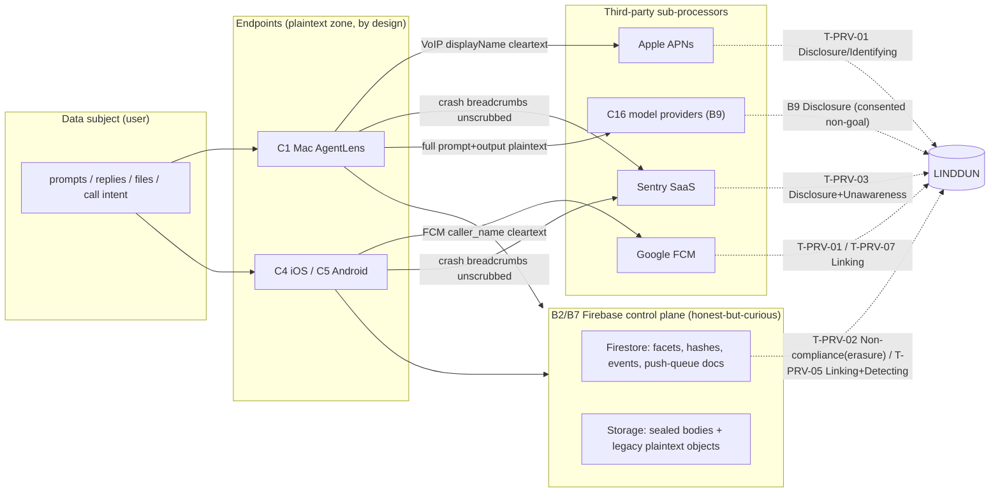

> **CONFIDENTIAL — BurnBar security package.** Independently code-verified at HEAD `5416ef780`. Share with Cure53 out-of-band; do not publish. Generated 2026-06-13 — see `_evidence/` for raw findings.

# Phase 11 — Privacy Threat Model (LINDDUN)

**Product:** BurnBar / OpenBurnBar — local-first AI-agent control plane (Mac canonical store; opt-in cloud sync; phone/web observers).
**Scope of this file:** data-subject privacy, not authentication/integrity (covered in the STRIDE deliverables). The framing question is *not* "can an attacker break in" but **"what does an honest-but-curious party — BurnBar's own operator, Firebase/GCP, Apple (APNs), Google (FCM), Sentry, model providers — get to see, link, and retain, and what can the data subject do about it."**
**Method:** LINDDUN per [`_evidence/_INDEX.md` §9]. Code is source of truth; every load-bearing claim cites a real `file:line` pulled from `_evidence/13-privacy-logging.md`, `_evidence/06-cloud-authz.md`, `_evidence/12-attachments.md`. Conservative reading throughout: where a doc/name implies more than the code delivers it is flagged as an **OVERCLAIM**.

**Trust-boundary anchors (from `_INDEX.md` §3):** B2 (Device↔Cloud, honest-but-curious for content, **Admin SDK bypasses rules**), B7 (Cloud↔Storage), B9 (BurnBar↔model providers — **providers see plaintext by design**). The privacy story is mostly **metadata egress across B2/B7/B9 plus third-party sub-processor exposure** (Apple, Google, Sentry), not a confidentiality break of sealed bodies.

**Headline privacy threats foregrounded here:** `T-PRV-01` (VoIP caller-name leak to Apple/Google), `T-PRV-02` (push-queue root collections — no TTL, not erased on account delete), `T-PRV-03` (unscrubbed client Sentry — no `beforeSend`, no consent gate, macOS real-name seed), `T-PRV-04` (pattern-only server log scrubber), `T-PRV-05` (search-index facet/posting/access-pattern inference), `T-PRV-06` (agent-notification provider-fingerprint retention), `T-PRV-07` (cross-provider push-token / device correlation). Adjacent metadata findings imported by ID: `T-AZ-01`, `T-AZ-03` (`06-cloud-authz.md`), `T-ATT-03`, `T-ATT-02` (`12-attachments.md`).

---

## 11.0 LINDDUN coverage map (threat → category)

LINDDUN ↔ canonical-threat crosswalk (full analysis in §11.2):

| LINDDUN category | Primary threats | One-line |
|---|---|---|
| **L**inking | T-PRV-07, T-PRV-05, T-PRV-06, T-AZ-01 | Stable `connectionId`/`pairedDeviceId`/push tokens + facet co-occurrence link a person across sessions & sub-processors. |
| **I**dentifying | T-PRV-01, T-PRV-03 | Cleartext `displayName`/`caller_name` to Apple/Google; macOS Sentry seed = real name. |
| **N**on-repudiation | T-PRV-07 | Queue-doc timestamps + stable IDs prove "a call was attempted" and tie it to a user. |
| **D**etecting | T-PRV-05, T-AZ-03 | Existence/cadence of search queries, replies, sessions observable even when bodies sealed. |
| **D**isclosure | T-PRV-01, T-PRV-03, T-PRV-04, T-ATT-03, B9 | Cleartext payloads/breadcrumbs/log edge-fields/wire-manifest filenames egress. |
| **U**nawareness | T-PRV-03, gap §11.2.U | No client consent gate; no in-code sub-processor/DPA list; "no PII" overclaim. |
| **N**on-compliance | T-PRV-02, T-PRV-06 | Root push-queue docs survive account erasure & have no TTL → GDPR Art.17/5(e) gap. |

---

## 11.1 Data Inventory

Per data type: **purpose · legal/business need · storage location · retention · deletion mechanism · third-party sharing · user visibility · user control · risk · recommendation.** "Sealed?" = is the *content* of this element cryptographically opaque to BurnBar's cloud. Rows derived from `_evidence/13-privacy-logging.md` (Data inventory table, lines 34-46), `_evidence/06-cloud-authz.md`, `_evidence/12-attachments.md`.

### 11.1.A Content (sealed-by-design)

| Data type | Purpose | Legal/business need | Storage location | Retention | Deletion mechanism | 3rd-party sharing | User visibility | User control | Risk | Recommendation |
|---|---|---|---|---|---|---|---|---|---|---|
| **Agent prompts / outputs (bodies)** | Sync conversation across devices; search backup | Core feature (opt-in) | GCS `users/{uid}/session_logs/.../bodies/*.json.aesgcm`; sealed snippets/titles (`13:36`) | Until user/account delete | `eraseUserCloudData` walks `users/{uid}` tree + storage prefix (`accountDeletion.ts:93-133`, `13:61`) | **Model providers see the *plaintext* equivalent** at inference time (B9, `_INDEX.md:41,100`) | App UI shows own content; cloud copy sealed | Delete account / per-collection delete (`dataDeletion.ts`) | Low at-rest (AES-256-GCM, vault key never leaves device, `13:36`); High at endpoint/provider (out of scope of "sealed") | Keep stating providers-see-plaintext non-goal; verify legacy plaintext sweep watermark (C2 gap). |
| **Attachment bytes + filename (gateway, schema 2+)** | File transfer to agent/peer | Core feature (opt-in) | GCS `users/{uid}/hermes_gateway_attachments/{clientId}/{attachmentId}`, fileName-free path (`12:9,12:36`) | Until delete; **no in-code GCS lifecycle TTL verified** (`12:97`) | Account-erase storage prefix; **legacy plaintext *objects* not provably purged** (C3 gap, `12:84`) | Cloud sees ciphertext size/hash/path/status only (`12:36,57`) | Sealed; opaque to cloud | Delete account | Low for current; **Medium legacy** — old plaintext bytes/filenames may persist (C3 Partial, `_claims.json` C3) | Production Storage scan for legacy plaintext objects; add bucket lifecycle TTL. |
| **Attachment wire-manifest (filename/mime/size)** | Advertise transfer to peer | Mercury P2P | iroh advertise frame `HermesRealtimeRelayAttachmentManifest` (`Types 1712-1738`, `12:61`) | Transient (frame) | n/a | Relay (C7) **if frame E2EE not active** (`12:68`, T-ATT-03) | Not surfaced to user | None | **Medium** — cleartext `filename` reaches relay unless frame sealed at relay layer (out-of-domain) | Seal/MAC-bind wire manifest at this layer; do not rely solely on relay E2EE; qualify trust copy (`12:84`). |
| **Search snippets / titles** | Search result previews | Search feature | GCS sealed (`encryptedSearch.ts:87`, `13:74`) | Until delete | Account-erase tree | None (sealed) | Sealed | Delete account | Low | — |

### 11.1.B Metadata (cleartext by design — the bulk of the privacy surface)

| Data type | Purpose | Legal/business need | Storage location | Retention | Deletion mechanism | 3rd-party sharing | User visibility | User control | Risk | Recommendation |
|---|---|---|---|---|---|---|---|---|---|---|
| **Search token hashes** | Encrypted-search index | Search feature | Firestore `users/{uid}/cloud_search_chunks.tokenHashes`, `cloud_search_postings` (`13:37`) | Until delete | Account-erase tree | None | Not surfaced | Delete account | **Medium** — operator sees hash co-occurrence + posting fan-out (T-PRV-05) | Add dummy-posting padding; consider query-hash blinding (`13:123`). |
| **Search semantic hashes** | Phrase/LSH bucketing | Search | Firestore `cloud_search_chunks.semanticHashes` (`13:38`) | Until delete | Account-erase | None | Not surfaced | Delete account | **Medium** — bucket structure leaks topic recurrence (T-PRV-05) | Same as above. |
| **Query hashes (search-time)** | Run a query | Search | Sent in request to `searchEncryptedSessionLogs` (`13:123`) | Request-scoped + logs | n/a | None | Not surfaced | None | **Medium** — operator observes *which* hashes a user searches & result-set size (T-PRV-05, Detecting) | Pad result sets; avoid logging query hashes. |
| **Facets: provider, model, deviceId, sourceType, costUSD, totalTokens, startTime** | Filter/aggregate UI; budgets | Feature + billing | Firestore `users/{uid}/session_logs` (cleartext) (`13:39`, `conversationQuery.ts:100-152`) | Until delete | Account-erase tree | None | Surfaced in own app UI | Delete account | **Medium** — operator infers provider mix, spend, activity timeline, device usage (T-PRV-05, T-AZ-03) | Document as known metadata leak; minimise `deviceId` granularity; do not over-promise "sealed". |
| **Generic cloud-sync metadata (counts, timestamps, deviceIds, projectKeyHash)** | Sync/ordering | Core | Firestore `users/{uid}/{usage,budgetRules,conversations,...}` (`06:52`, T-AZ-03) | Until delete | Account-erase tree | None | Not surfaced | Delete account | **Medium** — traffic-analysis / activity inference (T-AZ-03, Detecting) | Honest non-claim already stated (`_INDEX.md:100`); keep. |
| **Push tokens (APNs VoIP, FCM)** | Wake device for call/reply | Core (opt-in push) | Firestore `users/{uid}/devices/*`, `voip_outbound`, `fcm_outbound` (`13:40`) | Rotate on reinstall; **queue-doc copies untracked** | `devices/*` under account-erase; **queue-doc copies NOT** (T-PRV-02) | **Apple (APNs) + Google (FCM)** by necessity | Not surfaced | Disable push; reinstall rotates | **High** — stable correlator to two sub-processors (T-PRV-07) | TTL+erase queue docs (T-PRV-02); rotate `connectionId`. |
| **VoIP/call push payload — `callId`, `connectionId`, `pairedDeviceId`, `displayName`/`caller_name`, `isVideo`** | Incoming-call UI wake | CallKit/Mercury | `voip_outbound`/`fcm_outbound` root docs + APNs/FCM (`13:42,70`, `voipPush.ts:39-87`) | **No TTL; survives account delete** (T-PRV-02) | **None** (root collection not in erase tree) (`13:94`) | **Apple + Google receive cleartext `displayName`/`caller_name`** | Not surfaced | None | **High** — caller identity + persistent device link to two processors every call (T-PRV-01) | Generic "Incoming call" or sealed token resolved client-side (`13:87`); TTL+erase docs. |
| **Agent-reply notification events — `runtime`, `providerLabel`, `title`, `threadId`, `messageId`, `sourcePath`** | Notify of reply; deep-link | Push feature | Firestore `users/{uid}/agent_notification_events/{id}` (`agentNotifications.ts:300-321`, `13:130`) | **No TTL** (`13:129`) | Under account-erase tree (covered) | FCM `data.runtime`+`deep_link` → Google (`13:130`) | Not surfaced | Delete account | **Low/Medium** — provider-usage fingerprint + reply cadence (T-PRV-06) | Add TTL on these events; minimise provider label in FCM `data`. |
| **Push preview body** | Notification text | Push | APNs `notification.body` / FCM `data.preview` (`agentNotifications.ts:226,234,257`) | Transient | n/a | Apple/Google see **static string only** | Visible on lock screen | n/a | **Low** — `GENERIC_PREVIEW` "OpenBurnBar has a new agent reply." (`13:22,57,69`) | Keep generic preview (a genuine control). |
| **Device IDs / client IDs / thread IDs** | Routing, dedup | Core | Firestore events/devices/postings (`13:43`) | Until delete | Account-erase tree | Firestore/operator | Not surfaced | Delete account | **Low/Medium** — linkable identifiers (Linking) | Rotate long-lived correlators where feasible. |
| **Hashed UID** | Log/crash grouping | Ops | Logs `user_id_hash` (8 char), Sentry `sha256(uid)[:16]` (`13:46,56`) | Per log/Sentry retention | Log retention policy | Sentry SaaS (server) | Not surfaced | None | **Low** — one-way, grouping-only (`sentry.ts:180-183`) | Good; keep. |
| **Avatars / profile JPEG** | Profile photo | Feature | GCS `avatars/{userId}/profile.jpg` (`storage.rules:19`, `06:50`) | Until delete | Account-erase `avatars/<uid>` prefix | **Any authenticated user can read any avatar** (cross-tenant, accepted) (T-AZ-01) | Visible by design | Replace/delete | **Low** — BOLA-read; UID↔photo correlation across all users (`06:46`) | Serve via owner-scoped signed URL or follow/visibility model (`06:60`). |

### 11.1.C Telemetry / crash / IP

| Data type | Purpose | Legal/business need | Storage location | Retention | Deletion mechanism | 3rd-party sharing | User visibility | User control | Risk | Recommendation |
|---|---|---|---|---|---|---|---|---|---|---|
| **Crash reports (client, iOS+macOS)** | Stability | Quality | **Sentry SaaS** (`AppDelegate.swift:53-85`, `AgentLensApp.swift:1168-1202`) | Sentry retention | Sentry-side only | **Sentry (3rd party)** | **No consent gate, silent** | None in-app | **High (internal/CI-DSN builds)** — no `beforeSend`/breadcrumb scrub; default breadcrumbs (network URLs, console, lifecycle) + exception strings ship unscrubbed (T-PRV-03) | Add client `beforeSend`+`maxBreadcrumbs`+`sendDefaultPii=false`+consent gate; fix macOS seed. |
| **Crash reports (server)** | Stability | Quality | Sentry SaaS | Sentry retention | Sentry-side | Sentry | n/a (server) | n/a | **Low** — `sanitizeSentryEvent` deletes `request.data/cookies/env/query_string`, redacts body keys/URL secrets, `sendDefaultPii:false` (`sentry.ts:82-152`, `13:55`) | Asymmetry vs client is the gap (T-PRV-03). |
| **macOS Sentry anonymized-id seed** | Crash grouping | Ops | Hash input `NSFullUserName()` (`AgentLensApp.swift:1192`, `13:72`) | Per Sentry | n/a | Sentry (hashed) | Not surfaced | None | **Medium** — *input* is the user's real OS account name; "no PII" is imprecise even though output is one-way hashed (T-PRV-03, Unawareness) | Seed from a random per-install UUID like iOS `identifierForVendor`. |
| **Server structured logs** | Debug/ops | Ops | GCP logging | Log retention | Retention policy | Google Cloud Logging | Not surfaced | None | **Medium** — pattern-only scrubber; numeric fields & non-pattern PII bypass (`logging.ts:48-90`, T-PRV-04) | Allowlist model; scrub numbers; never log free-form provider error bodies raw. |
| **Media analytics events** | Transfer telemetry | Quality | Default `NoOpMediaAnalyticsSink` (discards) (`MediaAnalyticsEvent.swift:10-12,59`, `13:60`) | n/a (default no-op) | n/a | **None by default** (no Firebase Analytics/Amplitude wired, verified absent in `project.yml`) | Not surfaced | n/a | **Low** — content-free scalar counters; "hashes, peer NodeIds, frame contents never appear" (`13:60`) | Good; keep no-op default; document if a sink is ever wired. |
| **Source IPs** | Request handling | Ops | Transient in logs / Firebase request context | Log/Sentry retention | Retention policy | Google (infra), Sentry if leaked | Not surfaced | None | **Medium** — `scrubString` masks IPv4 in *string* log values (`logging.ts:48-99`) but request-context IPs are handled by GCP infra; not user-controllable | Confirm GCP log IP redaction policy; client Sentry network breadcrumbs may carry endpoint hosts (T-PRV-03). |
| **Agent memory (project memory)** | Agentic recall | Feature | Firestore doc id `pm_`+HMAC (opaque), sealed body (`CloudVaultCrypto.swift:803-807`, `13:74`) | Until delete | Account-erase tree | None (sealed) | Sealed | Delete account | **Low** at-rest; **High** at endpoint/provider (memory is fed to model = B9) | Keep opaque docID; remember memory is plaintext to providers. |

**Inventory takeaways:** (1) BurnBar's privacy posture is strong on *content sealing* and weak on *metadata minimisation* — the cleartext facet/hash/event/queue surface is the real LINDDUN exposure. (2) Two retention bugs (T-PRV-02 root push-queue, T-PRV-06 events) and one third-party-egress bug (T-PRV-01 caller name) dominate. (3) The single largest gap by blast radius is **client Sentry (T-PRV-03)** *if* `SENTRY_DSN` is set for public builds — currently **UNKNOWN** (`13:181`); resolution flips it from High→Critical.

---

## 11.2 LINDDUN analysis

For each category: **scenario · impact · existing control (file:line) · gap · recommendation**, applied across the data classes named in the spec (message/device metadata, pairing records, IPs, push tokens, logs, analytics, crash reports, model-provider calls, attachment metadata, agent memory, prompts, telemetry, search hashes/facets).

### 11.2.L — Linking

| # | Scenario | Impact | Existing control (file:line) | Gap | Recommendation |
|---|---|---|---|---|---|
| L-1 (**T-PRV-07**) | Stable `connectionId`/`pairedDeviceId` + push tokens flow to APNs+FCM and persist in queue docs; a processor with cross-service visibility links a device across sessions and ties calls to a user. | Persistent cross-session, cross-sub-processor device linkage; high-confidence user↔device map. | Tokens rotate on reinstall; per-user scoping (`13:140`). | `connectionId`/`pairedDeviceId` are long-lived; **no rotation of `connectionId` correlator** (`13:141`). | Rotate `connectionId` per call/epoch; minimise stable IDs in payload. |
| L-2 (**T-PRV-05**) | Operator observes which token hashes co-occur per chunk + posting fan-out per `postingKey` across a user's corpus. | Builds a per-user topic/term graph without ever decrypting. | Per-user HKDF keying → cross-user hashes differ (`13:122,172`). | No padding / dummy postings; co-occurrence structure intact (`13:123`). | Add noise postings; cap/obfuscate fan-out. |
| L-3 (**T-PRV-06**) | `agent_notification_events` link `threadId`↔`providerLabel`↔reply cadence per user. | Per-thread provider-usage profile. | Generic preview; covered by account-erase (`13:131`). | No TTL → indefinite link accumulation (`13:132`). | TTL on events. |
| L-4 (**T-AZ-01**) | Any authenticated user reads any `avatars/{userId}/profile.jpg`; correlate photo↔UID across the whole tenant base. | Cross-tenant face↔UID linkage. | Auth required; marked accepted (`storage.rules:19`, `06:50`). | No per-owner read scope. | Owner-scoped signed URL / visibility model (`06:60`). |
| L-5 (pairing records) | Trust-chain / escrow records carry stable device identity/fingerprint fields (`firestore.rules:3453-3514`) tying a person's device graph together. | Device-graph linkability across a user's devices. | Server-only trust elevation; identity/fingerprint fields frozen on update (`06:27`). | Inherent to a trusted-device graph; fields are stable by design. | Accept; ensure these are erased on account delete (they are, under `users/{uid}` tree). |

### 11.2.I — Identifying

| # | Scenario | Impact | Existing control (file:line) | Gap | Recommendation |
|---|---|---|---|---|---|
| I-1 (**T-PRV-01**) | Caller's cleartext `displayName` → `caller_name` reaches Apple (APNs) and Google (FCM) on every Mercury call. | Real-world identity of caller exposed to two external processors; stored cleartext in root `voip_outbound`/`fcm_outbound` docs (`voipPush.ts:39-76`, `13:70`). | Entitlement gate (`voipPush.ts:28-30`); App Check; doc admits the leak (`13:86`). | Display name unnecessary for wake-up (`13:87`). | Sealed token resolved client-side, or generic "Incoming call". |
| I-2 (**T-PRV-03**) | macOS Sentry seeds the "anonymized" id from `NSFullUserName()` — the OS account *full name*, often the user's real name. | The *input* to the identity hash is PII; "no PII" claim imprecise. | Output is one-way `sha256` so Sentry cannot reverse it (`13:72`). | Real name is the seed; inconsistent with iOS `identifierForVendor` (`13:152`). | Seed from random per-install UUID. |
| I-3 (model calls, **B9**) | Prompts/outputs/memory routed to `C16` providers identify the user via content (names, project paths, code). | Provider sees identifying plaintext (consented non-goal). | Architectural non-claim openly stated (`_INDEX.md:41,100`); BYOK keys don't transit BurnBar (`_INDEX.md:41`). | Inherent to using a third-party model. | Keep stating the non-goal; surface provider identity in UI before send. |

### 11.2.N1 — Non-repudiation

| # | Scenario | Impact | Existing control (file:line) | Gap | Recommendation |
|---|---|---|---|---|---|
| N-1 (**T-PRV-07**) | Queue-doc timestamps + stable `pairedDeviceId`/`connection_id`/push tokens prove a call was *attempted* and bind it to a user with high confidence. | A user cannot plausibly deny a call event happened; durable evidentiary trail in cleartext (`13:139`). | Per-user scoping; tokens rotate on reinstall (`13:140`). | Identifiers long-lived; **no TTL on queue docs** so the trail is indefinite (compounds T-PRV-02). | TTL + erase queue docs; rotate `connectionId`. |
| N-2 (logs) | Server logs retain `user_id_hash` + event + timestamp, attributable to a UID. | Activity attributable to an account hash over the log-retention window. | UID truncated to 8 chars / `sha256[:16]`; mostly `event/callable/trace_id/user_id_hash` only (`13:52,113`). | Grouping hash still links sequences of actions to one account. | Bound log retention; avoid correlatable per-action sequences. |

### 11.2.D1 — Detecting

| # | Scenario | Impact | Existing control (file:line) | Gap | Recommendation |
|---|---|---|---|---|---|
| D-1 (**T-PRV-05**) | Even with sealed bodies, operator detects *that* a user searched (query hashes sent in clear to endpoint), result-set sizes/scores, and repeated-topic recurrence (same hash recurring). | Behavioral profiling without decryption; presence/cadence of activity leaks. | Sealed snippets/titles; bounded hash counts (`requireSearchHashes` `shared.ts:324-342`, `13:122`). | Query hashes in clear; no access-pattern obfuscation (`13:123`). | Pad result sets; blind/rotate query hashes; don't log them. |
| D-2 (**T-AZ-03**) | Operator detects activity from cleartext counts/timestamps/`deviceId` even on "sealed" collections. | Traffic-analysis of when/how-much a user uses the product (`06:52`). | Content fields sealed (`firestore.rules:462-500`). | Metadata cleartext by design. | Accepted; document; minimise timestamp granularity where possible. |
| D-3 (push) | Existence of `voip_outbound`/`agent_notification_events` docs and their timing detect call attempts and reply cadence even if payloads were minimised. | Communication-pattern detection. | Generic preview (content) (`13:57`). | Doc existence/timestamps unavoidable for delivery. | TTL to bound the detectable window. |

### 11.2.D2 — Disclosure

| # | Scenario | Impact | Existing control (file:line) | Gap | Recommendation |
|---|---|---|---|---|---|
| DC-1 (**T-PRV-03**) | Client crash inside chat/agent/media code uploads default Sentry breadcrumbs (network URLs+params, view lifecycle, console) + exception messages/local-var context that may surface plaintext prompts, file paths, peer IDs, tokens. | Uncontrolled PII/prompt egress to Sentry SaaS (`AppDelegate.swift:53-85`, `AgentLensApp.swift:1168-1202`, `13:103`). | `tracesSampleRate=0`; DSN absent in OSS builds → disabled; **server** Sentry scrubbed (`sentry.ts`) (`13:104`). | **No client `beforeSend`/`beforeBreadcrumb`/`sendDefaultPii=false`; client/server asymmetry** (`13:105`). | Add client scrubber + consent; confirm `SENTRY_DSN` not set for public builds (`13:181`). |
| DC-2 (**T-PRV-01**) | Cleartext `displayName`/`caller_name` disclosed to Apple+Google and stored cleartext in root docs. | Caller identity disclosed to two processors per call (`13:70,85`). | Entitlement gate; doc admits leak. | Name not needed for wake. | Generic / sealed token. |
| DC-3 (**T-PRV-04**) | Server log scrubber is pattern-based: numbers/booleans pass through unchanged; PII/secret in a numeric field or non-`{email,IPv4,sk-/AIza/ya29./eyJ,16-digit-CC}` string is logged verbatim; free-form `String(error)` / `lastFailureReason` may carry tokens/paths. | Log/Sentry secret/PII disclosure on edge fields (`logging.ts:16-29,48-90`, `13:112`). | Known-prefix + key-name redaction + 1024-char truncation; most callable logs emit only safe fields (`13:113`). | No allowlist model; numeric values unscrubbed; relies on dev naming discipline (`13:114`). | Allowlist serialization; scrub numerics; never raw-log provider error bodies. |
| DC-4 (**T-ATT-03**) | Wire-manifest cleartext `filename`/`mime`/`size` reach the relay (C7) unless the advertise frame is E2EE-sealed at the relay layer. | Filename/size metadata visible to relay (`Types 1712-1738`, `12:68`). | At-rest Firestore manifest seals filename (`12:52`). | Transport manifest unsealed at this layer; trust copy implies "never readable by server" (OVERCLAIM, `12:84`). | Seal/MAC-bind wire manifest; qualify trust copy. |
| DC-5 (**T-ATT-02**) | iOS-received Mercury media stored plaintext at rest (no seal, no quarantine, no gate) — recoverable from an unlocked/jailbroken device or backup. | Plaintext media disclosure from device artifacts (`iOSFileTransferService.swift:135-208`, `12:67`). | iOS sandbox + default Data Protection (Class C until first unlock). | No explicit `FileProtectionType.complete`/`isExcludedFromBackup`; platform parity gap vs Mac seal-at-rest. | Apply complete protection + seal-at-rest on iOS; exclude inbox from backup. |
| DC-6 (legacy, **C2/C3**) | Documents/attachments written by older app versions may hold plaintext content/filenames the server can read until a backfill re-seals them. | Historical plaintext server-readability (`_claims.json` C2/C3 gaps). | Owner-scoped `privacyBackfill` strips legacy plaintext once an encrypted copy exists; rules reject new plaintext (`firestore.rules:462-500`, C2 safe wording). | **Backfill sweep watermark / legacy plaintext *Storage objects* not provably purged** (C3 gap). | Production Firestore+Storage scan; publish sweep watermark. |

### 11.2.U — Unawareness

| # | Scenario | Impact | Existing control (file:line) | Gap | Recommendation |
|---|---|---|---|---|---|
| U-1 (**T-PRV-03**) | Client crash reporting is enabled silently (gated only on injected `Info.plist sentry.dsn`); no in-app consent toggle. | User unaware their crash data + breadcrumbs go to a third party (`AppDelegate.swift:60-70`, `13:103`). | Disabled when DSN absent (OSS). | No consent UX. | Add explicit opt-in consent gate before init. |
| U-2 (sub-processors) | No in-code sub-processor list / DPA mapping for Sentry, APNs (Apple), FCM (Google), Stripe, Firebase. | User/auditor cannot enumerate who processes their data (transparency) (`13:155`). | Threat-model doc names some processors. | No machine-readable / surfaced sub-processor inventory (`13:155`). | Ship a sub-processor list + DPA mapping; surface in privacy policy. |
| U-3 ("no PII" overclaim) | Client docstrings say "without collecting any personally identifiable information"; reality: macOS seeds id from real name, crash bodies/breadcrumbs unscrubbed. | False sense of privacy (`13:162` OVERCLAIM). | iOS seed acceptable. | Wording overstates (`13:162`). | Correct wording to "anonymized identifier; crash payloads may contain incidental data" until scrubber added. |

### 11.2.N2 — Non-compliance

| # | Scenario | Impact | Existing control (file:line) | Gap | Recommendation |
|---|---|---|---|---|---|
| NC-1 (**T-PRV-02**) | `eraseUserCloudData` walks only `users/{uid}` + `workspaces/{workspace-uid}` trees + `provider_account_secret_refs`; **root** `voip_outbound`/`fcm_outbound` docs (carrying `uid`, cleartext `displayName`/`caller_name`, `callId`, `connectionId`, `pairedDeviceId`, push tokens, `lastFailureReason`) are top-level and **not enumerated** — they persist indefinitely after account deletion. | **Right-to-erasure (GDPR Art.17) violated** for call metadata; unbounded retention of identifying push payloads (`voipPush.ts:57,78`, `accountDeletion.ts:112-113`, `13:94`). | Default-deny client reads; terminal-state docs never re-read (`13:95`). | No TTL field/index; no deletion in `eraseUserCloudData`/`dataDeletion.ts`; no scheduled purge (`13:96`). | Add `ttl:true` on `deleteAt`/`expireAt`; enumerate these collections in `eraseUserCloudData`; scheduled purge of terminal-state docs. |
| NC-2 (**T-PRV-06**) | `agent_notification_events` have no TTL (storage-minimisation / GDPR Art.5(1)(e) retention). | Indefinite retention of provider-fingerprint + thread graph (`agentNotifications.ts:300-321`, `13:129`). | Covered by account-erase tree (so erasure OK, retention not). | No TTL (`13:132`). | Add TTL on events. |
| NC-3 (DSAR access/portability) | Account-delete + per-collection delete exist (`accountDeletion.ts`, `dataDeletion.ts`); data export via `dataExport.ts` signed URLs (`06:34`). | DSAR access/portability partially supported; **erasure incomplete (NC-1)**. | `dataDeletion.ts` per-collection delete; `dataExport.ts` 15-min uid-scoped signed URLs (`06:34`). | Erasure gap (NC-1) means "delete my data" is not truthful for push-queue docs. | Close NC-1 so the erasure contract is honest end-to-end. |

---

## 11.3 Privacy Claims — what users may believe vs what BurnBar does

Canonical claim verdicts from `_claims.json` (C2 Partial/High, C3 Partial/Med, C11 Partial/Med, C13 Partial/Med). **Safe vs unsafe wording** is reproduced/condensed from the canonical register; the unsafe column is what marketing/docs must **not** say.

| Claim | Verdict | Safe wording (use this) | Unsafe wording (do NOT say) | Why / evidence |
|---|---|---|---|---|
| **C13 — "Logs, crash reports, push do not contain plaintext bodies or secrets."** | **Partial (Med)** | Agent-reply pushes carry a fixed generic body with no message text; server logs/crash reports apply key+pattern scrubbing; designed to exclude bodies and known-shaped secrets. **Protection is by allow-listing, not structural impossibility** — free-form error strings and client crash events without a `beforeSend` hook are not scrubbed and could carry user-derived text; **VoIP pushes include a caller-controlled display name.** | "Logs, crash reports, and push notifications **never** contain any plaintext message bodies or secrets." | `GENERIC_PREVIEW` (`agentNotifications.ts:310`); pattern scrubber (`logging.ts:48-90`, T-PRV-04); unscrubbed client Sentry (T-PRV-03); caller name leak (T-PRV-01). |
| **C2 — "Cloud cannot read CloudVault at-rest content."** | **Partial (High)** | Content from current app versions is sealed on-device (AES-256-GCM, vault key Keychain-only, shared between your devices as ciphertext); cloud stores/serves only ciphertext and is coded never to decrypt. **Some older-version data may contain plaintext metadata/content; an owner-scoped backfill strips it once an encrypted copy exists, so un-migrated legacy records may still be server-readable until re-sealed.** | "Cloud can **never** read any conversation/chat/session/memory data — everything has **always** been E2E encrypted with **zero** server ability to see plaintext." | `firestore.rules:462-500`; `13:36,74`; C2 gaps (legacy sweep watermark unverified; Admin-SDK can structurally bypass rules). |
| **C3 — "Attachments sealed before upload; cloud can't read bytes/filenames."** | **Partial (Med)** | For current (schema 2+) gateway attachments the client seals bytes + filename/type/size in an envelope the cloud can't decrypt; opaque object, no plaintext filename accepted, new unsealed writes rejected. **Caveats: sealing is client-enforced (cloud cannot prove ciphertext); cloud always sees metadata (size/path/status/hash); legacy attachments stored plaintext filenames and the legacy plaintext *objects* are not provably purged.** | "**All** attachments are end-to-end encrypted; the cloud can **never** read attachment bytes or filenames." | `hermesGateway.ts:1414-1472` (`12:57`); C3 gaps (legacy plaintext objects, client-enforced sealing); wire-manifest cleartext filename (T-ATT-03, `12:68`). |
| **C11 — "One user cannot reach another user's data."** | **Partial (Med)** | Every private user-data collection is read-gated to the owner (`request.auth.uid == userId`), no fail-open; Functions re-check ownership before Admin-SDK access; relay binds token to one account. **Known exceptions: profile JPEGs are readable by any signed-in user; some public/operator metadata shared by design; full assurance assumes App Check is enabled in the console and that un-audited callables contain no IDOR.** | "**No** user can **ever** access another user's data — total cross-user isolation is **cryptographically guaranteed** end-to-end across all collections and endpoints." | `firestore.rules:52`; avatar BOLA (T-AZ-01); Admin-SDK bypass (T-AZ-05); App Check UNKNOWN (T-AZ-06). |
| **Metadata minimisation ("sealed cloud sync").** | n/a (honest non-claim) | "We seal your **content**; the cloud still sees **metadata** — counts, timestamps, device IDs, provider/model/cost facets, search trapdoor hashes, and routing — and our model providers see the plaintext you send them." | "BurnBar's cloud **cannot see anything**." / "**Zero-knowledge**." | `_INDEX.md:100`; `06:68` (encryption ≠ E2E for metadata); the code comment "zero-knowledge" overstates (`13:163` OVERCLAIM). |
| **Account deletion.** | Partial (erasure gap) | "Deleting your account removes your user data tree, workspaces, storage, and provider secret references." | "Deleting your account **erases everything** about you from our systems." | NC-1 / T-PRV-02 — root push-queue docs with cleartext caller metadata are **not** deleted (`13:94`). |
| **Client crash telemetry.** | Overclaim flagged | "We may collect anonymized crash diagnostics (opt-in); crash payloads may contain incidental technical data." | "We collect crash data **without any personally identifiable information**." | T-PRV-03; macOS real-name seed + unscrubbed breadcrumbs (`13:162` OVERCLAIM); add consent gate. |

---

## 11.4 Framework mapping (NIST Privacy Framework + GDPR data-subject rights)

Mapped (not name-dropped) to the **NIST Privacy Framework v1.0** functions and **GDPR** articles, per `_INDEX.md` §9.

| Threat | NIST Privacy Framework (Function: Category) | GDPR article | Status at HEAD |
|---|---|---|---|
| **T-PRV-01** caller-name leak | **CONTROL-P (Data Processing Management: disassociated processing)**; **PROTECT-P (Data Security)** | Art.5(1)(c) data minimisation; Art.28 (Apple/Google as processors) | Open — minimise/seal display name |
| **T-PRV-02** push-queue no-erase/no-TTL | **GOVERN-P (Data Lifecycle)**; **CONTROL-P (Data Processing: deletion)** | **Art.17 erasure**; Art.5(1)(e) storage limitation | Open — High; erasure contract violated |
| **T-PRV-03** client Sentry unscrubbed/no consent | **COMMUNICATE-P (Awareness)**; **PROTECT-P (Data Protection Policies)**; **CONTROL-P (Manage with individuals)** | Art.6/7 lawful basis & consent; Art.5(1)(f); Art.28 (Sentry) | Open — High (Critical if public-build DSN) |
| **T-PRV-04** pattern-only log scrubber | **PROTECT-P (Data Security: data-at-rest/leakage)** | Art.5(1)(f); Art.32 security of processing | Open — Medium |
| **T-PRV-05** search-index inference | **IDENTIFY-P (Inventory & Mapping: data actions)**; **CONTROL-P (disassociated processing)** | Art.5(1)(c); Art.25 data protection by design | Open — Medium |
| **T-PRV-06** event provider fingerprint, no TTL | **GOVERN-P (Data Lifecycle)** | Art.5(1)(e) storage limitation | Open — Low/Med |
| **T-PRV-07** cross-provider correlation | **CONTROL-P (Disassociated processing)**; **IDENTIFY-P (Linkability)** | Art.5(1)(c); Art.25 | Open — Low |
| T-AZ-01 avatar BOLA | **PROTECT-P (Identity Mgmt & Access Control)** | Art.32; Art.25 | Accepted-risk; revisit |
| T-AZ-03 metadata leakage | **IDENTIFY-P (Data Processing Ecosystem mapping)** | Art.25 | By-design; document |
| T-ATT-03 wire-manifest filename | **PROTECT-P (Data Security in transit)** | Art.32 | Open — qualify trust copy |
| **DSAR access/portability** | **CONTROL-P (Individuals' data-management: access/export)** | **Art.15 access; Art.20 portability** | Present (`dataExport.ts`, `dataDeletion.ts`) — but erasure (Art.17) incomplete via NC-1 |
| Model-provider plaintext (B9) | **COMMUNICATE-P (Awareness & training)** | Art.13/14 transparency; Art.28 | Honest non-goal; ensure surfaced before send |

**DSAR readiness summary:** Access (Art.15) and Portability (Art.20) are supported by `dataExport.ts` (15-min uid-scoped signed URLs, `06:34`) and per-collection `dataDeletion.ts`. **Erasure (Art.17) is the binding gap** — T-PRV-02 leaves cleartext caller metadata in root collections after deletion. Closing NC-1 (TTL + enumerate root push-queue collections in `eraseUserCloudData`) is the single highest-leverage compliance fix.

---

## 11.5 Prioritised remediation (privacy)

| Priority | Threat | Fix | Effort |
|---|---|---|---|
| **P0** | **T-PRV-02** | Add `ttl:true` (`deleteAt`/`expireAt`) on `voip_outbound`/`fcm_outbound`; enumerate them in `eraseUserCloudData`; scheduled purge of terminal-state docs. | Low |
| **P0** | **T-PRV-03** | Resolve `SENTRY_DSN`-for-public-builds UNKNOWN (`13:181`); add client `beforeSend`+`beforeBreadcrumb`+`sendDefaultPii=false`+consent gate; fix macOS `NSFullUserName()` seed → random UUID. | Med |
| **P1** | **T-PRV-01** | Replace cleartext `displayName`/`caller_name` with a generic "Incoming call" or a sealed client-resolved token. | Low |
| **P1** | **T-PRV-04** | Allowlist log serialization; scrub numeric fields; stop raw-logging provider error bodies / `lastFailureReason`. | Med |
| **P2** | **T-PRV-05** | Pad result sets + dummy postings; blind/rotate query hashes; stop logging them. | Med |
| **P2** | **T-PRV-06** | TTL on `agent_notification_events`; minimise provider label in FCM `data`. | Low |
| **P2** | **T-PRV-07** | Rotate `connectionId` per call/epoch. | Low |
| **P2** | **T-ATT-03 / T-ATT-02** | Seal/MAC-bind wire manifest at this layer; apply iOS `FileProtectionType.complete`+seal-at-rest+backup-exclusion; qualify trust copy. | Med |
| **P3** | **Unawareness** | Ship machine-readable sub-processor/DPA list; correct "no PII" wording; surface provider identity before send. | Low |
| **P3** | **T-AZ-01** | Serve avatars via owner-scoped signed URLs or a visibility model. | Low |

---

## 11.6 Open questions (deployed evidence would resolve)

From `_evidence/13-privacy-logging.md:179-187`, `06-cloud-authz.md:76-81`, `12-attachments.md:92-98`:

1. **Is `SENTRY_DSN` set for client (iOS/macOS) App-Store/production builds, or only internal/CI?** If set for public builds, **T-PRV-03 is Critical** (`13:181`).
2. **Sentry org-level Data-Scrubber / Sensitive-Fields config** — could partially compensate for the missing client `beforeSend` (`13:182`).
3. **Any out-of-band GCP-console Firestore TTL policy** on `voip_outbound`/`fcm_outbound`/`agent_notification_events` not in `firestore.indexes.json`? (Code shows none — `13:183`.)
4. **Does `deleteAccount` invoke cleanup beyond `accountDeletion.ts`** for root collections? (Reviewed paths show none — `13:184`.)
5. **Apple/Google push-log retention** for VoIP/FCM `caller_name` payloads (DPA — `13:185`).
6. **Legacy plaintext residue:** privacyBackfill sweep watermark (`privacy_reseal_state/current.resealEpoch`) and whether legacy plaintext **Storage objects** (not just manifest fields) are purged (C2/C3 gaps; `12:84`).
7. **Production push-payload inventory** — every `getMessaging().send` / `add({collection:*_outbound})` call site, incl. Mercury media pushes (`13:186`).
8. **Firestore PITR/backup retention** — affects how long deleted/legacy data is recoverable (`06:78`).
