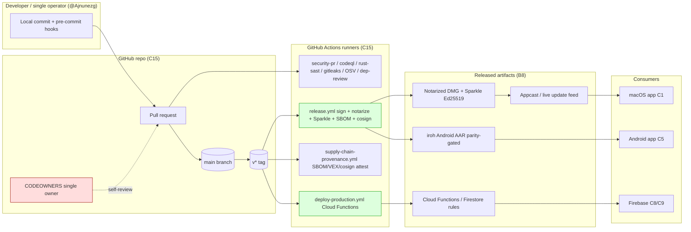
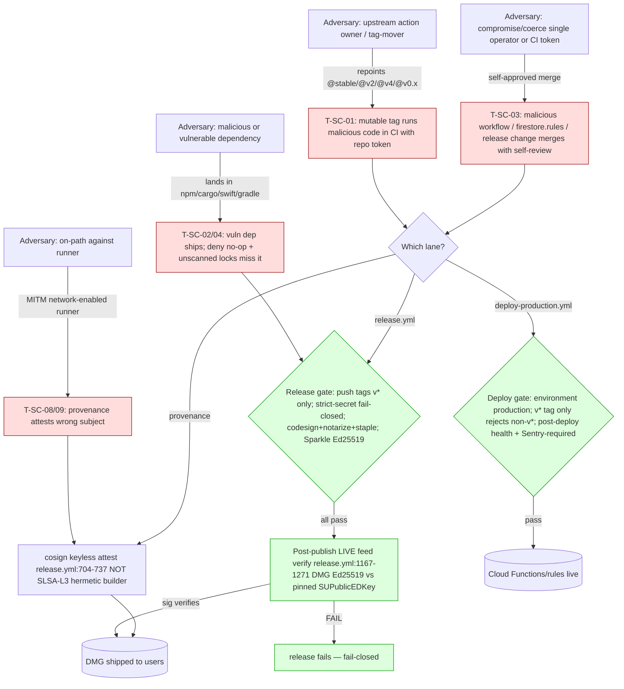

> **CONFIDENTIAL — BurnBar security package.** Independently code-verified at HEAD `5416ef780`. Share with Cure53 out-of-band; do not publish. Generated 2026-06-13 — see `_evidence/` for raw findings.

# Supply-Chain / CI-CD / Build-Release Integrity Threat Model — BurnBar / OpenBurnBar

**Phase 12.** Component **C15** (CI/CD + release) and trust boundary **B8** (Repo/CI ↔ released artifacts), with spillover into **C16** (model providers / B9), **C6** (iroh transport build), **C10** (vendored Hermes agent runtime), and **C8/C9** (Firebase / Hermes Gateway deploy path).

Frameworks mapped (not name-dropped — each finding carries the cell it lands in): **NIST SSDF (SP 800-218)** practice families PO/PS/PW/RV; **OWASP SCVS 1.0** verification groups V1–V6; **SLSA v1.0** build track L0–L3; cross-referenced to STRIDE, **NIST CSF 2.0** (Govern/Identify/Protect/Detect/Respond/Recover), and **MITRE ATLAS** where an agentic/model dependency is in play.

Evidence basis: `_evidence/14-supply-chain.md`, `_evidence/_threats.tsv` (canonical `T-SC-01…T-SC-10`), `_evidence/_claims.json` (C14), `_evidence/_INDEX.md` §6 headline risks. Code is source of truth; every load-bearing claim cites a real `file:line`. Conservative posture: where a guarantee depends on un-exported GitHub repo settings (branch protection, environment approvals, App Check console state), it is marked **UNKNOWN — needs deployed evidence**, never assumed present.

---

## 0. Reconciliation notes (read first — material deltas from the evidence file)

The per-domain evidence file `14-supply-chain.md` was authored against the spine pin `5416ef780`. Two of its statements are **corrected here after independent re-verification of the same tree**; both reduce residual risk and must be carried into the audit accurately.

| # | Evidence-file statement | Verified reality at `5416ef780` | Effect |
|---|---|---|---|
| R1 | "No Dependabot/Renovate config found for GitHub Actions SHA-bumping" (`14-supply-chain.md:76`); T-SC-01 residual "`dependabot`/Renovate not confirmed for actions" | **`.github/dependabot.yml` IS present and was present at `5416ef780`** (`git cat-file -e 5416ef780:.github/dependabot.yml` = PRESENT). It declares **12 update streams** incl. `github-actions` at `/` (`dependabot.yml:136-149`), plus `npm`×7, `gradle`, `cargo`, `swift`×2. | **T-SC-01 residual lowered to Low–Medium**: mutable action tags WILL receive weekly bump PRs. Caveat below — Dependabot bumps a *tag to a newer tag*, it does **not** convert a mutable `@v4`/`@stable` ref into a SHA pin. So the *exposure window per malicious tag-move* is reduced (PRs surface drift) but the *mutable-ref vulnerability itself persists* until refs are SHA-pinned. The finding stands; the "no automation" framing does not. |
| R2 | `Vendor/OpenBurnBarIroh.xcframework` — a `git ls-files` glob appeared to list it | `git check-ignore -v` resolves it to `.gitignore:18` (IGNORED). **Not committed.** Evidence file's T-SC-05 ("gitignored/built-fresh") is **correct**; the apparent listing was a glob artifact. | No change. T-SC-05 stays Low/latent. |

Other reconciliations confirmed *unchanged*: AAR **is** committed and rebuild-parity-gated (`Vendor/openburnbar-iroh.aar`, `build-iroh-android-aar.yml:110-119`); the C10 vendored Hermes runtime is represented in-repo only by `third_party/hermes-agent/manifest.json` + `LICENSES/Nous-hermes-agent-MIT.txt` (no committed `.pyc` at this path — the `.pyc` lives in the out-of-repo `~/.hermes/hermes-agent` runtime, so in-repo provenance for C10 is a manifest pointer, not the bytes); `run-ecosystem-deny-checks.sh:17` "cargo-deny not installed — skipping" no-op is confirmed verbatim.

**Spine note:** this deliverable is pinned per the package header to `5416ef780` (the evidence corpus pin). The working tree at authoring time sits 22 commits ahead at `c813a0d2f` on the same branch `remediation/tech-debt-fable-2026-06-12`; nothing in this model depends on a post-`5416ef780` change, and the dependabot file is identical at both commits.

---

## 1. Scope, assets, and the trust boundary (B8)

**Assets protected by B8:** the Ed25519 Sparkle update-signing key, Apple notarization/signing identity, the `GCP_SA_KEY` Firebase deploy credential, the released DMG bytes, the Cloud Functions / `firestore.rules` / `storage.rules` deployed configuration, and the committed iroh AAR. **Adversaries:** (a) compromised upstream GitHub Action; (b) malicious or vulnerable dependency (npm/SwiftPM/Cargo/Gradle/Actions); (c) compromise/coercion of the single operator or a CI token; (d) on-path attacker against the runner; (e) a poisoned model/provider or agentic-tool dependency (C10/C16, ATLAS lens). **Crown-jewel invariant:** *nothing reaches a consumer device except from a signed `v*` tag, code-signed + notarized, Sparkle-Ed25519-signed, and post-publish live-feed-verified against the pinned key.* That invariant is **largely upheld in code** (§4); the residual risk is concentrated in five places (§3 T-SC-01/02/03/04/08).

---

## 2. Dependency inventory & manifest/lockfile posture (SCVS V2 / SSDF PW.4, RV.1)

| Ecosystem | Manifests | Lockfiles (committed) | Update automation | Vuln scanning in CI | Gap |
|---|---|---|---|---|---|
| **npm** (16 workspaces) | `functions/package.json` (+overrides, `file:` deps), `apps/console`, `extensions/openburnbar`, `website`, `services/*`, `packages/*`, `tools/*`, `firestore-rules-tests`, `quota-runner` | 16× `package-lock.json` (`git ls-files '*package-lock.json'`) | **Dependabot** npm ×7 dirs weekly (`dependabot.yml:6-84`) | **OSV-Scanner over 8 locks** (`security-pr.yml:199-209`); **npm audit** high/critical (`:100-127`); **Dependency Review** fail-on-high + license allowlist (`:90-98`) | OSV covers 8 of 16 locks; the other 8 (incl. several `tools/*`, `packages/*`) rely on dep-review/npm-audit only on PR |
| **SwiftPM** | `OpenBurnBarCore/Package.swift`, `OpenBurnBarDaemon/Package.swift`, app workspace, 2× test tools | `Package.resolved` ×3 (`OpenBurnBarCore`, `OpenBurnBarDaemon`, app workspace) | **Dependabot** swift ×2 (`dependabot.yml:111-133`); dedicated lock-refresh workflow `openburnbar-app-swiftpm-lock-refresh.yml` | **None** — `Package.resolved` is **not** fed to OSV/grype | **T-SC-04**: no SwiftPM vuln scan |
| **Cargo** | `crates/openburnbar-iroh/Cargo.toml`, `crates/burnbar-remote/Cargo.toml` | 2× `Cargo.lock` (only these two crates ship) | **Dependabot** cargo `/crates/openburnbar-iroh` (`dependabot.yml:98-108`) — note: `burnbar-remote` not in dependabot | **cargo-audit `--deny warnings`** weekly+PR, fresh RustSec DB, both crates (`rust-sast.yml:42-98`); clippy FFI/memory lints (`:100-131`) | **T-SC-04**: `Cargo.lock` not OSV-scanned; **T-SC-02**: `cargo deny check` (license/bans/sources) never runs |
| **Gradle (Android)** | `android/app/build.gradle(.kts)`, `libs.versions.toml` | **No `gradle.lockfile` committed** (none found) | **Dependabot** gradle `/android` (`dependabot.yml:86-96`) | **None** — Android Gradle deps not OSV-scanned; CodeQL `java-kotlin` covers app code, not deps | **T-SC-04**: no Gradle dependency lock + no dep vuln scan; reproducibility weaker without a lockfile |
| **GitHub Actions** | 32 workflows | refs pinned per-action (mostly SHA) | **Dependabot** github-actions `/` weekly (`dependabot.yml:136-149`, `allow: dependency-type: all`) | Implicit via pinning + dep-review | **T-SC-01**: mutable tag exceptions remain (§3) |
| **iroh transport (C6)** | `crates/openburnbar-iroh/Cargo.toml:20-29` pins `iroh = "=1.0.0-rc.0"` | covered by `Cargo.lock` | exact-pin + cargo Dependabot | cargo-audit | **T-TRN-07** (cross-domain): production E2E transport on a **release candidate** — latent unpatched-upstream risk |
| **Vendored binary (C6 Android)** | `Vendor/openburnbar-iroh.aar` (**committed**) | rebuild parity = the "lock" | rebuilt + diffed each run | `build-iroh-android-aar.yml:110-119` `git diff --exit-code` vs clean rebuild | **Strong** — tampered committed AAR fails the gate |
| **Vendored binary (C6 iOS)** | `Vendor/OpenBurnBarIroh.xcframework` (**gitignored**, `.gitignore:18`) | built fresh in release | n/a | n/a (no committed bytes) | **T-SC-05**: no parity gate *if vendoring policy ever changes* |
| **Hermes agent runtime (C10)** | `third_party/hermes-agent/manifest.json` + `LICENSES/Nous-hermes-agent-MIT.txt` | manifest pins identity; runtime `.pyc` lives out-of-repo at `~/.hermes/hermes-agent` | none in-repo | none — source not fully in-repo | **C10 trust caveat**: model-loop runtime is a *trusted endpoint whose source is not fully in-repo*; provenance is a manifest pointer, not the executed bytes |
| **Model providers (C16)** | external (Anthropic/OpenAI-compatible/OpenRouter) | n/a | n/a | n/a | **B9 / ATLAS**: providers see plaintext by design; provider/model substitution is an external supply-chain surface (§7) |

**Lockfile completeness verdict (SCVS V2.x):** npm + Cargo + SwiftPM are lock-pinned; **Android Gradle has no committed dependency lock** — the weakest cell for reproducibility and a real **T-SC-04** contributor. SwiftPM and Gradle and Cargo locks are **unscanned by OSV** (only npm is). cargo-audit gives RustSec advisory coverage but not license/bans/sources/yank policy (that is the no-op `cargo deny` — **T-SC-02**).

---

## 3. Supply-chain threat model table (canonical IDs)

Severities and IDs are reproduced **verbatim** from `_evidence/_threats.tsv`; the "Residual" column folds in the §0 reconciliation (R1) and CI compensating controls. Framework cells map findings — they are not labels.

| ID | Title | Sev (canonical) | STRIDE | SSDF | SCVS | SLSA impact | Code anchor | Residual (canonical → adjusted) |
|---|---|---|---|---|---|---|---|---|
| **T-SC-01** | Mutable action tags enable CI compromise of build/release | **High** | Tampering | PW.4, PO.3 | V6.2 | caps build track at L1–L2 (build steps not pinned-immutable) | `fast-feedback.yml:478` (`dtolnay/rust-toolchain@stable`); `codeql.yml:129,184` + `codeql-pr.yml:63,70` (`github/codeql-action@v4`); `deploy-production.yml:90,96` (`google-github-actions/auth@v2`); `security-pr.yml:199` (`osv-scanner-action@v2.3.8`); `openburnbar-pr-harness.yml:852` (`android-emulator-runner@v2`); `nightly-e2e.yml:110,142` (`zaproxy/action-*@v0.x`) | Med → **Low–Med**: most actions SHA-pinned + read-only perms on security lanes; **Dependabot github-actions stream now surfaces tag drift weekly (`dependabot.yml:136-149`)** but does **not** convert mutable refs to SHA. The mutable-ref class persists on release-adjacent (`auth@v2`) and scanner lanes. |
| **T-SC-02** | Provenance lane ecosystem-deny silently no-ops | **High** | Tampering / Repudiation | PW.7, RV.1 | V2.4, V2.7 | false provenance signal (attests "deny passed" when it didn't) | `supply-chain-provenance.yml:103-104` → `run-ecosystem-deny-checks.sh:10,16-18,25,32-33` (`command -v cargo-deny … || skip`; `:17` "cargo-deny not installed — skipping") | Med — only `npm audit` actually runs there; `cargo deny check` (license/bans/sources) **never executes in CI**; the *name* of the lane overclaims its coverage. Compensated on PR by `rust-sast.yml`+`security-pr.yml` but the provenance attestation itself asserts an unran check. |
| **T-SC-03** | Single CODEOWNER = no separation of duties | **High** | Elevation / Repudiation | PO.2, PW.7 | V1.x (governance) | undermines two-person integrity over the build config itself | `.github/CODEOWNERS:4,18` (`* @Ajnunezg`; `.github/workflows/ @Ajnunezg`) | **High until branch-protection/ruleset evidence supplied.** Owner owns its own `.github/workflows/`; a compromised operator or token self-reviews a malicious workflow/`firestore.rules`/release. **UNKNOWN**: required-reviews / required-checks not exportable from code. |
| **T-SC-04** | Cargo/SwiftPM/Gradle locks not OSV-scanned | **Medium** | Tampering | RV.1 | V2.4 | gaps continuous-vuln-monitoring of 3 ecosystems | `security-pr.yml:199-209` (npm only); `rust-sast.yml:50-55` (cargo-audit only); no `Package.resolved`/Gradle scan | Med — cargo-audit catches RustSec-known crate CVEs; a malicious *new* transitive crate, or any vulnerable SwiftPM/Gradle dep, lands undetected. |
| **T-SC-05** | xcframework lacks rebuild-parity gate | **Low** | Tampering | PW.4 | V6.1 | latent if iOS binary ever committed | `iroh-xcframework.yml:63-79`; `.gitignore:18` (currently IGNORED) | Low — currently built-fresh, no committed bytes to tamper; asymmetric vs the parity-gated AAR. |
| **T-SC-06** | GPG checksum signing best-effort, not enforced | **Medium** | Repudiation | PS.2 | V4.x | weakens checksum provenance leg | `release.yml:658-664` (`if: env.RELEASE_SIGNING_KEY != ''`); strict-secret gate `:139-170` does **not** include this key | Low–Med — if the secret is unset the release ships **unsigned** `.asc`; cosign + notarization + Sparkle Ed25519 + live-feed verify remain, so provenance survives via three other legs. |
| **T-SC-07** | `firebase.json` predeploy runs arbitrary npm build with deploy creds | **Low** | Tampering | PW.6 | V5.x | build-time code exec inside the GCP-authed job | `firebase.json:5-7,30-32,309` (`npm --prefix … run build/verify`) after `google-github-actions/auth` | Low — signed-tag-only deploy, `npm ci` from committed lock, least-priv token; but a compromised devDependency executes *with deploy credentials in env*. |
| **T-SC-08** | Provenance SBOM attests source, not as-shipped bytes | **Medium** | Spoofing / Repudiation | PS.3, RV | V2.7 | attestation subject ≠ published artifact | `supply-chain-provenance.yml:59-69,84-93` (PR-style fallback attests `$SBOM` from `$GITHUB_WORKSPACE`) | Med — `release.yml:707-737` attests the **actual** DMG/zip, but the provenance lane attests a freshly-generated SBOM regardless of whether artifacts downloaded → a consumer trusting the provenance-lane attestation gets a source-tree SBOM, not the binary's. |
| **T-SC-09** | `workflow_run` runs in trusted context off external success | **Low** | Elevation | PO.3 | V6.x | trusted-context job triggered by another workflow's conclusion | `supply-chain-provenance.yml:11-14,23-25,48-54` (gets secrets + `id-token`/`attestations:write`; gated on `conclusion==success && head_branch starts v`) | Low — regenerates SBOM from source, never executes downloaded artifacts; tag-prefix guard. |
| **T-SC-10** | Agentic `droid exec --skip-permissions-unsafe` in CI | **Low** | Elevation / agentic-tool-abuse (ATLAS) | PW.6 | V6.x | autonomous agent runs unattended in CI | `droid-wiki-refresh.yml:34-37` (`--skip-permissions-unsafe`); refuses installers `:24-25` | Low — no write token (default read), `continue-on-error`; **but no explicit top-level `permissions:` block** (relies on repo default). |

**Cross-domain dependency threats pulled in (full detail in their domain files):**

| ID | Title | Sev | Why it lives partly here | Anchor |
|---|---|---|---|---|
| **T-TRN-07** | Production E2E transport on iroh `1.0.0-rc.0` | Low | A *release-candidate* dependency in the security-critical transport (C6) — dependency-maturity risk | `crates/openburnbar-iroh/Cargo.toml:20-29` |
| **C10 caveat** | Hermes agent runtime source not fully in-repo | Info/Med | Vendored model-loop runtime is trusted but its executed `.pyc` bytes are not version-controlled here | `third_party/hermes-agent/manifest.json` |
| **T-AI-03** | Memory/RAG poisoning via parsed third-party agent logs | Med | "Data supply chain" — untrusted agent-log content enters the RAG corpus with no provenance tier (ATLAS AML.T0070) | `LogParserProtocol.swift`, `SearchService+Retrieval` |

---

## 4. CI/CD attack paths to production deploy

**Reading the paths:**

- **Path via T-SC-01 → release/deploy:** a moved mutable tag executes attacker code inside a CI job that holds the repo token. On *security/test* lanes the top-level `permissions: contents: read` (30/32 workflows, e.g. `deploy-production.yml:3-5`, `build-iroh-android-aar.yml:3-4`) bounds the blast radius. The dangerous instances are release-adjacent: `google-github-actions/auth@v2` (`deploy-production.yml:90,96`) sits in the GCP-authenticated deploy job — a malicious `auth@v2` could exfiltrate the workload-identity token. **This is the single highest-value mutable-tag instance** and should be SHA-pinned first.
- **Path via T-SC-03 (insider/token):** the structural single-reviewer gap means a malicious change to `.github/workflows/*`, `firestore.rules`, or the release pipeline can merge under self-review. This is the **dominant residual** because it bypasses *every* downstream gate — the operator can also alter the gates. Mitigation is **organizational** (branch protection + required second reviewer), and is **UNKNOWN from code**.
- **Path via T-SC-02/04 (dependency):** a vulnerable/yanked Rust dep, an unscanned SwiftPM/Gradle dep, or a malicious npm transitive in one of the 8 OSV-uncovered locks reaches an artifact. The provenance "deny" lane *passes* without running cargo-deny/osv-scanner, producing a **false green** attestation (T-SC-02) — this is worse than no check because consumers may trust the attestation.
- **Where the chain holds (the good news, code-verified):** there is **no push-to-main or PR deploy path** to prod (`deploy-production.yml:7-10,56-59`); release is **tag-gated** (`release.yml:8-12`); the **post-publish live-feed verify** (`release.yml:1167-1271`) re-fetches the *published* feed and fails the release if the live DMG's Ed25519 signature does not verify against the **pinned** `SUPublicEDKey` (`release.yml:1254-1268`, SPKI-wrapped raw 32-byte key + `crypto.verify(null, dmg, key, sig)`). That single control closes the "tampered-after-build / tampered-feed" class fail-closed and is the strongest link in B8.

---

## 5. Release-integrity checklist (as-implemented, code-verified)

Legend: ✅ implemented & fail-closed · 🟡 implemented but best-effort/optional · ⚠️ gap/UNKNOWN.

| Control | Status | Evidence | SLSA / SSDF |
|---|---|---|---|
| Prod deploy only from `v*` tag + `environment: production` | ✅ | `deploy-production.yml:7-10,31,56-59` | SLSA build L1 source-gated; SSDF PO.3 |
| Release only on `push: tags: v*` + `workflow_dispatch` | ✅ | `release.yml:8-12` | SLSA provenance scope; SSDF PS.1 |
| Strict fail-closed release-secret validation (signing/notary/Sparkle/Firebase) | ✅ | `release.yml:139-170` | SSDF PO.5 |
| macOS codesign + hardened runtime + notarize + staple + validate | ✅ | `release.yml:415-448,500-531` | SSDF PS.2; SLSA L1 |
| Sparkle Ed25519 update signing | ✅ | `release.yml:179-191,587-615` | SSDF PS.2 |
| **Post-publish LIVE feed verify** (version/sha256/length + DMG Ed25519 vs pinned key) | ✅ | `release.yml:1167-1271,1254-1268` | SSDF RV.3; **strongest B8 link** |
| cosign keyless SLSA attestations over SBOM/VEX/checksums/DMG/zip/source/appcast | 🟡 | `release.yml:704-737`; `supply-chain-provenance.yml:84-93` | SLSA provenance L2 (keyless, transparency-log) — **not L3** (GitHub-hosted, network-enabled, non-hermetic builder) |
| SBOM (SPDX) + OpenVEX generation | 🟡 | `release.yml:677-702`; `generate-sbom.py`, `generate-vex.py` | SCVS V2; SSDF PS.3 |
| GPG-signed release checksums | 🟡 | `release.yml:658-675` (`if RELEASE_SIGNING_KEY != ''`) | **T-SC-06** — optional, not in strict gate |
| Committed Android AAR rebuild-parity gate | ✅ | `build-iroh-android-aar.yml:110-119` | SSDF PW.4; SLSA L2-ish for that artifact |
| iOS xcframework parity gate | ⚠️ | gitignored/built-fresh (`.gitignore:18`); no gate | **T-SC-05** (latent) |
| `cargo deny check` (license/bans/sources) actually runs | ⚠️ | `run-ecosystem-deny-checks.sh:17` no-ops | **T-SC-02** |
| Provenance SBOM = as-shipped bytes (not source tree) | ⚠️ | `supply-chain-provenance.yml:59-69` | **T-SC-08** |
| Bit-reproducible notarized builds | ⚠️ (honestly de-scoped) | `SUPPLY_CHAIN_PROVENANCE.md:53-68`; `supply-chain-provenance.yml:113` | **not** an overclaim — explicitly out of scope; SLSA L4 not targeted |
| Publishable-tree secret scan + privacy-manifest presence gate | ✅ | `release.yml:121-122,739-755` | SSDF PW.8 |
| Fail-closed release preflight (source provenance + signed legal approval) | ✅ | `check_burnbar_release_preflight.py:65-91` | SSDF PO.1 |
| libsignal submodule resync to tag gitlink (provenance reads released commit) | ✅ | `deploy-production.yml:60-68` | SSDF PS.3 |

---

## 6. Security-scanning posture (SAST / DAST / secrets / IaC / containers / license)

| Discipline | Coverage | Evidence | Gap |
|---|---|---|---|
| **SAST — CodeQL** | swift, java-kotlin, javascript-typescript, python (matrix) | `codeql.yml:53-65` | **Rust NOT in CodeQL** (no GA Rust analyzer) — compensated by `rust-sast.yml`. Swift on **push only, not PR** (`codeql.yml:9-10`) → Swift PRs un-SAST'd until merged. Kotlin **is** covered (closes the RR-16 "Kotlin SAST" item). |
| **SAST — Rust** | cargo-audit `--deny warnings` + clippy FFI/memory lints, both shipping crates, weekly cron + PR | `rust-sast.yml:42-131` | advisory + lint coverage; **not** a dataflow taint analyzer (no Rust CodeQL/semgrep-rust). |
| **Secret scanning** | gitleaks `@v8.28.0` PR-range + full-history fallback; pre-commit gitleaks `v8.27.2`, detect-secrets `v1.5.0`, detect-private-key, no-commit-to-branch | `security-pr.yml:63-79`; `.pre-commit-config.yaml:158-167,24,30` | strong; no trufflehog (gitleaks+detect-secrets adequate). Pre-commit relies on local opt-in (advisory). |
| **Dependency vuln scan** | OSV-Scanner ×8 npm locks; npm audit; GitHub Dependency Review fail-on-high + license allowlist; cargo-audit ×2 crates | `security-pr.yml:90-127,199-209`; `rust-sast.yml:50-55` | **T-SC-04**: SwiftPM/Gradle/Cargo locks not OSV-scanned; 8 npm locks OSV-uncovered. |
| **DAST** | OWASP ZAP nightly (`zaproxy/action-*`) | `nightly-e2e.yml:110,142` | runs on **mutable `@v0.x` tags** (T-SC-01); coverage scope (which surfaces) not audited here. |
| **IaC / rules scanning** | Firestore-rules test suite (`firestore-rules-tests/`); Confidentiality Guard with self-test; workflow lint | `confidentiality-guard.yml:45-49`; `workflow-lint.yml` | no generic IaC scanner (checkov/tfsec) — but infra is Firebase rules + workflows, partially covered by rules-tests + lint. |
| **Container / Docker provenance** | **N/A in consumer path** — macOS app + Cloud Functions + static console; no committed production Dockerfile in scope | — | **UNKNOWN**: if hosted services (`services/hosted-mcp`, `services/hermes-realtime-relay`) build container images, their registry/provenance is out of this repo's evidence — flag for deployed-infra review. |
| **License risk** | Dependency-review license allowlist; `license-posture.yml`; `LICENSES/` incl. `Nous-hermes-agent-MIT.txt` | `security-pr.yml:90-98`; `license-posture.yml` | the no-op `cargo deny check` would normally enforce *crate* license bans — that leg is **not running** (T-SC-02), so Rust license policy is unenforced in CI. |
| **AIBOM / model-bom** | none found | — | no AI-BOM enumerating model/provider/agent-runtime deps (C10/C16); recommended below. |

---

## 7. Model / provider / agentic dependency risk (C10, C16, B9 — ATLAS + SSDF lens)

The agent stack introduces a **non-package supply chain** that classic SCVS/SLSA do not fully cover:

- **C10 vendored Hermes runtime** — the model-loop runtime executes from `~/.hermes/hermes-agent` (`.pyc`), whose source is **not fully in-repo** (`_INDEX.md` C10). In-repo provenance is only `third_party/hermes-agent/manifest.json` + an MIT license file. A tampered or substituted runtime executes inside the **trusted endpoint** (C1/C2, B1) with full local agency. **Control gap:** no rebuild-parity (unlike the AAR), no SBOM entry, no signature pin on the `.pyc` bytes verified at load. **ATLAS:** AML.T0010 (ML supply-chain compromise) / AML.T0018 (backdoor in delivered artifact).
- **C16 model providers / B9** — providers (Anthropic, OpenAI-compatible, OpenRouter) see plaintext by design; **provider/endpoint substitution** (e.g. a poisoned OpenAI-compatible base URL or a malicious "model") is a supply-chain vector for *behavior*, not bytes. Combined with the unwrapped-tool-output injection findings (T-AI-01/02, T-TOOL-05) and YOLO RCE (T-TOOL-02/T-AI-07), a malicious model output is effectively a remote-code-execution dependency when the user opts into trusted/YOLO mode. **ATLAS:** AML.T0051 (LLM prompt injection) feeding AML.T0048-style policy spoofing.
- **Agentic tool/plugin deps** — external CLI agents (claude/codex/droid/forge/antigravity/cursor) are spawned with capability-derived flags (`CLIArgumentBuilder.swift:47-103`); OpenBurnBar cannot interpose on the CLI's own tool/plugin loading. The CLI's *own* plugin/MCP ecosystem is an unmanaged transitive dependency surface (T-TOOL-01/05).
- **Data supply chain (RAG)** — third-party agent logs enter the retrieval corpus with no provenance trust tier (T-AI-03); a poisoned chunk persists cross-session. This is "dependency confusion" applied to *knowledge*, not packages.
- **Dependency confusion (classic):** `functions/package.json` uses `file:` workspace deps + `overrides`. No evidence of a private-registry scope-squat guard (`.npmrc` scope→registry pinning) was surfaced in the evidence file — **UNKNOWN**, recommend explicit registry pinning to close namespace-takeover risk for internal `@openburnbar/*` packages.

**Recommendation:** publish an **AIBOM** alongside the SBOM enumerating provider + model id + endpoint, vendored agent-runtime hash, and each external CLI agent + version; and add a **load-time hash pin** on the C10 `.pyc` mirroring the AAR parity philosophy.

---

## 8. SLSA-level & SSDF-practice mapping

**SLSA v1.0 build track — current state ≈ L2, with L3 gaps:**

| SLSA requirement | State | Evidence / gap |
|---|---|---|
| L1 — provenance exists | ✅ | cosign attestations `release.yml:704-737` |
| L1 — scripted/automated build | ✅ | tag-triggered workflows |
| L2 — hosted, authenticated build service | ✅ | GitHub-hosted runners; keyless OIDC (Fulcio/Rekor) |
| L2 — provenance signed | ✅ | cosign keyless → transparency log |
| **L3 — non-falsifiable provenance / isolated builder** | ⚠️ | GitHub-hosted runners have **network access** and are **non-hermetic** (`supply-chain-provenance.yml:113`, `SUPPLY_CHAIN_PROVENANCE.md:53-68` — honestly de-scoped). Not L3. |
| **L3 — provenance subject == published bytes** | ⚠️ | `release.yml` attests real DMG/zip ✅, but the **provenance lane attests source-tree SBOM** (T-SC-08). Mixed. |

**Verdict:** the *release* lane is a credible **SLSA L2** with one L3-style strength (pinned live-feed Ed25519 verify) and one L3 gap (non-hermetic builder). The *provenance* lane **overclaims** (T-SC-02/08) and should be treated as L1-equivalent until cargo-deny/osv actually run and the SBOM is taken from the as-shipped artifact.

**NIST SSDF (SP 800-218) practice coverage:**

| Practice | Status | Anchor / gap |
|---|---|---|
| **PO.1** define security requirements | ✅ | preflight legal+provenance gate (`check_burnbar_release_preflight.py:65-91`) |
| **PO.2** roles & two-person integrity | ⚠️ **T-SC-03** | single CODEOWNER `.github/CODEOWNERS:4,18` |
| **PO.3** supporting toolchains secured | 🟡 **T-SC-01** | most actions pinned; mutable-tag exceptions; Dependabot now surfaces drift |
| **PO.5** secure build environments | ✅ | least-priv `permissions` 30/32; `environment: production` |
| **PS.1** protect code from tampering | ✅ | tag-gated, fail-closed secret gate |
| **PS.2** provide provenance / signing | 🟡 | codesign+notarize+Sparkle ✅; GPG checksums optional (T-SC-06) |
| **PS.3** SBOM/provenance archival | 🟡 **T-SC-08** | SBOM generated; provenance-lane subject mismatch |
| **PW.4** reuse secure third-party components | 🟡 **T-SC-01/04** | parity-gated AAR ✅; mutable tags + unscanned locks |
| **PW.6** secure build/config | 🟡 **T-SC-07/10** | predeploy npm-with-creds; agentic CI job |
| **PW.7** review/analyze code | ⚠️ **T-SC-03** | CodeQL/rust-sast ✅ but no enforced second reviewer |
| **PW.8** test executable security | ✅ | gitleaks, OSV, dep-review, DAST nightly |
| **RV.1** identify/confirm vulnerabilities | 🟡 **T-SC-04** | npm OSV + cargo-audit; SwiftPM/Gradle/Cargo-OSV gaps |
| **RV.3** analyze & remediate root cause | ✅ | post-publish live-feed verify fail-closes regressions |

---

## 9. Recommended controls (prioritized)

**P0 — close before audit sign-off:**
1. **SHA-pin the release/deploy-adjacent mutable actions first** (T-SC-01): `google-github-actions/auth@v2` (`deploy-production.yml:90,96`), then `github/codeql-action@v4`, `osv-scanner-action@v2.3.8`, `android-emulator-runner@v2`, `zaproxy/action-*@v0.x`, `dtolnay/rust-toolchain@stable`. Keep the Dependabot `github-actions` stream (`dependabot.yml:136-149`) to bump the *pinned SHAs* going forward.
2. **Make the provenance deny-lane real or delete it** (T-SC-02): `cargo install cargo-deny` + `cargo deny check` (advisories+bans+licenses+sources) and install `osv-scanner` on the provenance runner — *or* remove the no-op step so the attestation stops asserting an unran check. The current state is a **false-assurance attestation**, the worst failure mode.
3. **Establish provable two-person integrity** (T-SC-03): export and attach the GitHub **branch-protection / ruleset** (`gh api repos/{o}/{r}/rulesets`, `branches/main/protection`) showing required reviews ≥1 non-author, required status checks (CodeQL-swift, Confidentiality Guard, security-pr lanes), signed commits, linear history, and restricted push-to-main. Add a second trusted reviewer/identity to `CODEOWNERS` for `.github/workflows/`, `firestore.rules`, and `release.yml`. **This is the single highest-leverage fix** — it gates every other path.

**P1 — strong hardening:**
4. **Extend OSV/grype to Cargo.lock, `Package.resolved`, and a new Android `gradle.lockfile`** (T-SC-04); commit a Gradle dependency lock to restore reproducibility.
5. **Attest the as-shipped bytes** (T-SC-08): generate the provenance SBOM from the downloaded release artifacts, not the re-checked-out tree.
6. **Promote GPG checksum signing into the strict-secret gate** or drop it in favor of cosign-only (T-SC-06) so there is no silent unsigned-checksum path.

**P2 — agentic/model supply chain:**
7. **Publish an AIBOM** + **load-time hash-pin the C10 `~/.hermes/hermes-agent` `.pyc`** mirroring the AAR parity gate.
8. **Pin internal npm scopes to a private registry** in `.npmrc` to close dependency-confusion on `@openburnbar/*`.
9. **Add explicit top-level `permissions:`** to `droid-wiki-refresh.yml` and `computer-use-loopback-test.yml` (T-SC-10).
10. **Track iroh off the release candidate** (T-TRN-07) to a stable line when GA lands.

---

## 10. Minimum bar before audit

A Cure53 engagement can proceed on the *release* lane today, but the package must hand over the following so the auditor is not blocked on UNKNOWNs (all are deployed-config exports, not code changes):

| Required evidence | Resolves | How |
|---|---|---|
| `main` branch-protection / ruleset export (required reviews, required checks, signed-commit, restrict-push) | **T-SC-03** (the dominant residual) | `gh api repos/{o}/{r}/rulesets`, `…/branches/main/protection` |
| `production` environment protection-rules export (required reviewers/approval, secret scoping of `GCP_SA_KEY`, `APPLE_*`, `OPENBURNBAR_SPARKLE_PRIVATE_KEY_BASE64`, `RELEASE_SIGNING_KEY`) | release/deploy secret blast radius | environment settings export |
| Confirmation cargo-deny/osv-scanner are (or will be) installed on the provenance runner | **T-SC-02** | re-run + log capture, or remove step |
| IAM export for the `GCP_SA_KEY` service account (least-priv Firebase-deploy roles only) | T-SC-07 blast radius | cloud read-only IAM export |
| Whether hosted services (`services/*`) build container images + their registry/provenance | container-provenance UNKNOWN (§6) | deployed-infra review |
| App Check console enforcement state (cross-ref T-AZ-06) | not strictly C15 but gates the deployed-data confidentiality story | console export |

**Bottom line for B8:** the **build-and-publish integrity invariant is genuinely strong in code** — tag-gated, signed, notarized, Sparkle-Ed25519-signed, and post-publish live-feed-verified fail-closed (`release.yml:1167-1271`). The residual risk is **not in the cryptographic release machinery**; it is in (a) **governance** (single-reviewer T-SC-03 — UNKNOWN branch protection), (b) a **false-assurance provenance lane** (T-SC-02/08), and (c) **incomplete dependency-vuln coverage** (T-SC-04) plus **mutable-tag drift** (T-SC-01, now drift-surfaced by Dependabot but not eliminated). None are `NotDefensible` against the product's honest claims (C14 holds — BurnBar does not overclaim a hermetic SLSA-L3 supply chain; `SUPPLY_CHAIN_PROVENANCE.md:53-68` de-scopes reproducibility openly), but T-SC-02 and T-SC-03 should be closed before sign-off.
