> **CONFIDENTIAL — BurnBar security package.** Independently code-verified at HEAD `5416ef780`. Share with Cure53 out-of-band; do not publish. Generated — see `_evidence/` for raw findings.

# Trust Boundaries (Phase 3)

This document enumerates every trust boundary in the BurnBar / OpenBurnBar system: the canonical set **B1–B9** from `_evidence/_INDEX.md` plus the finer-grained boundaries the canonical set abstracts over. For each boundary it records **what crosses**, the **assumed trust** on each side, and the **authN / authZ / encryption / integrity / replay-freshness / logging** properties, the **failure mode**, **what happens if the less-trusted side is compromised**, the **existing controls** (`file:line` from the evidence files), the **missing controls**, and the **residual risk**.

Two boundaries are foregrounded because they are the package's structural weak points, and both are *asymmetric* — one direction is hardened, the reverse direction is not:

1. **B2-iroh — the asymmetric pairing-trust boundary** (`T-TRN-01` Critical / `T-PTR-03` High): the Mac→phone controller key is Keychain-pinned, but the phone→Mac iroh host pairing key is **in-memory TOFU**, re-fetched each cold session from untrusted Firestore. A compromised cloud can substitute the host key plus a matching signed record and MITM/redirect the iroh control channel.
2. **B1 — daemon code-sign==authZ boundary** (`T-DMN-01` High): the daemon treats a **valid first-party code signature as authorization** — no per-operation capability attenuation, running **unsandboxed** at full login-user privilege. One signed-app RCE = full local agency + credential access.

Severity model, component IDs (C1–C16), and the 14 claim verdicts (C1–C14) are defined in `_INDEX.md`. Threat IDs (`T-*`) and severities are canonical from `_threats.tsv`; claim verdicts from `_claims.json`. "Missing controls" are controls not proven by the codebase, not assertions of exploitation.

---

## 0. Boundary map (Mermaid)

```mermaid
flowchart TB
    subgraph LOCAL["Mac login-user trust domain (UID-equal, NOT sandboxed)"]
        C1["C1 AgentLens macOS app"]
        C2["C2 Daemon (launchd unix socket)"]
        C10["C10 Hermes agent runtime"]
        KC["macOS Keychain / Secure Enclave"]
        FS["~/Library FS · daemon binary · sockets"]
        SH["/bin/zsh · spawned CLI agents"]
    end

    subgraph ENDPOINTS["Mobile / web endpoints"]
        C4["C4 iOS/iPadOS app"]
        C5["C5 Android app"]
        C12["C12 Web console (semi-trusted)"]
        KS["iOS Keychain / Android Keystore"]
    end

    subgraph TRANSPORT["Transport (relays untrusted)"]
        C6["C6 iroh QUIC P2P"]
        C7["C7 iroh n0 relays (UNTRUSTED)"]
    end

    subgraph CLOUD["Firebase control plane (honest-but-curious)"]
        C8["C8 Firestore / Functions / Storage"]
        C9["C9 Hermes Gateway (blind store-fwd)"]
        C11["C11 Hosted MCP (no decrypt)"]
        SM["Secret Manager / KMS"]
        PUSH["FCM / APNs push"]
        OBS["Sentry / Crashlytics"]
    end

    subgraph AGENTIC["Agent runtime + tools (plaintext by design)"]
        AGENT["model loop (C10/C16)"]
        TOOLS["tools: shell·file·browser·CU"]
        MEM["memory / RAG corpus"]
        RET["retrieved/untrusted content"]
        C16["C16 model providers (UNTRUSTED 3P)"]
    end

    subgraph PIPELINE["Build / release"]
        ADMIN["operator / admin"]
        CI["C15 CI/CD (.github/workflows)"]
        REG["artifact registry / DMG / AAR"]
    end

    USER([User / operator])

    %% Local boundaries
    C1 -.B1 same-UID.-> C2
    C1 ==>|"B-KC app↔Keychain/SE"| KC
    C2 ==>|"B-FS daemon↔filesystem"| FS
    C2 ==>|"B-EXEC daemon↔shell/exec"| SH
    C2 --> C10

    %% Phone/web control
    C4 ==>|"B4 phone↔Mac control"| C1
    C5 ==>|"B4"| C1
    C12 ==>|"B-WEB wrap approval"| C8
    C4 ==> KS
    C5 ==> KS

    %% Pairing / transport (FOREGROUND asymmetry)
    C8 ==>|"B2-iroh host key TOFU in-mem ⟶ phone  T-TRN-01"| C4
    C1 ==>|"B3/B4 controller key Keychain-pinned ⟶ Mac"| C8
    C4 ==>|"B-NET"| C6
    C1 ==>|"B-NET"| C6
    C6 --- C7

    %% Cloud boundaries
    C4 ==>|"B2 device↔cloud"| C8
    C5 ==>|"B2"| C8
    C1 ==>|"B2"| C8
    C8 ==>|"B5 gateway↔agent"| C9
    C8 ==>|"B7 cloud↔storage"| REG
    C8 ==>|"B-SM cloud↔Secret Mgr/KMS"| SM
    C8 ==>|"B-PUSH cloud↔push"| PUSH
    C8 ==>|"B-OBS cloud↔analytics"| OBS
    C9 --> C11

    %% Agentic boundaries
    USER ==>|"B6 user↔agent"| AGENT
    AGENT ==>|"B-AT agent↔tools"| TOOLS
    AGENT ==>|"B-AM agent↔memory"| MEM
    RET ==>|"B-AR agent↔retrieved content"| AGENT
    AGENT ==>|"B-AA agent↔other agents"| C10
    AGENT ==>|"B9 burnbar↔providers"| C16
    TOOLS --> SH

    %% Pipeline
    ADMIN ==>|"B-AP admin↔prod"| C8
    ADMIN ==>|"B-CD CI↔prod deploy"| C8
    CI ==>|"B8 repo/CI↔artifacts"| REG
    CI ==>|"B-BR build↔registry"| REG

    classDef untrusted fill:#eee,stroke:#999,stroke-dasharray:4 3;
    class C7,C16,C8,C9,C11 untrusted;
```

Legend: `==>` data/authority crossing a boundary; `-.->` same-trust-domain (B1) link; grey/dashed = untrusted-for-content components.

---

## 1. Canonical boundary catalogue (B1–B9 + B2-iroh)

### B1 — Same-user processes ↔ Mac app/daemon  *(canonical)*

> **FOREGROUND: daemon code-sign == authZ (`T-DMN-01`, High).** All processes running as the login UID are treated as equally trusted, and the daemon converts "valid first-party signature" directly into "full authority" with no per-operation attenuation and no sandbox.

| Property | Detail |
|---|---|
| **What crosses** | JSON-RPC over a unix socket (`OpenBurnBarDaemonServer`): run dispatch, config writes, provider-credential reads, HID/input forwarding. C1 (app) → C2 (daemon) → C10 (runtime). |
| **Assumed trust** | All same-UID processes equally trusted (documented ground rule, `_INDEX` B1). Daemon trusts any peer that satisfies the Designated Requirement. |
| **AuthN** | Peer code-signature gate via audit-token DR on **every socket** before any RPC is honored — main `BurnBarDaemonPeerAuthenticator.swift:62-87`, `OpenBurnBarDaemonServer.swift:580-595`; HID `PrivilegedPeerAuthenticator.swift:36-84`. DR = `anchor apple generic and certificate leaf[subject.OU]="4Y367DF25B" and (identifier "com.openburnbar.app" or …)` (`PrivilegedSocketTrust.swift:69-71`); hardened-runtime + library-validation checked programmatically (`PrivilegedSocketTrust.swift:190-198`). |
| **AuthZ** | **Code-signature identity *is* the authorization** — no per-RPC capability attenuation (`T-DMN-01`). Bearer token (`OpenBurnBarDaemonServer.swift:365-383`, constant-time) demoted to defense-in-depth behind the DR gate (`BurnBarDaemonPeerAuthenticator.swift:28-31`). |
| **Encryption** | Local unix socket. HPKE credential envelopes for the macOS-login-password leg (`RemoteUnlockCredentialEnvelopeCrypto.swift:36-122`). |
| **Integrity / replay** | Audit-token DR per connection; constant-time token compare; socket files 0600 + 0700 squat-proof dir (`OpenBurnBarDaemonServer.swift:700`, `PrivilegedInputExecutionSocketServer.swift:84-109,177,186`). |
| **Logging** | Peer-auth failures fail-closed + audited; connection-slot semaphore bounds floods (`PrivilegedInputExecutionSocketServer.swift:37,56,138`). |
| **Failure mode** | Fail-closed: daemon refuses to launch tokenless (`OpenBurnBarDaemonConfiguration.swift:233-237`); DR mismatch closes the connection. |
| **If less-trusted side compromised** | Any code injected into the signed `com.openburnbar.app`/`.daemon` passes the DR gate → **full main-socket RPC** (run dispatch, config, provider creds) + HID input. **Single signed-app RCE = full local agency + credential access** (`T-DMN-01`). |
| **Existing controls** | `BurnBarDaemonPeerAuthenticator.swift:62-87,99-112`; `PrivilegedSocketTrust.swift:69-71,190-198`; `OpenBurnBarDaemonServer.swift:580-595,365-383,700`; `ConstantTimeCompare.swift`. |
| **Missing controls** | No per-RPC capability attenuation; no OS sandbox; env escape-hatch `OPENBURNBAR_DAEMON_DISABLE_PEER_CODESIG=1` ships in the released binary (`OpenBurnBarDaemonMain.swift:76-84`, `T-DMN-05`). |
| **Residual risk** | **High** — code-sign==authZ + no sandbox means one first-party RCE owns the local domain. |

Threats: `T-DMN-01` (High), `T-DMN-04` (Med), `T-DMN-05` (Med), `T-DMN-06`/`T-DMN-07` (Low). Claim evidence: "Only first-party signed apps connect" — **Defensible** (prod-enforced-only); "high-risk grants bound to single-use proof" — **Partial** (daemon does not re-verify, `T-DMN-04`).

---

### B2 — Device ↔ Cloud (Firestore / Functions)  *(canonical)*

| Property | Detail |
|---|---|
| **What crosses** | Sealed content envelopes, per-collection plaintext metadata, callable RPCs, signed-URL mints. C1/C4/C5 ↔ C8. |
| **Assumed trust** | Honest-but-curious for content; trusted for availability / ordering / authz-metadata. **Admin SDK bypasses rules.** |
| **AuthN** | Firebase Auth `request.auth`; App Check (code-side default-ON, prod fail-closed `config.ts:68,78-84`; SDK datapath enforcement is a **console toggle, UNKNOWN from repo** — `T-AZ-06`). |
| **AuthZ** | Per-namespace ownership `ownsUserNamespace(userId)` (`firestore.rules:52`); root-profile write allowlist (`:77-113`); server-only trust/entitlement/nonce collections (`:3364-3367,4226-4248`); central callable guard `assertOwnership`/`enforceAuthAndAppCheck` (`auth.ts:22-31,69-73`). |
| **Encryption** | Content sealed client-side (`validCloudSealedText` forces AES-256-GCM + AAD at schema≥2, `firestore.rules:462-500`); TLS to Firebase. Metadata cleartext **by design**. |
| **Integrity / replay** | Vault-key continuity in rules (`:2204-2205,2231`); high-risk single-use nonce atomic consume (`appCheckAttestation.ts:179,205`). |
| **Logging** | Append-only audit collections (`firestore.rules:2711-2712`). |
| **Failure mode** | Default-deny unmatched paths; callables throw on prod start if App Check disabled (`config.ts:78-84`). |
| **If cloud compromised** | Reads all plaintext metadata (`T-AZ-03` Med); cannot read sealed bodies (C2 **Partial** — legacy plaintext rows + endpoint exceptions); a missing-`assertOwnership` handler is a cross-tenant read/write via Admin SDK (`T-AZ-05` Med); can substitute the iroh host key (see **B2-iroh**). |
| **Existing controls** | `firestore.rules:52,77-113,462-500,2204-2205,3364-3367,4226-4248`; `auth.ts:22-31,69-73`; `config.ts:68,78-84`; `appCheckAttestation.ts:179`. |
| **Missing controls** | Plaintext-secret denylist exact-top-level-name only (`firestore.rules:56-69`, `T-AZ-04`); no structural guarantee all 100 callables call `assertOwnership` (`T-AZ-05`); console App Check unverifiable from repo (`T-AZ-06`); avatar global-read (`storage.rules:19`, `T-AZ-01`). |
| **Residual risk** | **Medium** — metadata exposure + per-handler-convention authz + unknown deployed App Check. |

Threats: `T-AZ-01`…`T-AZ-08`. Claims: C2 **Partial**/High; C10 **Defensible**/High; C11 **Partial**/Med.

---

### B2-iroh — Cloud-published iroh pairing key / inbound allowlist ↔ phone  *(canonical, transport-specific)*

> **FOREGROUND: the asymmetric pairing-trust boundary (`T-TRN-01` Critical / `T-PTR-03` High).** The single most important structural finding. The **Mac→phone** controller key is Keychain-pinned (persisted, safety-code-gated, mismatch always refused). The **phone→Mac** host pairing key is **in-memory TOFU only** — re-fetched fresh each cold session from untrusted Firestore, with **no Keychain pin, no safety code, no persistence**. Trust is asymmetric across the same logical pairing.

| Property | Detail |
|---|---|
| **What crosses** | (a) Mac's Ed25519-signed iroh `NodeAddr` pairing record + the `iroh_pairing_keys/host.publicKeyBase64` that verifies it (cloud→phone); (b) the inbound NodeId allowlist `iroh_pairing/{conn}/controllers/*` (cloud→Mac). |
| **Assumed trust** | Cloud is **untrusted** (ground rule). Phone currently trusts "whatever Firestore returns" for the host key. Mac trusts the cloud-sourced allowlist for transport admission. |
| **AuthN** | Phone verifies the Mac's Ed25519 signature over the canonical pairing payload (`IrohRelayPairing.swift:133`, `HermesIrohRelayTransport.swift:385`) + 180 s freshness (`IrohRelayPairing.swift:165`). **But the verifying key itself is unauthenticated** — fetched from Firestore, cached in-memory only (`FirestoreIrohPairingPublicKeyProvider.swift:9-11,27-47,45`). |
| **AuthZ** | Mac admits only allowlisted NodeIds before serving (`HermesIrohRelayHostClient.swift:292`), default-deny empty set; reload on heartbeat + per-peer stream purge (`:209,221-222,430`). Allowlist contents cloud-sourced (`FirestoreIrohInboundPeerAllowlist.swift:16-29`). |
| **Encryption** | iroh QUIC/TLS 1.3, NodeId = Ed25519 pubkey, cryptographically bound on connect (`lib.rs:302-310,430,481`). Payload independently E2E-sealed via HermesRelayCrypto (`IrohRelayRequestHandler.swift:303,959`) — **survives** transport MITM. |
| **Integrity / replay** | Pairing-root docs server-owned, client direct-write denied (`firestore.rules:2665,2677,2774 allow … : if false`). Replay bounded by 180 s window only; **no per-record nonce/counter** (`T-TRN-05`). |
| **Logging** | Audit events for pairing verify/reject, stream lifecycle, fallback (`IrohTransportAudit.swift:17-26`), append-only. |
| **Failure mode** | Stale/forged-sig records rejected; but a **cloud-substituted host key is silently accepted** because nothing pins it. |
| **If cloud compromised** | Backend / Firebase-project takeover / rogue admin writes `iroh_pairing_keys/host` + a matching signed record at an attacker NodeId; cold-start phone fetches the swapped key, "verifies" the attacker signature, and **dials the attacker's QUIC endpoint** → MITM / selective drop / forced fallback / downgrade to read metadata (`T-TRN-01`). Allowlist injection admits an attacker NodeId to the Mac accept set; deletion DoSes the owner (`T-TRN-02`). **Payload confidentiality survives** only because of the independent E2E relay layer. |
| **Existing controls** | `FirestoreIrohPairingPublicKeyProvider.swift:27-47`; `HermesIrohRelayTransport.swift:378,385,449-453`; `IrohRelayPairing.swift:133,165`; `HermesIrohRelayHostClient.swift:292,430`; `firestore.rules:2661-2665,2774`; independent E2E `IrohRelayRequestHandler.swift:303,959`. Contrast the hardened reverse direction: `ControllerKeyPinStore.swift:96,186,198` (Keychain pin, mismatch always refused), `PhoneControlAuthorityValidator.swift:202-225,216-217`. |
| **Missing controls** | **No TOFU/safety-code/Keychain pinning of the host pairing key on iOS** (`T-TRN-01`/`T-PTR-03`); no persisted cache or rotation/revocation surface (`FirestoreIrohPairingPublicKeyProvider.swift:9-11`); no out-of-band confirmation of allowlist membership; no per-record nonce. Asymmetric vs the Keychain-pinned Mac→phone controller key. |
| **Residual risk** | **Critical** (transport hijack/redirect/downgrade by a compromised cloud) — bounded to transport-MITM + metadata, **not** direct command injection (Mac-side controller pin + Signal at-rest sealer still gate control intents) and **not** payload disclosure (E2E survives). |

Threats: `T-TRN-01` (Critical), `T-PTR-03` (High), `T-TRN-02` (High), `T-TRN-05` (Med). Claims: C8 **Partial**; C9 **Partial** (`_INDEX` §5: "TOFU on first pairing; cloud-substituted host key"). **Overclaim flagged:** docs/comment "iOS pins / never-auto-rotates host pairing key" **overstates** — it is in-memory cache only (`03-pairing-trust-revocation.md:49,71`; `04-transport-iroh.md:66`). "Verified" here means "signature matched a key the cloud handed us," not "out-of-band-authenticated device."

---

### B3 — Device ↔ Device (pairing / escrow)  *(canonical)*

| Property | Detail |
|---|---|
| **What crosses** | Escrow-device registration, trust-chain signatures, vault-key wrappers, web-console wrap approval. Pending→trusted promotion. |
| **Assumed trust** | A pending device is untrusted until a **distinct trusted native approver** signs a server-verified + client-re-verified XEdDSA trust-chain. |
| **AuthN** | XEdDSA (libsignal XEd25519) trust-chain verify server-side (`computerUseSecurity.ts:616,706,1396`); scalar-malleability guard (`:627-628`); approver key read from published Firestore doc, never from proof. |
| **AuthZ** | Server-only trust elevation (`firestore.rules:3448,3453` — trustState + every identity byte-identical frozen); approver must be a distinct trusted native device (`computerUseSecurity.ts:1263,1284-1290`); web always needs a native approver. |
| **Encryption** | Vault-key wrap = ECIES eph-static P-256 → HKDF-SHA256 → AES-256-GCM (no AAD); trust-chain = XEdDSA over Curve25519. |
| **Integrity / replay** | Server fingerprint→key-bytes binding + on-curve check (`computerUseSecurity.ts:270,246,1248`); client recursive trust-chain re-verify rooted at local identity (`CloudVaultTrustedDeviceChainVerifier.swift:109,137,192`); bootstrap self-approval requires fresh single-use nonce (`computerUseSecurity.ts:1334`). |
| **Logging** | Atomic revoke emits a receipt (`computerUseSecurity.ts:1617`). |
| **Failure mode** | Fail-closed on signature/fingerprint mismatch (`:1411,1248`). |
| **If less-trusted side compromised** | A backend key-swap-under-a-signed-fingerprint fails closed (client re-binds string→bytes). Residual: approve-time OOB safety-code compare defaults **OFF** (`EscrowDeviceSafetyCode.swift:202`, `T-PTR-04`) — a captured-but-valid approval can enroll a device the human never visually confirmed. |
| **Existing controls** | `computerUseSecurity.ts:616,627-628,706,1263,1284-1290,1334,1396,1411,270,246,1248,663-699`; `CloudVaultTrustedDeviceChainVerifier.swift:109,137,192`; `firestore.rules:3448,3453,2665,2677,2774`. |
| **Missing controls** | Approve-time human safety-code compare default OFF (`T-PTR-04`); `cloud_vault_key_wrappers` rule lacks generation-monotonicity / rotation-job binding (`firestore.rules:2230-2253`, `T-PTR-06`). |
| **Residual risk** | **Medium** — promotion is cryptographically sound; the gap is the missing OOB visual confirmation at approval. |

**Revocation sub-property (C5 Partial/High, RR-5 remediated-with-caveats):** revoke is atomic — flips trustState, revokes grants/wrappers/controllers/sessions, queues a rotation requirement (`computerUseSecurity.ts:1456,1487,1508,1535-1557,1591`). But rotation is **client-driven by a surviving trusted Mac**, not server-driven (`ComputerUseSecurityCallableClient.swift:302,370`; `AppDelegate.swift:119,134,143`); **no claw-back** of the key already resident on the revoked device; if the only survivor is iOS or a Devices-screen-avoidant Android user the requirement starves (`T-PTR-01`/`T-PTR-02` Med). Threats: `T-PTR-01`, `T-PTR-02`, `T-PTR-04`, `T-PTR-06`. Claim C5 **Partial**.

---

### B4 — Phone ↔ Mac control  *(canonical)*

| Property | Detail |
|---|---|
| **What crosses** | Phone-issued control intents (input, grant requests); Mac verifies locally and acts. Phone-side state is cosmetic. |
| **Assumed trust** | Mac verifies everything locally (pinned keys, counters, intent hashes, OS-auth proofs); phone state is **not** authoritative. |
| **AuthN** | Controller-key TOFU pin, Keychain-backed, account-scoped `uid\|peerNodeId`, mismatch **always refused** (`ControllerKeyPinStore.swift:96,179,186,198`; `PhoneControlAuthorityValidator.swift:202-225,216-217`). |
| **AuthZ** | Ed25519 / SE-P256 (`.biometryCurrentSet`) signature over canonical-JSON→BLAKE3 intent hash; single-use local-auth proof bound to op hash for shell/desktopSystemInput/workspaceWrite (`PhoneControlAuthorityValidator.swift:432-454,475-548`; `AgentCapabilityGrant.swift:35-50`). |
| **Encryption** | HermesRelayCrypto HPKE-Auth (RFC 9180) on the relay leg; AAD binds uid\|conn\|requestID\|operation\|senderDevice\|peerNode\|counter\|keyID; open binds **pinned** sender key (`HermesRelayCrypto.swift:493-557`). |
| **Integrity / replay** | Monotonic per-peer counter + persisted consumed-proof store survive restart, fail-closed on corruption (`PhoneControlAuthorityValidator.swift:133-143,540-547`). |
| **Logging** | Audit-before-action fail-closed (`ComputerUseSessionCoordinator.swift:871-902`). |
| **Failure mode** | Fail-closed on pin mismatch, counter regression, replay-store corruption. |
| **If phone compromised** | Cannot forge an intent without the pinned controller signing key; SE-P256 keys non-extractable. **Caveat (C7 Partial):** for SE-P256 controllers the explicit single-use proof is exempted (`PhoneControlAuthorityValidator.swift:493-503`) — replay then covered only by the monotonic counter, not a per-operation proof; cloud lane still demands the proof (divergence). First-pairing window (`T-PTR-05`) admits a relay-supplied key only if the enforcement flag is force-disabled. |
| **Existing controls** | `ControllerKeyPinStore.swift:96,179,186,198`; `PhoneControlAuthorityValidator.swift:133-143,202-225,432-454,475-548`; `HermesRelayCrypto.swift:493-557`; `AgentCapabilityGrant.swift:35-50`. |
| **Missing controls** | SE-P256 single-use-proof exemption (C7); approve-time safety-code default OFF (`T-PTR-04`). |
| **Residual risk** | **Low/Medium** — Mac-side verification is strong; the gaps are the SE-P256 proof exemption and the override-off first-pairing window. |

Threats: `T-PTR-05` (Low), `T-CRY-01` gateway downgrade (Med, adjacent). Claims: C7 **Partial**/Med; C12 (replay) **Partial**/High.

---

### B5 — Gateway ↔ Agent (hosted lane)  *(canonical)*

| Property | Detail |
|---|---|
| **What crosses** | Sealed message/event envelopes between phone and the hosted Hermes agent runtime; the gateway is a blind store-and-forward. C8/C9 ↔ C10. |
| **Assumed trust** | Gateway **untrusted for content** (blind); agent key pinned at pairing, immutable; clients PoP-bound. |
| **AuthN** | Bearer token (index hint only) + mandatory per-request Ed25519 PoP signed by the pairing-pinned key over `tokenHash\nMETHOD\npath\nbodyHash\nnonce\nts` (`hermesGateway.ts:693,758,845`). |
| **AuthZ** | PoP verified before scope/entitlement (auth-before-authz, `hermesGateway.ts:844-857`); pinned key server-only, immutable to token holders (`firestore.rules:2580-2582 write:if false`, `:4250-4251`). |
| **Encryption** | v3 HPKE-Auth (P256/HKDF-SHA256/AES-256-GCM); server validates **shape only**, never decrypts (`hermesGateway.ts:704-789`); no recipient private key server-side (`HermesRelayCrypto.swift:493-514`). |
| **Integrity / replay** | Body-hash binding (`hermesGateway.ts:604,719-722`); single-use nonce in a Firestore txn (`:758-771`); ±5-min skew; v1→v2 downgrade refused once v2 registered (`:705-707`). |
| **Logging** | `relay_key_change_rejected` on key-swap attempts (`hermesGateway.ts:1240-1262`); per-bearer rate limit (`:1119`). |
| **Failure mode** | Fail-closed: missing key/PoP → 401 `legacy_pop_required`/`bad_pop_signature`; plaintext write → `ciphertext_required` (`gatewayPlaintextWriteAllowed → false`, `hermesGateway.ts:188-190`). |
| **If gateway compromised** | Cannot read current bodies (C1 **Defensible**) or forge a request without the pinned signing key (C4 **Defensible**). Residual: server can force a v3→v2 crypto downgrade by advertising `supportsRelayEnvelopeVersions=[2]` (`T-CRY-01` Med — v2 still authenticated/confidential); legacy schema-1 plaintext read-fallback surfaces plaintext for any pre-cutoff doc (`hermesGateway.ts:1233-1268`); routing metadata plaintext. |
| **Existing controls** | `hermesGateway.ts:188-190,604,693,704-789,758,845`; `firestore.rules:2580-2582,4250-4251`; `HermesRelayCrypto.swift:493-514`. |
| **Missing controls** | No cryptographic version floor refusing v2 once v3 negotiated (`T-CRY-01`); HTTP edge has no App Check (accepted — `T-GW-01`); Pi-agent relay lane has no sender auth (`T-CRY-02` Med, adjacent). |
| **Residual risk** | **Low–Medium** — strong PoP + blind store-forward; downgrade and legacy-plaintext-read are the open seams. |

Threats: `T-GW-01`…`T-GW-07`, `T-CRY-01`, `T-CRY-02`. Claims: C1 **Defensible**/Med; C4 **Defensible**/High; C8 **Partial**/Med.

---

### B6 — User ↔ Agent (model output)  *(canonical)*

| Property | Detail |
|---|---|
| **What crosses** | Model output (chat, action proposals, tool calls). |
| **Assumed trust** | **Model output is untrusted.** Authority comes only from signed grants + typed-action approvals, never from model text. |
| **AuthN / AuthZ** | Deterministic capability gate, pure fn, fail-closed "harshest denial wins" (`ComputerUseCapabilityGate.swift:226,233,246,335`); kill switch first; hard-coded deny registry not editor-removable (`ComputerUseDenyRegistry.swift:13`); per-action approval for privileged broker tools (`OpenAICompatibleChatGatewayClient.swift:155-164`). |
| **Encryption** | n/a (intra-process); audit records command SHA-256 only, not plaintext. |
| **Integrity / replay** | Audit-before-action fail-closed (`ComputerUseSessionCoordinator.swift:871-902`); grants time/thread/runtime/device-scoped, non-sticky, 30-min expiry (`AgentCapabilityGrant.swift:311,374,186,360`). |
| **Logging** | Hashed audit of unrestricted-shell commands (`OpenAICompatibleChatGatewayClient.swift:382-387`) — attribution, not prevention. |
| **Failure mode** | Default-deny when no grant (`CLIArgumentBuilder.swift:57-64,95-101`); manual mode raises and **blocks** on a human approve/reject (`ComputerUseRunCoordinator.swift:280-343`). |
| **If model is adversarial** | In **Manual** mode the path is fail-closed (C6 **Defensible** in default posture). In **Trusted/YOLO** mode a scope-allowed high-impact action **auto-dispatches with no per-action approval** (`ComputerUseCapabilityGate.swift:362-363`, `ComputerUseRunCoordinator.swift:262-271`); injection that steers an already-trusted session acts within scope (C6 **Partial**). Untrusted-content wrapping is **advisory defense-in-depth, not isolation**. |
| **Existing controls** | `ComputerUseCapabilityGate.swift:226,335,362-363`; `ComputerUseDenyRegistry.swift:13,182,214`; `ComputerUseRunCoordinator.swift:262-271,280-343,345-374`; `ContextBuilder.swift:8-50`. |
| **Missing controls** | No carve-out forcing high-impact action **classes** to re-approve in Trusted mode; the threat-model-prescribed "re-approve on new domain / >N chars" is **unimplemented**. |
| **Residual risk** | **High** in Trusted/YOLO (operator opt-in); **Low** in default Manual. |

Threats: `T-AI-01`…`T-AI-07`, `T-TOOL-02`. Claim: C6 **Partial**/High.

---

### B7 — Cloud ↔ Storage  *(canonical)*

| Property | Detail |
|---|---|
| **What crosses** | Sealed attachment/session/export objects; short-TTL signed URLs. |
| **Assumed trust** | Storage trusted for availability; objects are opaque ciphertext (client-sealed). |
| **AuthN / AuthZ** | Admin SDK mints v4 short-TTL signed URLs; `assertUserStoragePath` rejects `parts[1] !== uid` (`shared.ts:514-541`); owner-only session logs + size/contentType caps (`storage.rules:5-14`); default-deny catch-all (`storage.rules:26-28`). |
| **Encryption** | Attachment bytes + filename sealed client-side; server forces `application/octet-stream`, no fileName path segment, skips content-type sniff for sealed objects (`encryptedSearch.ts`, `dataExport.ts`). |
| **Integrity / replay** | Finalize checks size + ciphertext SHA-256 (`encryptedSearch.ts:87-94,135-141`; `dataExport.ts:240,601`); URLs uid-scoped, 10–15 min. |
| **Logging** | Object metadata (byteCount, path, status, hash, generation) always cloud-visible. |
| **Failure mode** | IDOR on download-URL minting blocked by path-scope guard. |
| **If cloud compromised** | Cannot read sealed bytes/filenames for current objects (C3 **Partial**). **Avatars are global-authenticated read** (`storage.rules:19`, `T-AZ-01` Low — BOLA on profile photos). **Legacy plaintext attachment Storage objects are not provably purged in code** (C3 caveat); cloud cannot prove an uploaded object is truly ciphertext (client-enforced). Mercury media transfer trusts `manifest.size` with no streaming ceiling (`T-ATT-01` High — disk-fill DoS). |
| **Existing controls** | `shared.ts:514-541`; `storage.rules:5-14,26-28`; `encryptedSearch.ts:87-94,135-141`; `dataExport.ts:240,601`. |
| **Missing controls** | Avatar per-owner read scope (`T-AZ-01`); code that deletes/re-seals legacy plaintext Storage bytes (C3 gap); forced `Content-Disposition` on gateway download URLs (`T-ATT-08`); Mercury post-fetch size==manifest reject (`T-ATT-01`). |
| **Residual risk** | **Low–Medium** — current objects opaque; legacy plaintext bytes + avatar BOLA + Mercury oversize remain. |

Threats: `T-AZ-01`, `T-ATT-01`…`T-ATT-08`. Claim: C3 **Partial**/Med.

---

### B8 — Repo/CI ↔ released artifacts  *(canonical)*

| Property | Detail |
|---|---|
| **What crosses** | Source → built DMG/AAR/zip → signed/notarized release. |
| **Assumed trust** | Supply-chain critical; **solo operator**. |
| **AuthN / AuthZ** | PR gates + tag-gated deploys; DMG Ed25519 vs pinned key; notarization; cosign; post-publish live-feed verify (`release.yml`). |
| **Integrity / replay** | release.yml attests actual DMG/zip (`:707-737`); exact-version dep pins (iroh `=1.0.0-rc.0`, `Cargo.toml:20-29`). |
| **Logging** | SBOM + provenance attestations. |
| **Failure mode** | Mostly fail-closed at release; provenance lane has silent no-ops. |
| **If CI compromised** | **Mutable action tags** (`@stable/@v2/@v4`) repointable to malicious commits, executing with the repo token (`fast-feedback.yml:478`, `codeql.yml:129`, `T-SC-01` High). The **`cargo deny` ecosystem-deny silently no-ops** when the tool isn't installed → false provenance assurance (`run-ecosystem-deny-checks.sh:10-18`, `T-SC-02` High). **Single CODEOWNER** = no separation of duties; self-review of workflow/rules/release (`.github/CODEOWNERS:4,18`, `T-SC-03` High). |
| **Existing controls** | `release.yml:139-170,658-664,707-737`; SHA-pinning on most actions; rust-sast/security-pr on PR. |
| **Missing controls** | SHA-pin all action refs; install cargo-deny/osv-scanner so the deny lane runs; second reviewer; OSV-scan Cargo.lock/Package.resolved/Gradle locks (`T-SC-04`). |
| **Residual risk** | **High** — mutable tags + no-op deny + single owner. |

Threats: `T-SC-01`…`T-SC-10`. RR-16 partly closed (`_INDEX` §7).

---

### B9 — BurnBar ↔ model providers  *(canonical)*

| Property | Detail |
|---|---|
| **What crosses** | Prompts, RAG snippets, file contents, tool output → external model providers (C16). |
| **Assumed trust** | Providers see **plaintext by design**; untrusted third party. BYOK keys do not transit BurnBar servers (gateway lane verified). |
| **AuthN / AuthZ** | Provider creds backend-decryptable via KMS/Secret Manager (IAM is the boundary, not zero-knowledge); BYOK does not transit servers. |
| **Encryption** | TLS to provider; content is plaintext to the provider intentionally. |
| **Integrity / replay** | n/a at this boundary (provider is the sink). |
| **Logging** | Insights path sends digest only (`insightsHostedAnswer.ts`); chat path sends raw content. |
| **Failure mode** | No content-level secret redaction before chat prompts (`T-AI-06` Med) — keys/tokens in transcript wrapped-as-untrusted but transmitted verbatim. |
| **If provider adversarial / retains data** | Provider sees everything routed to it; no zero-retention/no-train header asserted in code (`T-AI-06`); provider retention UNKNOWN/deployment-dependent. |
| **Existing controls** | KMS/Secret Manager creds custody (`_INDEX` crypto map); `CLILaunchRedactor` for log display (`CLIProfileStreamFailoverRunner.swift:260`). |
| **Missing controls** | Prompt-payload secret redaction; asserted no-train/zero-retention headers. |
| **Residual risk** | **Medium** — secret leakage to provider + unknown retention; an accepted non-claim (`_INDEX` §8). |

Threat: `T-AI-06`. Claims: C10 **Defensible**/High; C14 (no production Signal E2EE claimed) **Defensible**/High.

---

## 2. Finer boundaries (within / between the canonical set)

### B-KC — App ↔ Keychain / Keystore / Secure Enclave

| Field | Detail |
|---|---|
| **What crosses** | Vault key, identity/signing private keys, controller-pin material, recovery KEK. C1/C4/C5 ↔ Keychain / Android Keystore / SE. |
| **Assumed trust** | OS keystore trusted for at-rest protection; app reads keys in-process when unlocked. |
| **AuthN / AuthZ** | iOS Keychain `WhenUnlockedThisDeviceOnly`; Android Keystore-wrapped non-exportable key; SE-P256 `.biometryCurrentSet` for the controller signing path. |
| **Encryption / integrity** | TEE/Keychain wrap; device-only accessibility blocks iCloud/backup exfil; `allowBackup=false`, FLAG_SECURE (Android). |
| **Failure mode** | Keystore decrypt throws if auth required and not satisfied (`RemoteUnlockSavedCredentialStore.load:47-64`). |
| **If app side compromised on unlocked device** | **Identity/vault private keys are extractable** — no hardware-bound non-extractable signing, no per-use auth on the signing key (`T-CVS-03` High; Android `T-AND-01` Med). Endpoint compromise = total at-rest + sender-auth compromise; no PFS to bound blast radius. |
| **Existing controls** | `CloudVaultCrypto.swift:420,1426,1435`; Android `CloudVaultCrypto.kt:1206-1221`, `AndroidSignalIdentityKeyStore.kt`, `HermesRelayKeyStore.kt:33`. |
| **Missing controls** | StrongBox / user-auth-bound wrapping key; non-extractable signing; per-use auth. |
| **Residual risk** | **High** on a compromised/rooted/unlocked device; **Low** on stock locked device. |

Threats: `T-CVS-03` (High), `T-CVS-04`/`T-CVS-05`, `T-AND-01`/`T-AND-05`. Claim C2 **Partial** (endpoint exception explicit, `_INDEX` §8).

### B-FS — Daemon ↔ filesystem

| Field | Detail |
|---|---|
| **What crosses** | Daemon binary on disk, launchd plist, socket files, home-dir reads/writes, provider creds. |
| **Assumed trust** | Same-UID FS; daemon binary in a **user-writable** path (`~/Library/Application Support/.../daemon/OpenBurnBarDaemon`, 0755). |
| **Integrity** | Pre-exec on-disk sig check (`validateDaemonBinary → validateStaticCode`, `OpenBurnBarDaemonManager+Lifecycle.swift:66,216,296-309`); atomic rename-swap (`:172-208`); socket dir 0700 squat-proof (`PrivilegedInputExecutionSocketServer.swift:84-109`). |
| **Failure mode** | **TOCTOU**: launchd execs whatever is at the path without re-verifying the signature. |
| **If same-UID attacker compromised** | Swaps the binary between `validateStaticCode` and launchd exec; the swapped binary runs as the user. Live socket peer-auth contains **impersonation to the app, but not the hostile binary's own actions** before any app connects (`T-DMN-03` Med). |
| **Existing controls** | `OpenBurnBarDaemonManager+Lifecycle.swift:66,172-208,216,296-309`; live DR peer gate (B1). |
| **Missing controls** | Root-owned/SIP-protected install location; launchd-time signature verification. |
| **Residual risk** | **Medium** — peer-auth contains impersonation, not the binary's own agency. |

Threat: `T-DMN-03` (Med).

### B-EXEC — Daemon ↔ shell / process exec

| Field | Detail |
|---|---|
| **What crosses** | `shell_run` (sandboxed) and `runShellUnrestricted` (`/bin/zsh`, unsandboxed); spawned third-party CLI agents (`Process`). |
| **Assumed trust** | Sandboxed broker shell confined to workspace; unrestricted/CLI lanes run at full user privilege. |
| **AuthZ** | Broker: per-tool capability enforcement (`OpenAICompatibleChatGatewayClient.swift:136-139`); per-action approval unless Trusted (`:155-164`); `shell_run` `sandbox-exec` `(deny network*)`, write-confined to workspace, deny-read of ~/.ssh, ~/.aws, keychains (`:344-357,662`). |
| **Failure mode** | `shell_run` `(allow default)` (`:723`) permits general reads outside the curated deny list (`T-TOOL-10` Low). |
| **If model/injected content drives this side** | **YOLO** emits `--dangerously-skip-permissions` / `--dangerously-bypass-approvals-and-sandbox`; `runShellUnrestricted` runs unsandboxed with no approval (`CLIArgumentBuilder.swift:52,87,168,189,215`, `OpenAICompatibleChatGatewayClient.swift:367`) → **prompt-injection-to-RCE** (`T-TOOL-02` Critical, `T-AI-07` High). External CLI agents have **no in-process gate**; revoke ≠ kill (`T-TOOL-01`/`T-TOOL-03` High); panic coordinator compiled out of MAS (`T-TOOL-04`). |
| **Existing controls** | `OpenAICompatibleChatGatewayClient.swift:136-139,155-164,344-357,662,382-387`; MAS blocks `.shellUnrestricted` (`AgentCapabilityGrantStore.swift:166-172`). |
| **Missing controls** | Per-N-action re-auth for YOLO (TODO `:381`); in-process gate / mid-run kill for the CLI lane; MAS guard on CLI `--dangerously-skip-permissions`; allow-list (not deny-list) reads. |
| **Residual risk** | **Critical** (non-MAS YOLO); **High** under workspace/all CLI presets. |

Threats: `T-TOOL-01`…`T-TOOL-10`, `T-AI-07`, `T-TOOL-02`. Claims: C6/C7 **Partial**.

### B-SM — Cloud ↔ Secret Manager / KMS

| Field | Detail |
|---|---|
| **What crosses** | Provider/API credentials (encrypted refs → decrypt via KMS). |
| **Assumed trust** | Backend can decrypt creds; **IAM/KMS is the boundary, not zero-knowledge**. |
| **AuthZ** | Server-only provider secret refs (`firestore.rules:1086-1088 provider_account_secret_refs read,write:false`); secret-field denylist on owner-writable docs (`:56-69`). |
| **Failure mode** | Creds never in Firestore plaintext (C10 **Defensible**); refs resolve to KMS/Secret Manager. |
| **If cloud compromised** | A service account with KMS-decrypt can read provider creds (by design — IAM custody). Plaintext-secret in a non-denylisted field is a client-correctness gap (`T-AZ-04` Med). |
| **Existing controls** | `firestore.rules:1086-1088,56-69`; KMS/Secret Manager (`_INDEX` crypto map, C10). |
| **Missing controls** | Deployed IAM review of which SAs can KMS-decrypt (UNKNOWN from repo). |
| **Residual risk** | **Medium** — backend-decryptable by design; the residual is over-broad IAM. |

Threat: `T-AZ-04`. Claim: C10 **Defensible**/High.

### B-PUSH — Cloud ↔ push provider (FCM / APNs)

| Field | Detail |
|---|---|
| **What crosses** | Content-minimized push notifications + push tokens. |
| **Assumed trust** | Push provider sees tokens + minimized payloads; not trusted with bodies. |
| **Encryption** | Push is **content-minimized** (`_INDEX` §1, §8). |
| **Failure mode** | Push tokens + routing are cloud-visible metadata by design (`_INDEX` §8). |
| **If provider compromised** | Sees push tokens + minimized payloads; no plaintext bodies (C13 **Partial**). |
| **Existing controls** | Content-minimization (`_INDEX` §1). |
| **Missing controls** | Verify no plaintext leaks into payloads at deploy. |
| **Residual risk** | **Low** — metadata/token exposure only. |

Claim: C13 **Partial**/Med.

### B-OBS — App / cloud ↔ analytics / crash (Sentry / Crashlytics)

| Field | Detail |
|---|---|
| **What crosses** | Crash/ANR payloads, breadcrumbs, traces. |
| **Assumed trust** | Crash pipeline untrusted with in-memory secrets unless scrubbed. |
| **Failure mode** | Crash/ANR payloads may capture prompt/credential fragments (`T-AND-06` Low). |
| **If pipeline over-captures** | Prompt/credential fragments shipped off-device; **no reviewed PII-scrubbing/beforeSend config** (`AndroidManifest.xml:49-62`, `T-AND-06`). |
| **Existing controls** | DSN injected only in CI/non-debug; FLAG_SECURE limits screen capture (`T-AND-06`). |
| **Missing controls** | `beforeSend` PII scrub; redaction of in-memory prompt/secret fragments. |
| **Residual risk** | **Low** — needs Sentry config review (deployed). |

Threat: `T-AND-06` (Low). Claim: C13 **Partial**/Med.

### B-WEB — Web ↔ browser storage / web console

| Field | Detail |
|---|---|
| **What crosses** | Web-console wrap approval, session state. C12 ↔ browser ↔ C8. |
| **Assumed trust** | Web console **semi-trusted only once a native device approves the wrap** (`_INDEX` C12, B3). |
| **AuthN / AuthZ** | Web always needs a distinct **native** approver for trust elevation (`computerUseSecurity.ts:1284-1290`); no self-promotion. |
| **Failure mode** | Without native approval the web console holds no vault authority. |
| **If browser/web side compromised** | Bounded to whatever the native approver wrapped; cannot self-promote (B3 controls). |
| **Existing controls** | `computerUseSecurity.ts:1263,1284-1290`; `firestore.rules:3448,3453`. |
| **Missing controls** | Browser-storage hardening for the wrapped material (out of repo scope here). |
| **Residual risk** | **Medium** — depends on native-approver discipline. |

Claim: C5/C8 **Partial**.

### B-AP — Admin ↔ prod  &  B-CD — CI ↔ prod deploy

| Field | Detail |
|---|---|
| **What crosses** | Admin SDK writes (rule-bypassing), deploy credentials, firebase predeploy build scripts. |
| **Assumed trust** | Admin SDK **fully trusted and bypasses Firestore rules**; deploy runs with GCP creds. |
| **AuthZ** | Tag-gated deploys; least-priv deploy token; `npm ci` from committed lockfile. |
| **Failure mode** | A callable deriving uid from request body without `assertOwnership` is a cross-tenant read/write via Admin SDK (`T-AZ-05` Med). |
| **If admin/CI side compromised** | Admin SDK reads/writes any tenant; `firebase.json` predeploy runs arbitrary npm build with deploy creds (`T-SC-07` Low); operator custom-claim breadth (`T-AZ-07` Low). Single CODEOWNER self-merges rules/release (`T-SC-03` High). |
| **Existing controls** | `auth.ts:22-31,69-73`; `firebase.json:5-7,30-32`; `release.yml` tag gate. |
| **Missing controls** | Structural lint/CI gate that every callable calls `assertOwnership`; second reviewer; minimized predeploy creds. |
| **Residual risk** | **Medium–High** — Admin-SDK bypass + solo operator. |

Threats: `T-AZ-05`, `T-AZ-07`, `T-SC-03`, `T-SC-07`. Claim: C11 **Partial**/Med.

### B-BR — Build ↔ artifact registry

| Field | Detail |
|---|---|
| **What crosses** | Built binaries → registry/release channel; SBOM/provenance attestations. |
| **Assumed trust** | Registry trusted for distribution; artifacts must be signed/attested. |
| **Integrity** | `release.yml` attests actual DMG/zip (`:707-737`); AAR diff-checked. |
| **Failure mode** | Provenance SBOM attests the **source tree, not the as-shipped bytes** (`T-SC-08` Med); xcframework lacks rebuild-parity gate if ever vendored (`T-SC-05` Low). |
| **If registry/provenance lane compromised** | Subject/artifact mismatch in provenance (`T-SC-08`); GPG checksum signing best-effort, can publish **unsigned** checksums if key unset (`T-SC-06` Med). |
| **Existing controls** | `release.yml:658-664,707-737`; `supply-chain-provenance.yml`. |
| **Missing controls** | Attest the published bytes (not re-checked-out source); enforce GPG signing; xcframework parity guard. |
| **Residual risk** | **Medium** — provenance describes source, not shipped artifact. |

Threats: `T-SC-05`, `T-SC-06`, `T-SC-08`, `T-SC-09`.

### B-AT — Agent ↔ tools

| Field | Detail |
|---|---|
| **What crosses** | Tool calls (read_file, run_terminal, browser_*, CU) and their results. |
| **Assumed trust** | Tool **results are untrusted content**; only an allowlisted subset is wrapped. |
| **AuthZ** | Deterministic gate + deny registry (B6 controls); 2-tool allowlist (`browser_extract` + `mac_inspect_accessibility`) wrapped (`shouldWrapUntrustedComputerUseResult:529`). |
| **Failure mode** | Allowlist is **not** default-deny: file/shell/screenshot/clipboard tool output is **unwrapped** and appended verbatim as `role:tool` (`OpenAICompatibleChatGatewayClient.swift:1165-1169`; forwarded as Anthropic `tool_result` `OpenBurnBarAnthropicProviderExecutor.swift:798`). |
| **If tool output attacker-controlled** | Indirect prompt injection chains into further tool calls including shell under YOLO (`T-AI-01` High). Browser SSRF via redirect/JS-nav after a validated `goto` (`T-AI-04` Med). |
| **Existing controls** | `OpenAICompatibleChatGatewayClient.swift:136-139,529`; `ComputerUseDenyRegistry.swift:88-162` (file://, 169.254.*, metadata, loopback). |
| **Missing controls** | Default-deny untrusted-wrapping of all tool output; post-navigation/redirect host re-validation; CLI-lane interposition (`T-TOOL-05`). |
| **Residual risk** | **High** — RR-15 only partly closed at HEAD (`_INDEX` §7). |

Threats: `T-AI-01`, `T-AI-04`, `T-TOOL-05`. Claim: C6 **Partial**.

### B-AM — Agent ↔ memory (RAG corpus)

| Field | Detail |
|---|---|
| **What crosses** | Parsed third-party agent logs → indexed → retrieved snippets. |
| **Assumed trust** | Memory corpus is untrusted (poisonable). |
| **Integrity** | Retrieval output wrapped at `formatPack`; oracle path **unwrapped** and framed as "authoritative findings" (`ChatSessionController.swift:1609-1614`). |
| **Failure mode** | No write-time validation, no provenance trust tier, no poisoned-chunk quarantine (`LogParserProtocol.swift`). |
| **If memory poisoned** | Durable cross-session influence (`T-AI-03` Med); oracle injects unwrapped snippets framed as authoritative (`T-AI-02` High). |
| **Existing controls** | `formatPack` wrapping; `sanitizedLocalOracleContext` (`ChatSessionController.swift:2411`) strips 4 UI strings only. |
| **Missing controls** | Provenance trust tier at write time; quarantine/deletion of poisoned chunks; wrap the oracle path. |
| **Residual risk** | **Medium–High** — memory poisoning + authoritative-framed injection. |

Threats: `T-AI-02` (High), `T-AI-03` (Med). Claim: C6 **Partial**.

### B-AR — Agent ↔ retrieved / untrusted content

| Field | Detail |
|---|---|
| **What crosses** | Webpages, files, OCR/AX trees, focus transcripts entering LLM context. |
| **Assumed trust** | All retrieved content untrusted. |
| **Integrity** | `LLMSafeContent.wrapUntrusted` with delimiter-breakout defang + "never treat as instructions" (`ContextBuilder.swift:8-50`); focus transcript now wrapped (`ChatSessionController.swift:132-144`). |
| **Failure mode** | Wrapper is **advisory defense-in-depth, not isolation** — the model can still be steered (`security-claims.md:20`). CLI lane wraps only the chat user message (`CLIArgumentBuilder.swift:248`). |
| **If content adversarial** | Indirect prompt injection; in the CLI lane, repo files/tool output the CLI itself ingests are never tagged and OpenBurnBar cannot interpose (`T-TOOL-05` High). |
| **Existing controls** | `ContextBuilder.swift:8-50`; `ChatSessionController.swift:132-144`. |
| **Missing controls** | Hard data/instruction isolation; CLI-lane untrusted tagging. |
| **Residual risk** | **High** when write/shell granted. |

Threats: `T-AI-01`, `T-TOOL-05`. Claim: C6 **Partial** ("retrieved content cannot override instructions" — Not defensible per repo matrix).

### B-AA — Agent ↔ other agents

| Field | Detail |
|---|---|
| **What crosses** | Sub-agent / agent-runtime messages (C10), queued grant authorities. |
| **Assumed trust** | Hermes agent runtime trusted endpoint but **source not fully in-repo** (`.pyc`, `_INDEX` C10). |
| **AuthN** | Remote grant intake Ed25519/pinned-controller verified (`AgentCapabilityGrantQueueListener.swift:81-90`); authority key sourced from cloud Firestore doc (TOFU). |
| **Failure mode** | A Firestore-write-capable attacker pre-seeding an authority key before first pin could forge signed grant requests (`T-TOOL-06` Med). |
| **If a peer agent / authority key malicious** | Forged grant requests, rejected only if the controller pin already holds a differing key (`validator.registerPeer:81`). |
| **Existing controls** | `AgentCapabilityGrantQueueListener.swift:81-90,97-110,167`. |
| **Missing controls** | firestore.rules write-protection on `agent_grant_authorities` before first pin (TOFU window); in-repo provenance for the agent runtime. |
| **Residual risk** | **Medium** — depends on pin enforcement + rules write protection. |

Threat: `T-TOOL-06` (Med).

---

## 3. Framework lens mapping

Findings mapped (not name-dropped) to the named frameworks. Boundary IDs in brackets.

| Framework | Mapped finding(s) → boundary |
|---|---|
| **STRIDE** | Spoofing: cloud-substituted host key [B2-iroh, `T-TRN-01`]; daemon code-sig spoof via env opt-out [B1, `T-DMN-05`]. Tampering: allowlist injection [B2-iroh, `T-TRN-02`], mutable CI tags [B8, `T-SC-01`]. Repudiation: hashed-only shell audit [B-EXEC]. Information disclosure: metadata to cloud/relay [B2/B2-iroh, `T-TRN-04`, `T-AZ-03`], key extraction [B-KC, `T-CVS-03`]. DoS: iroh flood [B2-iroh, `T-TRN-06`], Mercury oversize [B7, `T-ATT-01`]. Elevation: daemon code-sign==authZ [B1, `T-DMN-01`], Admin-SDK bypass [B-AP, `T-AZ-05`]. |
| **LINDDUN** | Linkability/Identifiability: persistent NodeIds + raw IPs in Firestore [B2-iroh, `T-TRN-04`], avatar BOLA [B7, `T-AZ-01`]. Non-repudiation (loss of): control-channel hijack [B2-iroh, `T-TRN-01`]. Detecting: forced-fallback observability evasion [B2-iroh, `T-TRN-03`]. Disclosure: metadata-by-design [B2, `T-AZ-03`], manifest leak [B7, `T-ATT-03`]. Unawareness: approve-time safety-code default OFF [B3, `T-PTR-04`]. |
| **OWASP Top 10 LLM Apps 2025** | LLM01 prompt injection [B-AR/B-AT/B-AM, `T-AI-01/02/03`, `T-TOOL-05`]; LLM02 sensitive-info disclosure to providers [B9, `T-AI-06`]; LLM05 improper output handling [B6, `T-AI-05`]; LLM06 excessive agency [B-EXEC, `T-TOOL-02`, `T-AI-07`]; LLM08 vector/embedding & memory poisoning [B-AM, `T-AI-02/03`]. |
| **OWASP Agentic Apps 2026** | Tool misuse / excessive agency: CLI lane no gate [B-EXEC/B-AT, `T-TOOL-01`]; kill-switch gap: revoke≠kill, MAS panic compiled out [B-EXEC, `T-TOOL-03/04`]; authority confusion: daemon doesn't re-verify proof [B1, `T-DMN-04`]; control-channel hijack [B2-iroh, `T-TRN-01`]. |
| **MITRE ATLAS** | AML.T0051 (prompt injection) [B-AR/B-AT]; AML.T0070 (memory poisoning) [B-AM, `T-AI-03`]; AML.T0048 (crypto/policy downgrade) [B5, `T-CRY-01`]. |
| **OWASP ASVS 5.0** | V2/V4 authn/authz: App Check console unknown [B2, `T-AZ-06`], per-handler ownership convention [B-AP, `T-AZ-05`]. V6 crypto: key extraction, no PFS [B-KC, `T-CVS-03/05`]. V8 data protection: plaintext-secret nondenylisted field [B-SM, `T-AZ-04`]. |
| **OWASP API Security Top 10 2023** | API1 BOLA: avatar cross-read [B7, `T-AZ-01`], workspace write-pollution [B2, `T-AZ-02`]; API2 broken auth: App Check datapath [B2, `T-AZ-06`]; API3 BOPLA: nondenylisted secret field [B-SM, `T-AZ-04`]; API5 BFLA: Admin-SDK bypass [B-AP, `T-AZ-05`], operator-claim breadth [B-AP, `T-AZ-07`]. |
| **OWASP MASVS / MASTG** | STORAGE-1/CRYPTO-2: key recoverability [B-KC, `T-AND-01`, `T-CVS-03`]; NETWORK-1: cleartext base-config [`T-AND-02`]; PLATFORM-1: exported surface [`T-AND-03`]; PRIVACY: crash capture [B-OBS, `T-AND-06`]. |
| **MITRE CWE Top 25 2025** | CWE-409/770/400 decompression/resource exhaustion [B7, `T-ATT-01`]; CWE-345/646 unauthenticated manifest [B7, `T-ATT-04`]; CWE-312 plaintext at rest [B7, `T-ATT-02`]. |
| **NIST CSF 2.0** | Govern: single CODEOWNER, no SoD [B8/B-CD, `T-SC-03`]. Identify: this boundary catalogue. Protect: pinning gaps [B2-iroh], sandbox absence [B1/B-EXEC]. Detect: stale-rotation detector alerts-only [B3], no fallback-rate alarm [B2-iroh, `T-TRN-03`]. Respond: revoke≠kill [B-EXEC, `T-TOOL-03`], no claw-back [B3]. Recover: weak recovery-bundle KDF [B-KC, `T-CVS-04`]. |
| **NIST Zero Trust** | Implicit-trust violations: code-sign==authZ [B1, `T-DMN-01`]; cloud-authoritative transport admission [B2-iroh, `T-TRN-02`]; per-session UID-equal trust [B1]. |
| **NIST SSDF** | PW.4/PO.3 mutable tags [B8, `T-SC-01`]; PW.7/RV.1 no-op deny [B8, `T-SC-02`]; PO.2 no SoD [B8, `T-SC-03`]; PS.3 provenance subject-mismatch [B-BR, `T-SC-08`]. |
| **OWASP SCVS** | V2 provenance: no-op cargo-deny [B8, `T-SC-02`], SBOM-attests-source [B-BR, `T-SC-08`]; lockfiles not OSV-scanned [B8, `T-SC-04`]. |
| **SLSA** | Build provenance present but attests source tree not as-shipped bytes [B-BR, `T-SC-08`]; tag-gated but mutable-action-tagged build [B8, `T-SC-01`]. |

---

## 4. Compromise-propagation summary

If the **less-trusted** side of each foregrounded boundary is compromised:

- **Compromised cloud (B2 / B2-iroh):** can MITM/redirect/downgrade the iroh control channel and read all metadata (`T-TRN-01`/`02`/`03`/`04`), but **cannot read sealed payloads** (independent E2E relay layer) and **cannot inject control commands** (Mac-side controller pin + Signal at-rest sealer). The asymmetry is the bug: pin the host key on iOS to close it.
- **Compromised first-party app (B1):** owns the local domain — full main-socket RPC, HID input, provider creds (`T-DMN-01`), and bypasses the app-side single-use proof the daemon does not re-verify (`T-DMN-04`). No sandbox to contain it.
- **Compromised endpoint while unlocked (B-KC):** extracts identity/vault keys → total at-rest + sender-auth compromise, no PFS (`T-CVS-03`). This is an **accepted in-scope** plaintext exposure (`_INDEX` §8).
- **Adversarial model / poisoned content (B6/B-AR/B-AT/B-AM):** fail-closed in default Manual mode; in Trusted/YOLO, injection-to-RCE via unsandboxed shell (`T-TOOL-02`, `T-AI-07`) — operator opt-in.
- **Compromised CI / single operator (B8/B-CD):** mutable tags + no-op deny + self-review → malicious release (`T-SC-01/02/03`).

---

*Cross-references: pairing/revocation `_evidence/03-pairing-trust-revocation.md`; transport `_evidence/04-transport-iroh.md`; cloud authz `_evidence/06-cloud-authz.md`; daemon `_evidence/07-daemon-privsocket.md`; agent runtime/tools `_evidence/08-agent-runtime-tools.md`; canonical IDs `_evidence/_INDEX.md`; threats `_evidence/_threats.tsv`; claim verdicts `_evidence/_claims.json`.*
