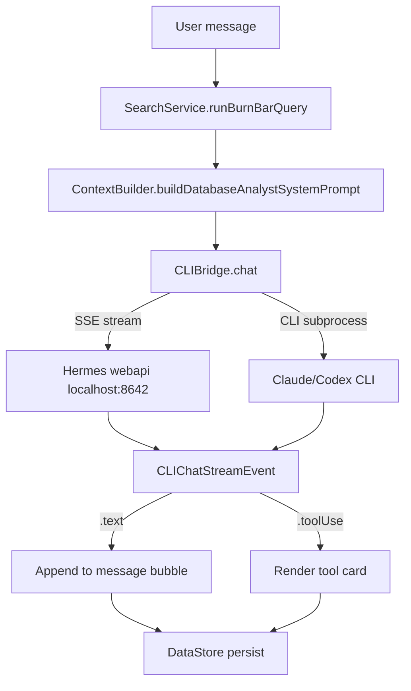

# Hermes chat

Hermes chat is an AI assistant panel embedded in the macOS app and iOS companion. It lets you ask questions about your usage data and interact with your Mac through two backends: a local CLI bridge and a full Hermes gateway.

## Backends

### Local Index mode

- Backed by `CLIBridge.Backend.claudeCode` or `.codex` — spawns a CLI subprocess.
- Stateless per turn: retrieval context is rebuilt as a system prompt for each message.
- No conversation memory across sessions.
- Detects available backend via `CLIBridge.detect()`.

### Hermes mode

- Backed by `CLIBridge.Backend.hermes(baseURL:)` — HTTP to the Hermes gateway at `http://127.0.0.1:8642`.
- OpenAI-compatible `POST /v1/chat/completions` with `stream: true` (SSE).
- Full multi-turn memory: the complete message history is sent per request.
- Tool calls handled server-side by Hermes; results stream as `.toolUse` events.
- Hermes availability is probed via `GET /v1/models`; if Hermes is running it becomes the preferred backend.

## Data flow

OpenBurnBar injects current usage statistics, recent sessions, and quota headroom as system prompt context in both modes so Hermes can answer questions about your actual spend.

## Popover Hermes strip (macOS)

A compact strip lives in the macOS menu-bar popover between the provider list and the action bar.

- **Collapsed:** ~44px tall — caduceus glyph (☿) + "Ask Hermes..." placeholder + `mercuryGradient` border with shimmer on hover.
- **Expanded:** grows to ~220px — inline chat thread showing up to 3 messages. "Open in Dashboard →" link at the bottom.
- Border: 1px `mercuryGradient` with animated shimmer overlay (3s sweep, `easeInOut`).
- Animation: `gentle` spring (`response: 0.4, dampingFraction: 0.85`) for expand/collapse.

## Dashboard chat panel (macOS + iOS)

The floating `ChatPanel` supports two modes selectable via a segmented pill in the header:

| Mode | Placeholder | Bubbles | Memory |
|---|---|---|---|
| Local Index | "Ask your local index..." | `whimsy`/`ember` strokes | None (per-turn) |
| Hermes | "Ask Hermes..." | `mercuryGradient` stroke with shimmer | Multi-turn |

Both modes inject the same retrieval context via `ContextBuilder`.

## Thinking state

When Hermes is generating a response, three 8px circles animate in a mercury pooling pattern:

- **Animation:** `mercuryPool` keyframes — scale `1→1.4→0.8→1`, translateY `0→-2→1→0`, opacity `0.5→1→0.6→0.5`
- **Duration:** 1.8s, 0.3s stagger between dots
- The streaming cursor (`▍`) uses `hermesMercury` color when Hermes is the active backend.

## Tool cards

Hermes tool calls render as collapsible cards in the message thread:

- Border: 1px `mercuryGradient`
- Tool name: `caption` (12pt semibold), `mercuryGradient` text fill
- Running state: 6px pulsing dot + status text in `textMuted`
- Completed state: collapsed to one line, expandable on tap
- Tools are grouped by capability (search, code, file, web, system) — not enumerated individually

## "via Hermes" badge

A `tiny`-weight badge with `hermesAureate` color and a caduceus prefix appears above Hermes assistant messages, mirroring the existing `cliUsed` badge pattern.

## Key files

| File | Role |
|---|---|
| `AgentLens/Services/CLIBridge/CLIBridge.swift` | Backend detection, chat dispatch, Hermes probing |
| `AgentLens/Services/CLIAgentRelayChatExecutor.swift` | CLI subprocess streaming executor |
| `AgentLens/Services/CLIBridge/CLIProcessStreamRunner.swift` | Low-level process stream runner |
| `AgentLens/Services/CLIBridge/RoutingClientWiring.swift` | Wiring between routing and CLI backends |

## Related

- [Computer Use](./computer-use.md) — Hermes can also drive your Mac from the chat interface
- [Mercury media](./mercury-media.md) — iroh transport that Hermes chat rides for remote relay
- [iOS companion app](../apps/ios-app/index.md) — Hermes chat surface on mobile
- `docs/HERMES_REALTIME_RELAY.md` — historical relay architecture (retired 2026-05-28; now uses iroh)
