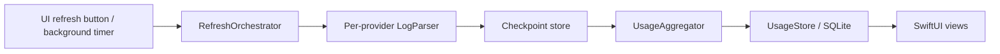

# Usage tracking

Usage tracking is the core feature of OpenBurnBar: it reads AI agent log files from disk, extracts token counts and costs, and persists records to a local SQLite database.

## Supported providers

17 log parsers ship in `AgentLens/Services/LogParser/`:

| Parser | Agent |
|---|---|
| `ClaudeCodeParser.swift` | Claude Code (Anthropic CLI) |
| `FactoryDroidParser.swift` | Factory Droid |
| `CursorAgentParser.swift` | Cursor AI |
| `WindsurfParser.swift` | Windsurf |
| `GrokParser.swift` | Grok Build (`~/.grok/sessions/`) |
| `HermesParser.swift` | Hermes (local) |
| `GooseParser.swift` | Goose (Block) |
| `GeminiCLIParser.swift` | Gemini CLI |
| `KimiParser.swift` | Kimi |
| `WarpParser.swift` | Warp AI |
| `AugmentParser.swift` | Augment Code |
| `ClineFormatParser.swift` | Cline / RooCode |
| `AntigravityParser.swift` | Antigravity |
| `ForgeDevParser.swift` | Forge Dev |
| `TokenExtractionUtility.swift` | Shared extraction helpers |
| `LogParserProtocol.swift` | Parser protocol |
| `ClaudeConversationExtractor.swift` | Claude conversation extractor |

Session paths for the most common agents:
- Codex: `~/.codex/sessions/`
- Claude Code: `~/.claude/projects/`
- Grok Build: `~/.grok/sessions/`

## Refresh cycle



1. A manual button press or background timer triggers `RefreshOrchestrator`.
2. Each `LogParser` reads new log content since the last checkpoint.
3. `UsageAggregator` coordinates: parses token counts, applies `ModelPricing` lookups, aggregates cost.
4. Results are persisted to SQLite via `UsageStore`.
5. SwiftUI views observe `@Observable` state on `UsageAggregator` and update.

Heavy parsing work runs in `Task.detached` off the main thread. `@Observable` state updates are dispatched back to `@MainActor` at apply boundaries.

## Data model

`TokenUsage` (SQLite row):

| Field | Type | Description |
|---|---|---|
| `provider` | `AgentProvider` | Enum identifying the agent |
| `model` | `String` | Model name (normalized) |
| `inputTokens` | `Int` | Prompt tokens |
| `outputTokens` | `Int` | Completion tokens |
| `cacheTokens` | `Int` | Cache read/write tokens |
| `cost` | `Double` | USD cost calculated from `ModelPricing` |
| `sessionPath` | `String` | Source log file path |
| `timestamp` | `Date` | Session timestamp |

## Pricing

`ModelPricing.swift` maps model names to per-million-token rates:

```swift
struct ModelPricing {
    let inputPerMToken: Double
    let outputPerMToken: Double
    let cacheCreationPerMToken: Double?
    let cacheReadPerMToken: Double
}
```

`ModelPricing.lookup(model:providerID:)` normalizes model strings via `TokenExtractionUtility.normalizeModelName(_:)` before lookup so aliased or version-suffixed names resolve correctly.

## Key files

| File | Size | Role |
|---|---|---|
| `AgentLens/Services/UsageAggregator.swift` | ~23 KB | Refresh pipeline coordinator, `@Observable` facade |
| `AgentLens/Services/UsageAggregatorParsers.swift` | ~96 KB | Per-provider parser orchestration |
| `AgentLens/Services/RefreshOrchestrator.swift` | — | Schedules refreshes, manages background timer |
| `AgentLens/Services/ModelPricing.swift` | — | Token pricing table and lookup |
| `AgentLens/Services/DataStore/UsageStore.swift` | — | SQLite persistence via GRDB |
| `AgentLens/Services/LogParser/` | — | 17 individual parsers |

## Error handling

`UsageAggregator` surfaces per-provider errors in `errors: [AgentProvider: String]` and `parserHealth: [AgentProvider: ParserHealth]`. A `persistenceErrorMessage` and typed `typedPersistenceError: OpenBurnBarError?` are set when SQLite writes fail.

## Related

- [Insights engine](../systems/insights.md) — derives patterns and recommendations from the stored `TokenUsage` rows
- [Provider quota management](../features/quota-management.md)
- [Android companion app](../apps/android-app.md) — reads usage data from Firestore (Mac publishes on sync)
