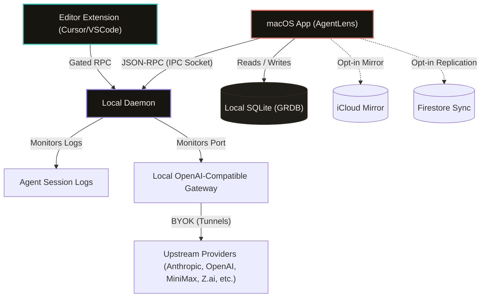

# Core Release Architecture, Boundaries, and Sandbox Escape Strategy

This document details the system design, communication pathways, security guarantees, and execution permissions of the **OpenBurnBar** ecosystem.

## Canonical Stance & Architecture Philosophy

OpenBurnBar is a **local-first, daemon-first** observability and automation platform. Local on-device storage is the absolute source of truth. Cloud replication and file-mirroring systems are completely optional, opt-in, and function solely as secondary planes.

---

## Unsandboxed Execution Rationale

The macOS application runs **without the App Sandbox** (`com.apple.security.app-sandbox = false`). This is a deliberate, structural requirement of the platform's core tracking capabilities. Sandboxing is bypassed to allow the following essential behaviors:

1. **Arbitrary Filesystem Observation:** Reading AI agent log files from arbitrary home-directory locations (e.g., `~/.claude/`, `~/.factory/`, `~/.codex/`, `~/.kimi/`, `~/.hermes/`, `~/.augment/`, `~/.forge/`, `~/.goose/`) to parse session telemetry dynamically.
2. **Subprocess Management:** Managing, spawning, and monitoring the lifecycle of the local daemon launch agent.
3. **iCloud Documents Container Integration:** Seamlessly accessing and writing copy-mirrors into the user's personal iCloud Drive container.
4. **AppKit/Keychain Interoperability:** Using native AppKit APIs and sharing Firebase Auth credentials within macOS Keychain chains securely.

*Security Tradeoff:* Running unsandboxed means that if the App or Daemon is compromised, it shares the executing user's privileges. To mitigate this risk, OpenBurnBar enforces strict localized transport security, credential isolation via the Keychain, and static typed deserialization interfaces.

---

## Component Boundaries & Communication

OpenBurnBar enforces strict process separation across four coordinated control surfaces:

### 1. macOS Application (`AgentLens`)
* **Role:** The primary, user-facing control center. Houses the Popover, Menubar, dashboard, settings, local Retrival (FTS5 + semantic embeddings) projection interfaces, and the Hermes chat view.
* **State Scope:** Owns the local canonical SQLite database (`OpenBurnBar.sqlite`), local retrieval indexes, and the mirrored controller runtime cache.

### 2. Local Daemon (`OpenBurnBarDaemon`)
* **Role:** A background service managed via `launchd`. It runs as a local JSON-RPC server listening on a UNIX domain socket at `~/Library/Application Support/OpenBurnBar/openburnbar-daemon.sock`.
* **State Scope:** Owns local provider routing configurations, transaction ledgers, task journals, and workspace connection state. It does not run with elevated root privileges.

### 3. Editor Extension Shell (Cursor/VS Code)
* **Role:** Integrates into the active coding environment. Acts as an RPC client talking to the daemon.
* **Workspace trust behaviors:** 
  - **Untrusted Workspaces:** The extension declares `"untrustedWorkspaces": { "supported": false }` in its `package.json`, completely preventing activation in restricted workspaces.
  - **Trusted Workspaces:** Active tools stay strictly confined to opened workspace roots. Destructive operations like terminal execution or code patching require manual workspace-level confirmation.

### 4. Local CLI Tool (`OpenBurnBarCLI`)
* **Role:** Fast, developer-centric terminal entrypoint for daemon health checks, manual simulator replays, and mission approval dispatches.

---

## State Ownership Matrix

| State Type | Primary Owner | Storage Strategy | Purpose |
|:---|:---|:---|:---|
| **Usage, Conversations, Logs** | macOS App | Local SQLite (GRDB) | Local retrieval spine, history rendering, and search |
| **Provider API Keys & Tokens** | macOS App/Daemon | macOS Keychain | Secure credential storage (`kSecAttrAccessibleWhenUnlockedThisDeviceOnly`) |
| **Run Journals & Checkpoints** | Local Daemon | `~/Library/Application Support/OpenBurnBar/` | High-fidelity execution history and process recovery |
| **Cloud-Synced Replication** | Optional Cloud | Firestore & Auth (App Check) | Multi-device coordination, optional team sharing |
| **Log Backup Copies** | Optional Cloud | iCloud Drive Container | Personal disaster recovery copies |

---

## Security and IPC Gating

* **Socket Security:** The UNIX domain socket is protected by Unix filesystem ACLs set to `0o600` (owner read/write only). Only processes running under the logged-in user's UID can connect.
* **Token Authentication:** Every JSON-RPC request must carry a cryptographically secure authentication token.
* **Token Protection:** The auth token is passed to the daemon through `launchd` plist `EnvironmentVariables` written with `0o600` permissions. It is never passed via CLI arguments, eliminating exposure to local users via process list inspection (`ps aux`).
* **Input Validation:** Request sizing is statically capped at 64KB (`maxRequestBytes`), protecting the parser from denial-of-service and stack exhaustion vectors.

---

## Support Tiers

### Core (Standard Release Guarantee)
Features built into the critical local-first loop. Guaranteed backward compatibility, extensive test coverage, and strict performance targets:
* macOS Menu Bar App & Popover Dashboard
* Local Daemon & RPC Unix Socket Core
* Local SQLite with GRDB integration
* CLI Control Surface (`OpenBurnBarCLI`)
* Cursor/VS Code Editor Gating

### Experimental (Best Effort)
Advanced integrations that broaden the network surface or external dependency chains. These are disabled by default and subject to design revisions:
* **Connector Plane:** Background credential storage and testing pipelines for Slack, GitHub, Linear, Gmail, PostHog, and Sentry.
* **Mission Control & Controller Runtime:** Automation and scheduled review engines.
* **Telegram Bot Integration:** Bot-token backed status reporting.
* **Browser Plane:** Full Playwright-based browser driver automation.
* **Cloud Planes:** Firebase Firestore replication and iCloud backup mirrors.
